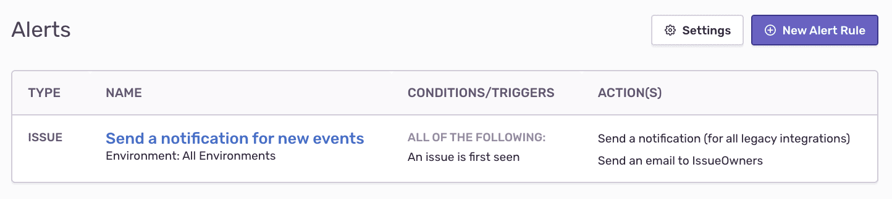

Triage, resolve, and ignore Sentry issues directly from Slack.

This integration needs to set up only once per organization, then it is available for _all_ projects.

## Install

<Note>

Sentry owner or manager permissions are required to install this integration.

</Note>

Slack defaults to let any workspace member authorize apps, but they may have to request access. See this [Slack help article](https://get.slack.help/hc/en-us/articles/202035138-Add-an-app-to-your-workspace) for more details.

1.  In Sentry, navigate to **Settings > Integrations**.

1.  When you enter the page, the integrations list displays, which includes Slack. Use the search bar to filter quickly for the Slack integration.
    Click "Slack" to navigate to the details page for this integration.

    

1.  Click "Add workspace".

    

1.  Toggle to the Slack workspace to which you want to connect using the dropdown menu in the upper right corner of the authentication window, then select **Allow**. Repeat this process if you are connecting to multiple workspaces.

    

1.  Your integration details page will refresh and show the Slack workspace you just added.

    

Your Slack integration is now available to all projects in your Sentry organization. To enable Slack notification for private channels, add the Slack app to the channel. One quick method: use `@sentry` to invite the Sentry bot the Slack channel.

In the next section, we'll walk you through configuring your notification settings.

## Configure

Use Slack for [alerts](#alert-rules) regarding issues, environments, deployment, etc.

### Alert Rules

1. Confirm your Slack workspace is configured globally for your Sentry organization by navigating to Organization Settings > **Integrations**. Click on "Configuration(s)" to go to the configuration details page.

   

1. Select the Slack workspace to configure from the list, then click "Configure".

   

1. Click "Add Alert Rule" for this project to navigate to Alert Rule settings.

   

   You can also access **Alerts** from your **Project Settings**. From here, you can configure when notifications are sent to your Slack workspace(s).

   You can route notifications in a few ways: to a specific channel in your Slack workspace, to multiple channels in your Slack workspace, or to multiple Slack workspaces.

1. Click "New Alert Rule" to configure a new Alert.

   

   Update the Slack channel routing by for existing Alert Rules by choosing Slack as the action under **Perform these actions**:

   

   After selecting **Send a Slack notification**, specify the workspace, channel(s), and tags you’d like to include with your Alert Rule.

   

   You can add Alert Rules routing to as many Slack channels as you’d like.

1. Then once you receive a Slack notification, you can use the Resolve, Ignore, or Assign buttons to update the Issue in Sentry.

   

## Deleting the legacy project-based Slack integration

We recommend disabling the legacy project-based integration after setting up the global integration.

Once you configure the global Slack integration and Alert Rules, you can disable the old project-based Slack integration. Go to each project that has the old project-based Slack enabled and disable it. If you're looking to upgrade your global integration, please refer to the information below under **Upgrading Slack**.

## Upgrading Slack

### How do I know if I need to upgrade?

You need to upgrade if you installed the global Slack integration on a Sentry organization before May 8, 2020. Unsure whether or not that includes your organization? Please visit your integration's page via **Organization Settings > Integrations**. You will see a call to action for the Slack integration.

Please note we are still rolling this out, if you don't see this yet you may be in a later wave.

If you installed the Slack integration on a Sentry organization after May 8, 2020, your integration will be up-to-date, and no upgrade is needed.

### Why do I need to upgrade?

Sentry built its previous Slack integration on top of Slack's workspace apps. Unfortunately, Slack deprecated the workspace apps shortly afterward. You can find more details about that decision on [the Slack blog](https://medium.com/slack-developer-blog/an-update-on-workspace-apps-aabc9e42a98b).

While we were able to maintain the integration in the past, our workspace app relies on Slack APIs that will soon deprecate. We now need to move to Slack's newly supported bot app framework.

### What changes after my integration is upgraded?

Previously, Slack workspace apps allowed you to give Sentry access to whichever channels you chose, including public or specific channels -- which could be either public or private.

Bot apps in Slack work differently. By default, the Sentry bot will be able to post alerts in public channels, but in order to be able to post to private channels, you'll need to add the bot to that specific channel.

In terms of your alert rule configurations, if your current Slack integration only uses public channels, then nothing needs to change after you upgrade.

Going forward, if you want to add private channels to alert rules, you'll need to add the Sentry bot to the channel first before making the Sentry rule.

If you have any private channels currently used in your alert rules, for the alerts to work, you'll need to add the Sentry bot after you've upgraded. In the upgrade flow, you'll have a chance to review which private channels you're using. Sentry will send a message to each channel, once you've upgraded, as a reminder to add the Sentry bot to that channel.

### How do I upgrade?

1. Go to your Slack configurations page in Sentry. Click "Upgrade Now".

   

2. Click "Continue".

   

3. If you have any private channels in use, you'll see them listed.

   

   Otherwise, you'll see:

   

   Either way, when you're ready, Click "Upgrade".

### When do I need to migrate by?

All Sentry organizations will have until October 1, 2020, to upgrade their Slack integration. If you have any questions or concerns, please email us at [partners@sentry.io](mailto:partners@sentry.io).
