Sentry’s GitLab integration helps you track and resolve bugs faster by using data from your GitLab commits. Additionally, you can streamline your triaging process by creating a GitLab issue directly from Sentry.

## Install

<Note>

Sentry owner, manager, or admin permissions and GitLab owner or maintainer permissions are required to install this integration.

</Note>

1. Navigate to **Settings > Integrations > GitLab**.

   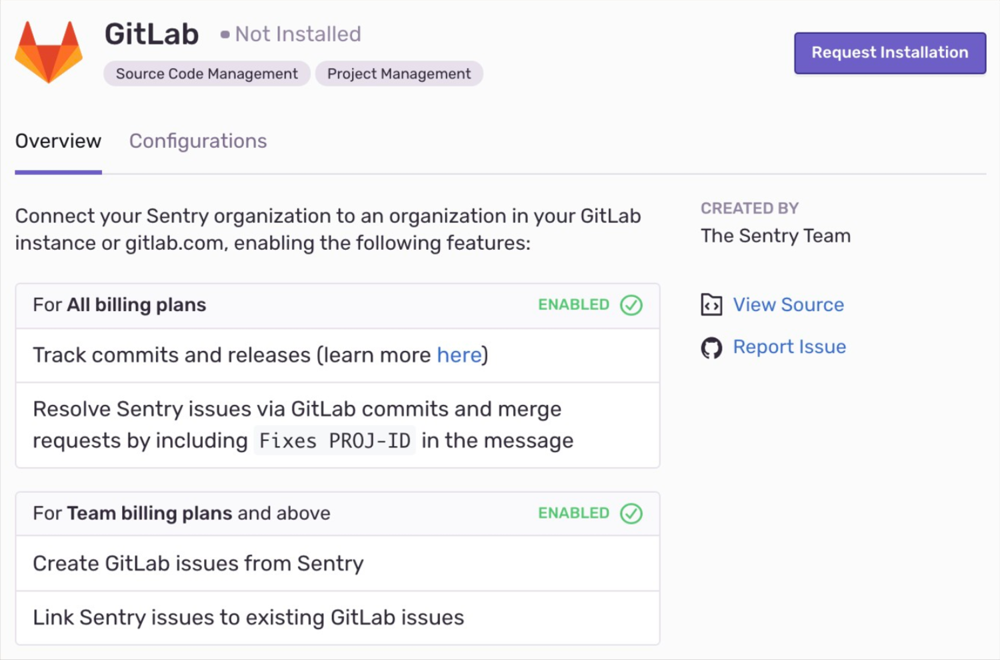

1. In the resulting modal, click "Add Installation".

   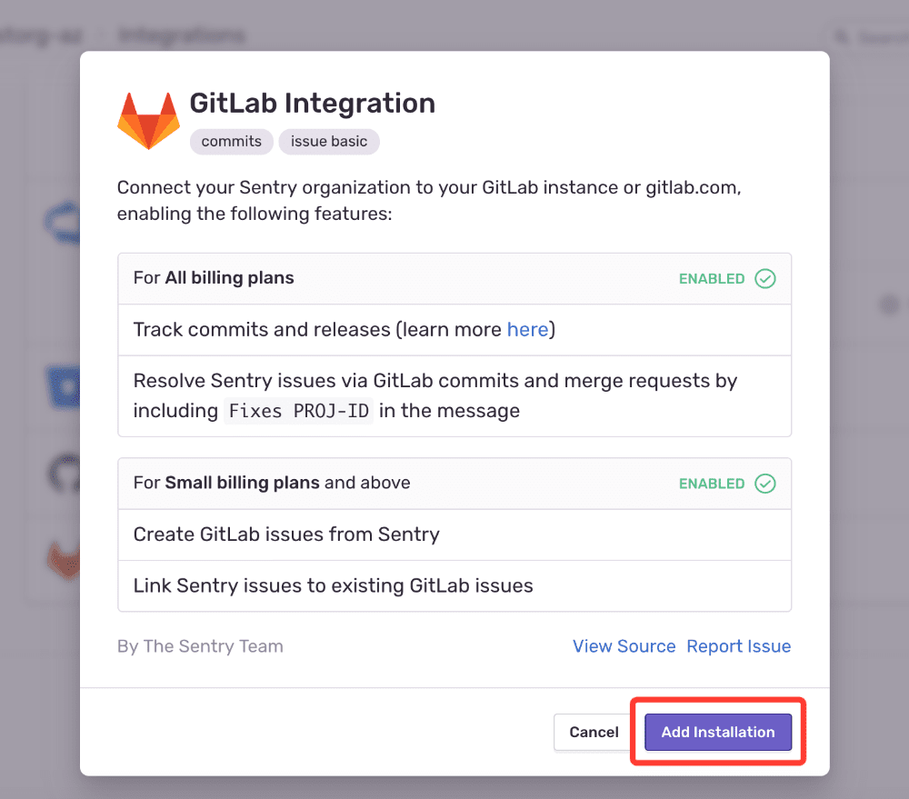

1. In the pop-up window, complete the instructions to create a Sentry app within GitLab. Once you’re finished, click "Next".

   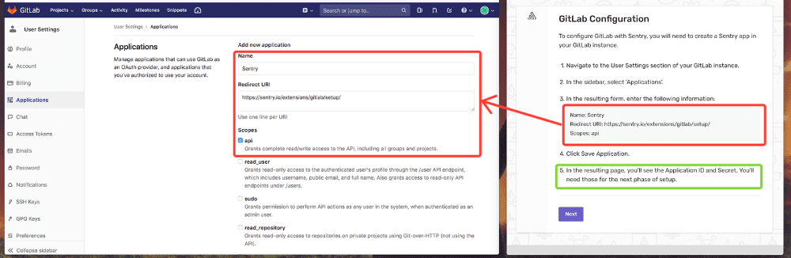

1. Fill out the resulting GitLab Configuration form with the following information:

   1. The GitLab URL is the base URL for your GitLab instance. If using gitlab.com, enter https://gitlab.com/.

   2. Find the GitLab Group Path in your group’s GitLab page. Groups might contain subgroups and projects. You should not specify the URL to any specific project, just to a group or subgroup.

      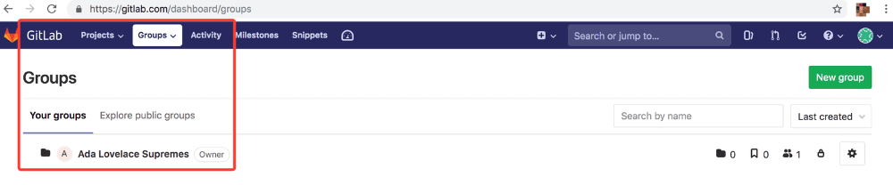

   3. Find the GitLab Application ID and Secret in the Sentry app within GitLab.

      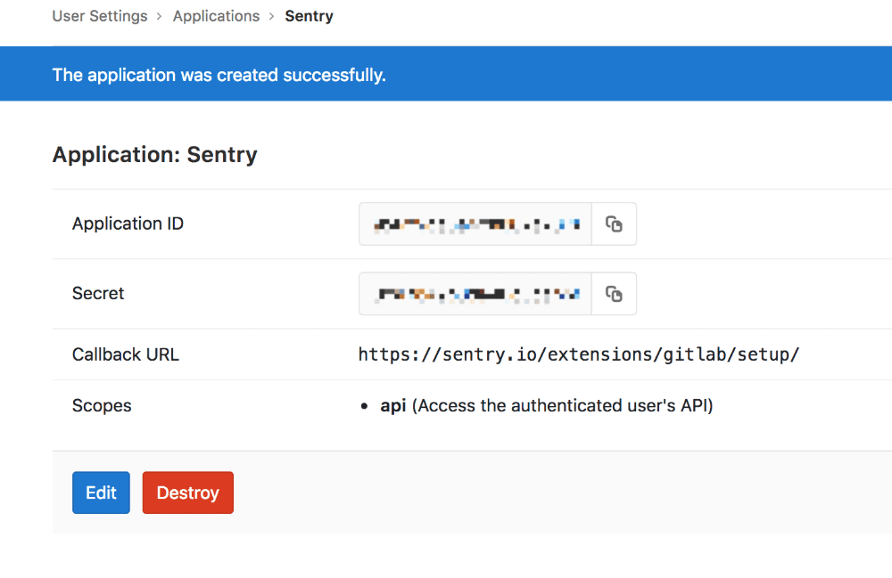

   4. Use this information to fill out the GitLab Configuration and click "Submit".

      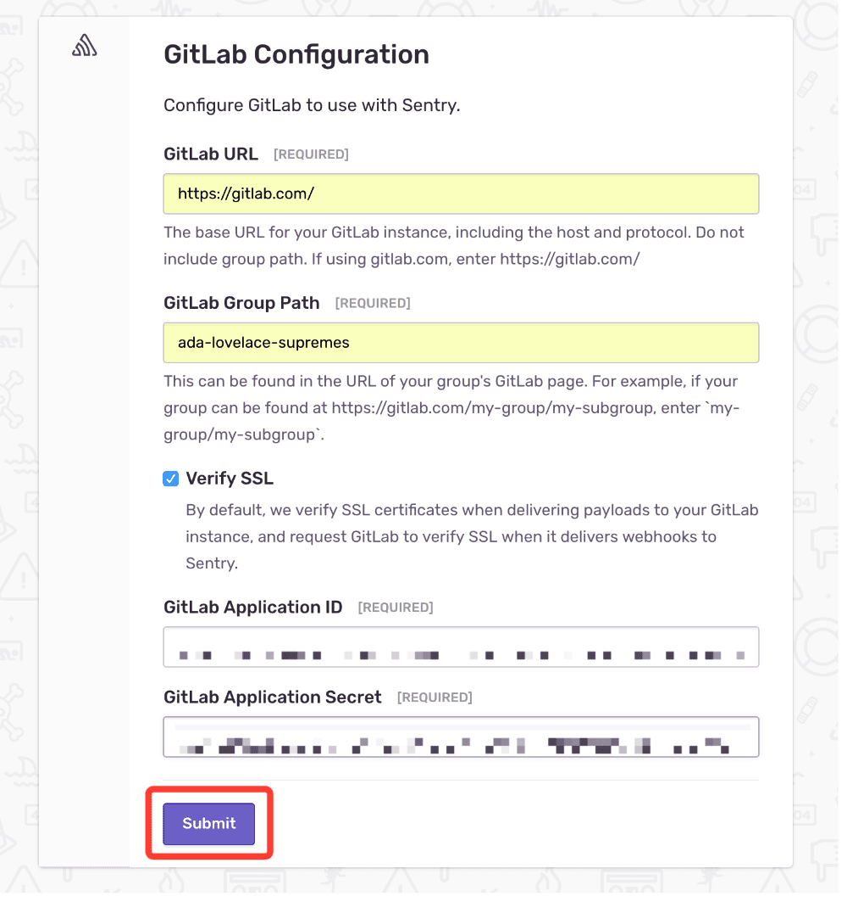

1. In the resulting panel, click "Authorize".

1. In Sentry, return to Organization Settings > **Integrations**. You’ll see a new instance of GitLab underneath the list of integrations.

1. Next to your GitLab Instance, click "Configure". _It’s important to configure to receive the full benefits of commit tracking._

   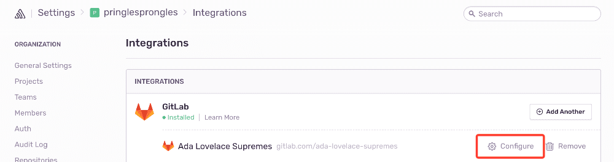

1. On the resulting page, click "Add Repository" to select which repositories in which you’d like to begin tracking commits.

   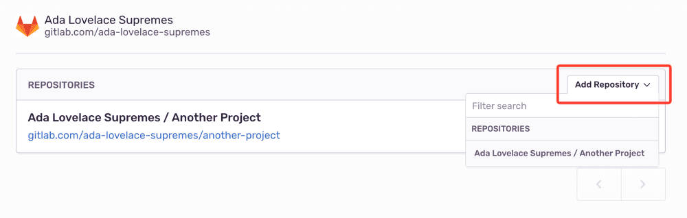

## Configure

Use GitLab to [track commits](#commit-tracking), identify [suspect commits](#suspect-commits), [resolve via commit or PR](#resolve-via-commit-or-pull-request) and [manage issues](#issue-management).

### Issue Management

Issue tracking allows you to create GitLab issues from within Sentry and link Sentry issues to existing GitLab issues.

1. Select your issue

   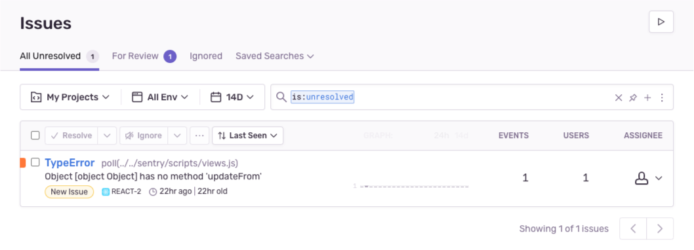

1. Navigate to Linked Issues on the right panel of the issue's page and click "Link GitLab Issue".

   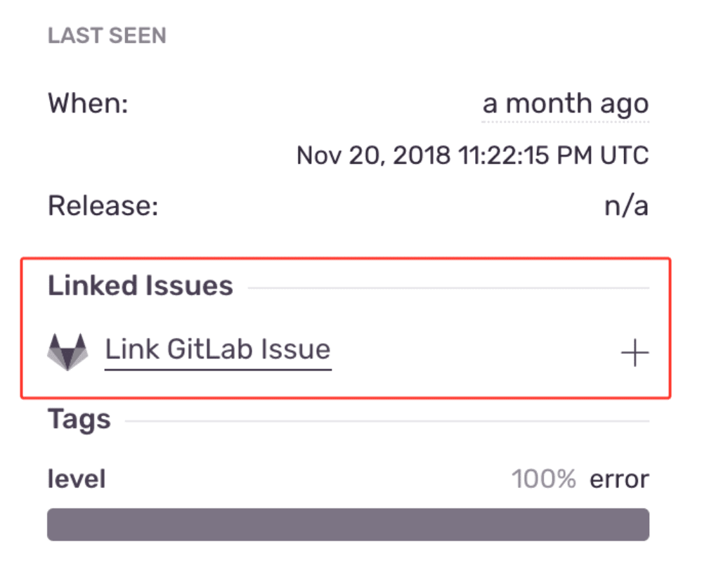

1. You have two options to complete the issue link:

   1. In the pop-up, you can fill out the appropriate details in the _Create_ tab, and then click "Create Issue".

      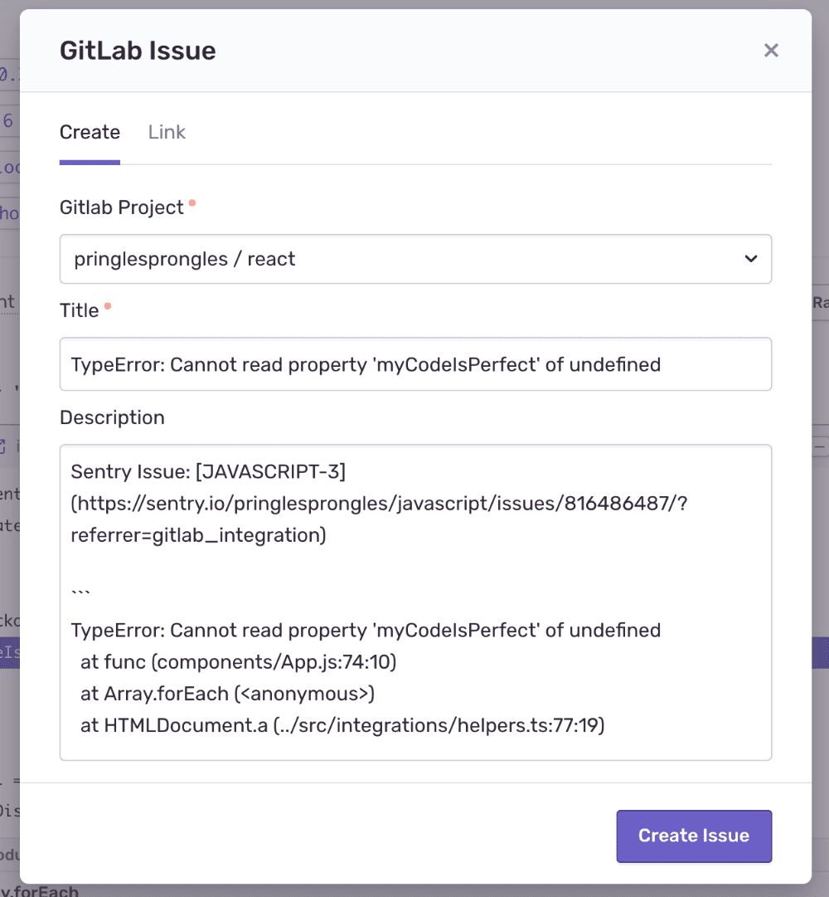

   1. Or, in the pop-up, you can click the Link tab, search the issue by name, and then click "Link Issue". _Issues aren't currently searchable by number._

      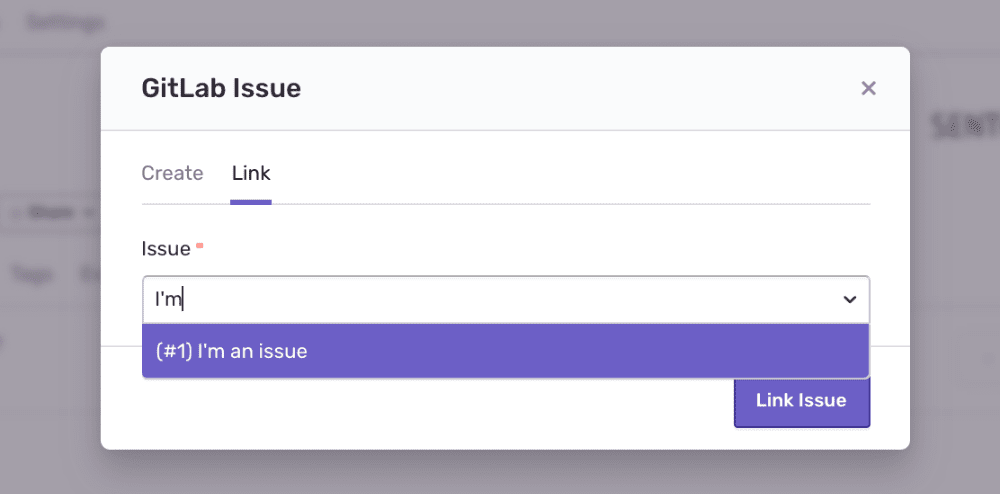

1. To unlink an issue, click on the "X" next to its name under Linked Issues.

   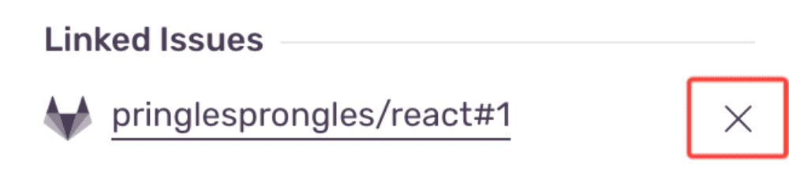

### Commit Tracking

Commit tracking allows you to hone in on problematic commits. With commit tracking, you can better isolate what might be problematic by leveraging information from releases like tags and metadata.

Once you've configured both [release and commit tracking](/product/releases/), you'll be able to see more thorough information about a release: who made commits, which issues were newly introduced by this release, and which deploys were impacted.

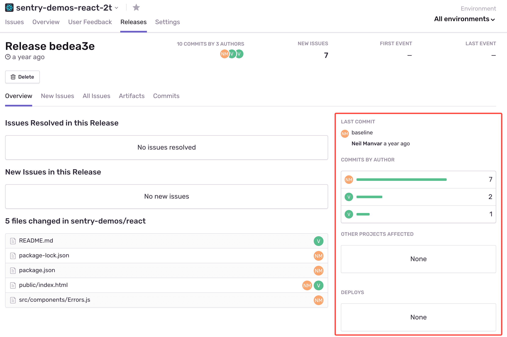

When you investigate deeper into that commit, you can leverage information from metadata like tags.

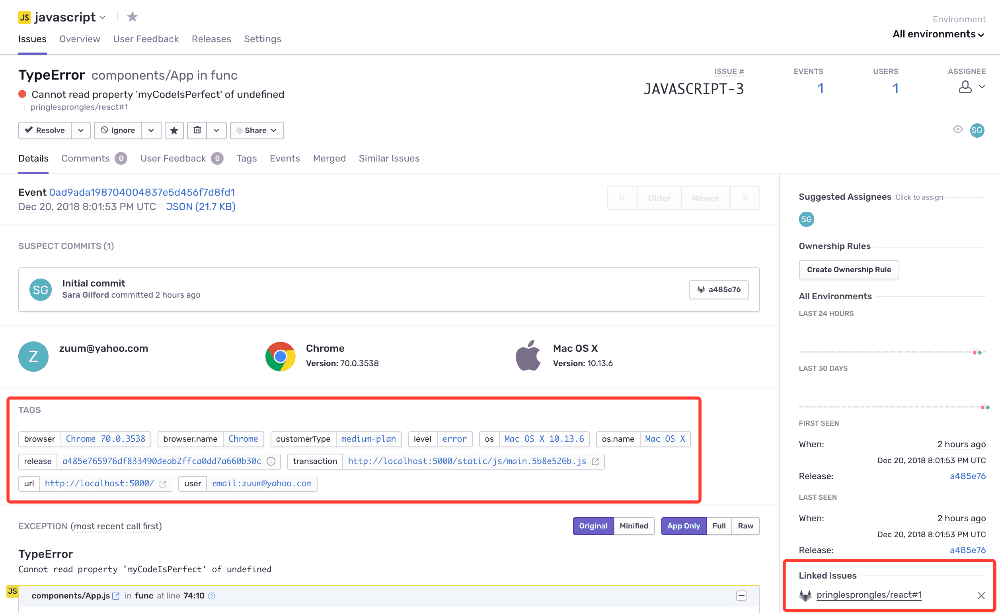

Broadly, this lets you isolate problems in order to see which commits might be problematic.

Learn more about [release and commit tracking](/product/releases/).

### Resolve via Commit or Pull Request

Once you've added a repository (see configuration step 8), you can start resolving issues by including `fixes <SHORT-ID>` in your commit messages. You might want to type something in the commit like: "this fixes MyApp-AB12" or "Fixes MyApp-317". The keyword to include is **fixes**. You can also resolve issues with pull requests by including `fixes <SHORT-ID>` in the title or description. This will automatically resolve the issue in the next release.

A `<SHORT-ID>` may look something like 'BACKEND-C' in the image below.

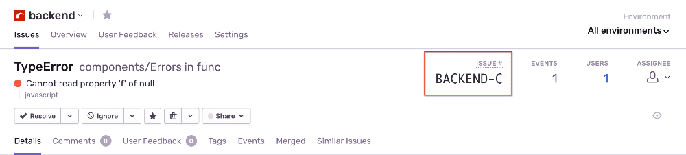

### Stack Trace Linking

<Note>

This feature is currently only supported for Ruby, Python, Php, Node, JavaScript, Go and Elixir.

</Note>

Stack trace linking takes you from a file in your Sentry stack trace to that same file in your source code. If you have commit tracking set up in Sentry, we can take you to the exact version (using the commit associated with the event) of the source code when the error occurred. Otherwise we'll link you to the current state of the source code (using the default **branch**).

1. Navigate to **Settings > Integrations > GitLab > Configurations**.

1. Click the "Configure" button next to your GitLab Instance.

1. Click the **Code Mappings** tab.

1. Set up a code mapping for each project for which you want to enable stack trace linking. To create a new code mapping, click **Add Mapping**.

1. Fill out the form, then click **Save Changes**. Each form field is described below:

   - **project** (required): This is the Sentry project.
   - **repo** (required): This is the GitLab project associated with the Sentry project above. If you have more than one GitLab project being used per Sentry project, you'll need multiple code mappings.
   - **branch** (required): This is the default branch of your code we fall back to if you do not have commit tracking set up.
   - **stack trace root** and **source code root** (optional):
     - If the file path in your Sentry stack trace frame matches the path to your source code, you don't need to set these values.
       - For example, if everything after the branch (`main`) matches the file path of `code.py` using a source code path of `https://gitlab.com/murdith-group/issa-project/-/blob/main/code.py`, you don't need to set either `stack trace root` or `source code root`
     - If the file path in your Sentry stack trace frame doesn't match the path to your source code, you will need to replace the `stack_root` part of the file path with your `source_root` to make the file path match the source code path.
       - For example, to get `src/code.py` to match `code.py` when the source code path is `https://gitlab.com/murdith-group/issa-project/-/blob/main/code.py`, change the `stack trace root` to be set as `src/`, and leave `source code root` empty.

### Suspect Commits

Once you've set up stack trace linking, Sentry can use information from your source code provider to suggest the commit that likely introduced the error. After pinpointing the suspect commit, you can also identify the developer who made the commit and assign them the task of fixing the error.

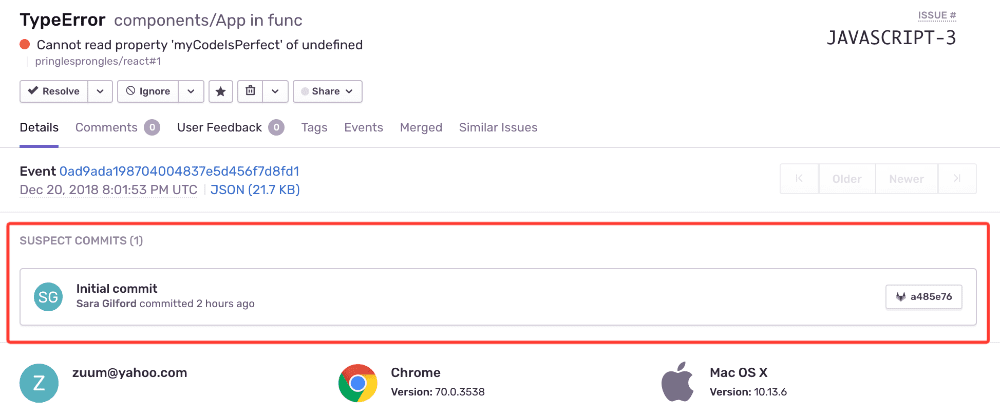

Learn about setting up this functionality in [Suspect Commits](/product/issues/suspect-commits/).

### Code Owners

<Note>

Let us know if you have feedback: [ecosystem-feedback@sentry.io](mailto:ecosystem-feedback@sentry.io).

</Note>

<Include name="business.mdx" />

Import your existing GitLab CODEOWNERS files to automatically assign Sentry issues and route alerts to the responsible individuals and teams.

For more details, see the full documentation for [Code Owners](/product/issues/ownership-rules/#code-owners).

## Troubleshooting

- I'm using GitLab on-premises. Do I need to allow Sentry's IP addresses?

  - Yes. You can find our IP ranges [ here ](/product/security/ip-ranges/).
  - Verify the provided installation URL is a fully qualified domain name (FQDN), which is resolvable on the internet.
  - Make sure that Sentry's access to your installation URL is not path restricted.
  - To add the GitLab repo, navigate to ** GitLab > Admin area > Settings > Network > Outbound requests > Allow requests to the local network from hooks and services ** and enable the option.

- I'm using both GitLab on-premises and self-hosted Sentry, and I get an error `Error Communicating with GitLab (HTTP 422): unknown error` when I try to use the integration. How can I fix this?

  - By default, GitLab does not allow Hooks to communicate with the local private network, which prevents the integration with Sentry from working. To enable local network communication in GitLab, enable "Allow requests to the local network from hooks and services" on the **Admin > Settings > Network** page.

- Do you support subgroups?

  - Currently, we only support subgroups for users using GitLab 11.6 or higher.

- My repositories are hosted under my user account, not a group account. Can I still use this integration?

  - Unfortunately, not. The GitLab integration only works for repositories that are hosted under group accounts.

- Are there pricing restrictions?

  - This integration is available for organizations on the [Team, Business, or Enterprise plan](https://sentry.io/pricing/).

- Who has permission to install this?

  - You must have both owner/manager/admin permissions in Sentry and owner permissions in GitLab to successfully install this integration.

- Why am I getting a `500` response during installation or configuration?

  - First, make sure you’ve allowed our IPs, which can be found [here](/product/security/ip-ranges/). The 500 response is coming from GitLab, so you may need to try again or double-check that your settings and permissions are correct in GitLab. You must have both owner/manager/admin permissions in Sentry as well as owner permissions in GitLab to successfully install this integration.

- Why am I seeing an "Invalid Repository Names" error?

  - GitLab takes into account the whitespace before and after the `/` . On the Repositories page (Organization Settings > Repositories), you’ll notice a space (for example, "Owner / Repo" as opposed to "Owner/Repo"), which will need to be included in any command you’re running. If you are using GitLab’s [environment variables](https://docs.gitlab.com/ee/ci/variables/#debug-tracing) to pass the repository as `CI_PROJECT_PATH` in a cURL request for example, it may not include the spaces and you’ll need to hardcode the name in order for it to work.

- Why am I always the reporter?
  - When using the GitLab integration to create issues, the “reporter” field is populated as the person who set up the integration by default — this is not configurable.
