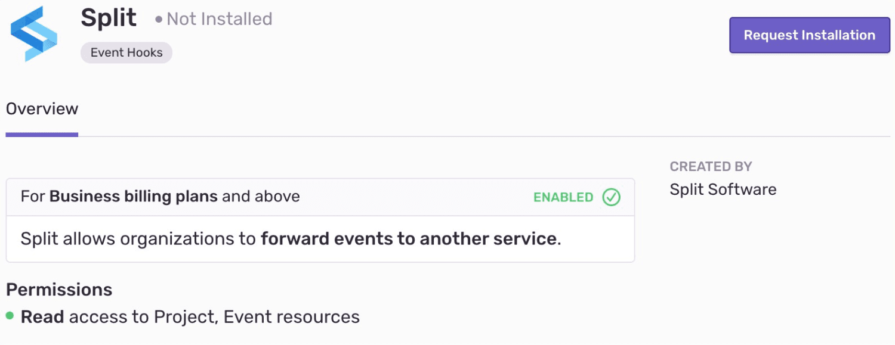

The Split integration quickly processes and displays Sentry exception data in the Split platform as track events for analysis. You can control what environments and traffic types you're capturing exceptions for in the Split dashboard without having to touch any code.

This integration needs to set up only once per organization, then it is available for _all_ projects. It is maintained and supported by the company that created it. For more details, see [Integration Platform](/product/integrations/integration-platform/).

## Install and Configure

<Note><markdown>

Sentry owner or manager permissions permissions are required to install this integration. The Split integration is available only for organizations on the Business and Enterprise plans.

Split **won't** work with self-hosted Sentry.

</markdown></Note>

1. Navigate to **Settings > Integrations > Split**

2. Then, follow the full [Split installation instructions](https://help.split.io/hc/en-us/articles/360029879431).
