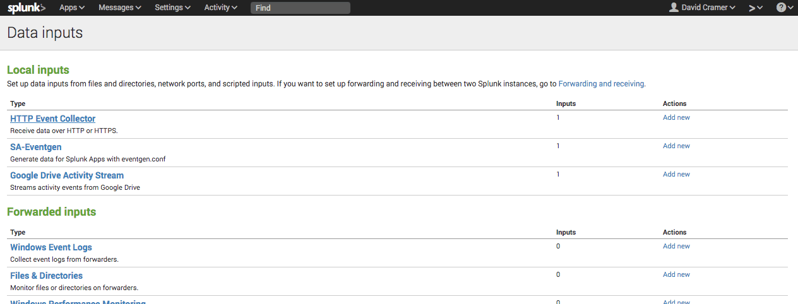
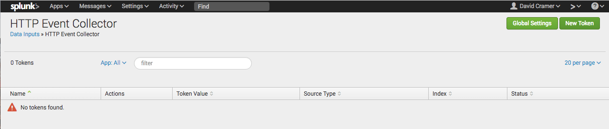

Connect Splunk to Sentry with the [Data Forwarding](/platform-redirect/?next=/data-management/data-forwarding/) feature.

<Note>

We only support Splunk Cloud plans. We do not support Splunk Enterprise plans. See the [Splunk documentation](https://dev.splunk.com/view/event-collector/SP-CAAAE7F) for specific details on your Splunk installation.

</Note>

This integration needs to be set up in each project for which you wish to use it. It is maintained and supported by the [Sentry community](https://forum.sentry.io/).

## Install and Configure

<Note>

Sentry owner or manager permissions permissions are required to install this integration.

</Note>

Navigate to **Settings > Integrations > Splunk**


### Enabling HEC

To get started, you’ll need to first enable the HTTP Event Collector:

Under **Settings**, select **Data Inputs**:


Select **HTTP Event Collector** under Local Inputs:



Under your HEC settings, click "Global Settings":



Change **All Tokens** to **Enabled**, and note the HTTP Port Number (`8088` by default):


<Note>

If you’re running Splunk in a privileged environment, you may need to expose the HEC port.

</Note>

### Creating a Sentry Input

Under HTTP Event Collector, create a new Sentry input by clicking "New Token":


Enter a name (e.g. `Sentry`), and click "Next":


Select the index you wish to make accessible (e.g. `main`), and click "Review":


You’ll be prompted to review the input details. Click "Submit" to continue:


The input has now been created, and you should be presented with the **Token Value**:


### Enabling Splunk Forwarding

To enable Splunk forwarding, you’ll need the following:

- Your instance URL (see note below)
- The Sentry HEC token value

In Sentry, navigate to the project you want to forward events from, and click "Project Settings".

### Data Forwarding

Configure [Data Forwarding](/platform-redirect/?next=/data-management/data-forwarding/) in **[Project] > Settings > Data Forwarding**, and provide the required information for the given integration.

After navigating to **Data Forwarding**, enable the Splunk integration:


Your instance URL is going to vary based on the type of Splunk service you’re using. If you’re using self-service Splunk Cloud, the instance URL will be the URL of the Splunk instance running the HTTP Event Collector (HEC):

```
https://<host>:8088
```

For all other Splunk Cloud plans, you’ll use the `http-inputs` prefix:

```
https://http-inputs-<host>:8088
```

If you’re using Splunk behind your firewall, you’ll need to fill in the appropriate host.

Once you’ve filled in the required fields, hit **Save Changes**:


We’ll now begin forwarding all new events into your Splunk instance.

<Note>

Sentry will internally limit the maximum number of events sent to your Splunk instance to 50 per second.

</Note>


