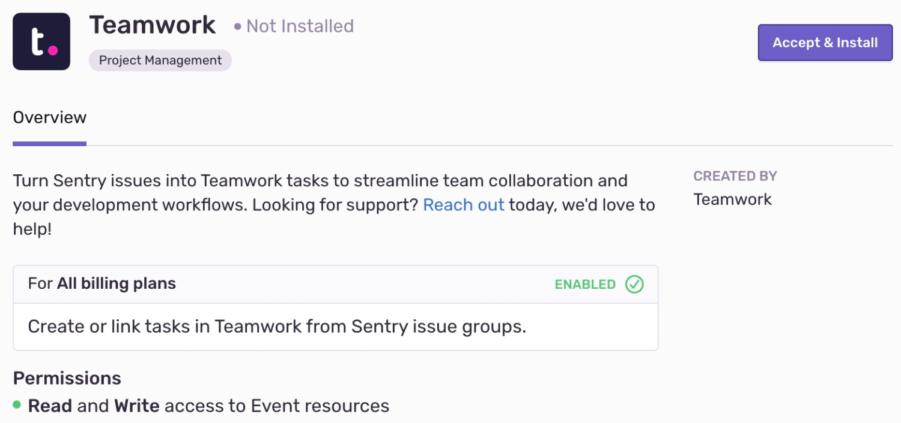

Turn Sentry issues into Teamwork tasks to streamline team collaboration and your development workflows.

Teamwork needs to set up only once per organization, then it is available for _all_ projects. It is maintained and supported by the company that created it. For more details, see [Integration Platform](/product/integrations/integration-platform/).

## Install and Configure

<Alert title="Note" level="info">

Teamwork **won't** work with self-hosted Sentry.
</Alert>

1. Navigate to **Settings > Integrations > Teamwork**

   

2. Follow the full [Teamwork installation instructions](https://support.teamwork.com/projects/sentry).
