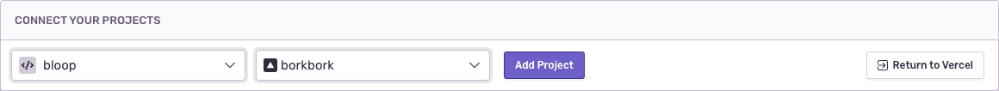

Vercel is an all-in-one platform with Global CDN supporting static and JAMstack deployment and Serverless Functions. Connect your Sentry and Vercel projects to automatically upload source maps and notify Sentry of release deployment.

This integration needs to set up only once per organization, then it is available for _all_ projects.

## Install

1. Visit <https://vercel.com/integrations/sentry/add>

2. Select your account and click "Add".

   

   <Alert title="Important" level="warning">
     The installation created an internal integration to generate an auth token
     used in building releases. If the Vercel internal integration is deleted,
     your Vercel integration will stop working.
   </Alert>

   

## Configure

Use Vercel to [link projects](#project-linking) for uploading source maps and notifiying Sentry of release deployment.

### Project Linking

1. Select a Sentry project and a Vercel project to link together.

   

   - This step will generate environment variables in the selected Vercel project. Having these set means you can skip the [CLI Configuration step](https://github.com/getsentry/sentry-webpack-plugin#cli-configuration) in the Sentry Webpack Plugin setup. You can see these in Vercel in **Project Settings** > **General** > **Environment Variables**.

   

   - `SENTRY_ORG` - the name of your Sentry organization
   - `SENTRY_PROJECT` - the name of your linked Sentry project
   - `SENTRY_AUTH_TOKEN` - the auth token from the Vercel Internal Integration that was created upon installation
   - `NEXT_PUBLIC_SENTRY_DSN` - the linked Sentry project's DSN
   - `VERCEL_GITHUB_COMMIT_SHA`, `VERCEL_GITLAB_COMMIT_SHA`, or `VERCEL_BITBUCKET_COMMIT_SHA` - your source code provider's commit SHA, used for creating releases and associating commits

2. Redeploy your Vercel project in order to trigger a release.

## Usage

- If you have not already done so, [instrument your code with Sentry](/platforms/javascript/).
- Ensure you have [installed a repository integration](/product/releases/#install-repo-integration) and added the relevant repository.
- Add the [Sentry Webpack Plugin](https://github.com/getsentry/sentry-webpack-plugin) to your configuration. For NextJS, use `next.config.js`.
- If you already have a Vercel project integrated with Sentry, ensure the Sentry project you link is the one you're already using to report errors.

## Uninstallation

1. The integration must be uninstalled from Vercel. Visit the Vercel integration configuration page (**Organization Settings** > **Integrations** > **Vercel** > **Configurations**) and click "Uninstall" then "Visit Vercel" in the modal that pops up.

   

2. Click "Remove Configuration".

3. Delete the internal integration that was created by navigating to **Organization Settings** > **Developer Settings** and clicking the trash can icon next to **Vercel Internal Integration**. You will be prompted to confirm the deletion by entering a string provided in the modal. Enter the string and click "Confirm" to finalize the deletion.

   
