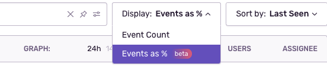
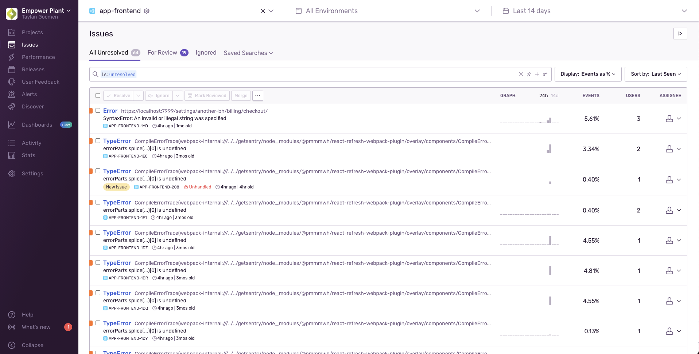

The **Issues** page displays information about errors in your application. Filter by properties such as browser, device, impacted users, or whether the error is unhandled. You can then inspect issue details to better understand the problem and [triage](/product/issues/issue-details/) effectively.

A typical application sends a large number of events to Sentry. You can think of an issue as a single bug or problem with your app. To make them manageable, we group similar events into issues based on the event stack trace and other information. This grouping of events into issues allows you to see how frequently a problem is happening and how many users it's affecting.

For each issue, the page displays:

- Error type and message
- Brief description of the issue
- Associated project
- Issue timing, such as last and first time seen

You can also hover over the issue title to see the stack trace of the latest event.

When you click on an issue on the main **Issues** page, the [Issue Details](/product/issues/issue-details) page displays.

From the **Issues** page, you can begin to triage. The page is organized into tabs, each corresponding to a filtered list of issues, and these different lists help you with triaging:

- All Unresolved (`is:unresolved`): All unresolved issues, including issues that need review.
- For Review (`is:unresolved is:for_review`): Issues that need to be reviewed; for-review issues are a sub-set of all unresolved issues.
- Ignored (`is:ignored`): All ignored issues.
- Saved Searches: Select from a set of [recommended](/product/sentry-basics/search/saved-searches/#recommended-searches) and [custom saved searches](/product/sentry-basics/search/saved-searches/#organization-wide-saved-searches). The name of the tab changes based on your selection.

Learn more about triaging issues and their different states in [Issue States and Triage](/product/issues/states-triage/).

### Display Options

You can use the display dropdown in the issues page to see error counts as a % of [sessions](/product/releases/health/#session).

For this option to be enabled you need to have selected a project that has [release health set up](/product/releases/health/setup) and need to have issues and sessions present in the selected period.

With `Events as %` option selected, instead of event counts you will see the issues' events as a % of overall sessions for the project.

<Note>

  The "Events as %" display option is available only if you're in the Early Adopter program. Features available to Early Adopters are still in-progress and may have bugs. We recognize the irony.

  If you’re interested in being an Early Adopter, you can turn your organization’s Early Adopter status on/off in General Settings. This will affect all users in your organization and can be turned back off just as easily.

</Note>

## Learn More

<PageGrid />
