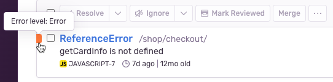

The **Issues** page displays information about errors and performance problems in your application. This page allows you to filter by properties such as browser, device, impacted users, or whether an error is unhandled. You can then inspect issue details to better understand the problem and [triage](/product/issues/states-triage/) effectively.

A typical application sends a large number of events to Sentry. You can think of an <SandboxLink scenario="oneIssue" projectSlug="react">issue</SandboxLink> as a single bug or problem with your app. To make them manageable, we group similar events into issues based on a fingerprint. This grouping of events into issues allows you to see how frequently a problem is happening and how many users it's affecting.

<Note>

**Issues and Event Quotas**

Your quota is consumed by _events_, not _issues_. Issues are generated from your accepted error or transaction events. Generating issues does not cause Sentry to accept more events for you and **does not** directly impact your quota. Sentry does provide tools, however, to control the type and amount of error and transaction events that are accepted. Learn more in [Quota Management](/product/accounts/quotas/).

</Note>

For each issue, the page displays:

- Issue type and description
- Associated project
- Issue timing, such as last and first time seen

For error issues, to see the stack trace of the latest event, you can hover over the issue title. You can also hover over the coloured square to the left of the issue information to see the error level (error, info, fatal, warning, debug, or sample) of the latest event:

You can save your issue queries and access them later by clicking the the "Saved Searches" button in the header. Learn more in [Saved Searches](/product/sentry-basics/search/saved-searches/). You can also add issues data to your [custom dashboards](/product/dashboards/custom-dashboards/), as widgets, using the [dataset selector](/product/dashboards/widget-builder/#choose-your-dataset).

When you click on an issue on the main **Issues** page, the **Issue Details** page for that issue is displayed. Learn more in [Issue Details](/product/issues/issue-details/).

## Issue Categories

There are two categories of issues: [_error issues_](/product/issues/issue-details/error-issues/) and [_performance issues_](/product/issues/issue-details/performance-issues/). An error issue is a grouping of error events; a performance issue is a grouping of transactions that are performing poorly. To learn more about each issue category and what kind of information is captured in their detailed view, check out our full [Error Issues](/product/issues/issue-details/error-issues/) and [Performance Issues](/product/issues/issue-details/performance-issues/) documentation.

## Issue Triage

From the **Issues** page, you can begin to triage. The page is organized into tabs, each corresponding to a filtered list of issues, and these different lists help you with triaging:

- All Unresolved (`is:unresolved`): All unresolved issues, including issues that need review.
- For Review (`is:unresolved is:for_review`): Also called **Review List**. Issues that need to be reviewed; for-review issues are a sub-set of all unresolved issues.
- Ignored (`is:ignored`): All ignored issues.

Learn more about triaging issues and their different states in [Issue States and Triage](/product/issues/states-triage/).

## Learn More

<PageGrid />
