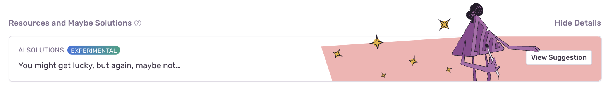
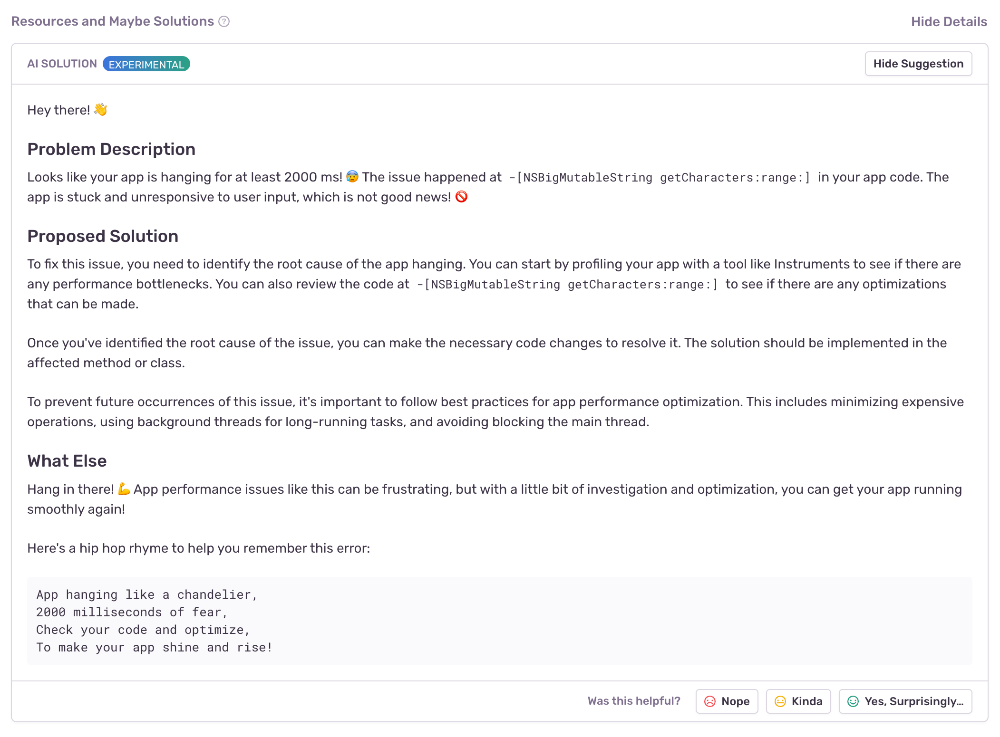
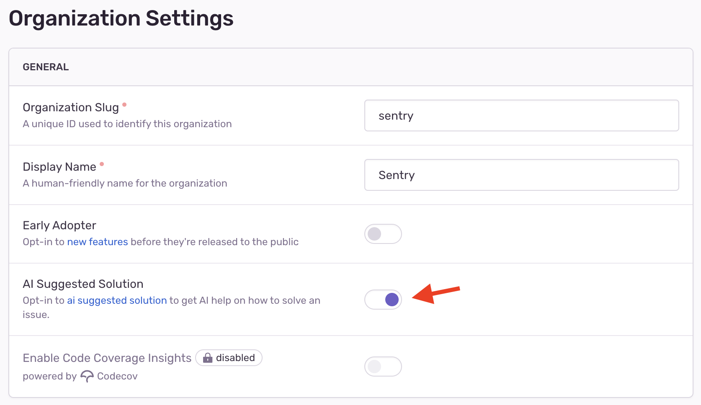

AI Suggested Solution is an experimental feature that uses AI to explain an issue
and to propose a solution. To achieve this, the feature sends certain parts
of an error event to OpenAI for processing.

You can find the feature below the breadcrumbs in the issue details page:

Once you click on 'View Suggestion', Sentry will send information about the event to OpenAI for
analysis. After some period of waiting, a suggested solution will be produced and might look
something like this:

## Data Processing

Under normal circumstances we do not send data to a third party
undisclosed in our [subprocessor list](https://sentry.io/legal/subprocessors/).
Because of this you need to provide consent to do so. If your organization has
signed a DPA with us, an owner of the organization will need to sign a
"OpenAI Subprocessor Acknowledgement" in the organization [Legal & Compliance
page](https://sentry.io/orgredirect/organizations/:orgslug/settings/legal/). Otherwise an individual
user will receive a prompt to confirm that data will be sent to a third party.

Under all circumstance we will not send any event data to OpenAI without an
explicit instruction to do so. Only by clicking the "View Suggestion" button
will selected event data be shared with a third party. we sent the following data from an event:

- message
- platform
- exception type
- exception mechanism
- exception value
- exception’s stack trace

This feature uses the OpenAI API and the event data shared via this feature will not be used to train their AI models.

## Disabling the Feature

If you don't find the feature useful and want to disable it for all users, you
can do so in your organization's settings. Also remember that if you have a
DPA signed with us, even if that toggle is enabled the feature won't be available
to users until a owner of the organization signed the "OpenAI Subprocessor
Acknowledgement".

