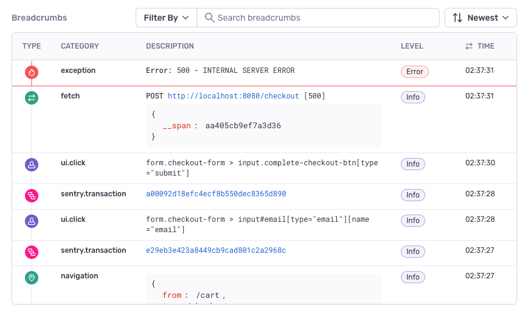
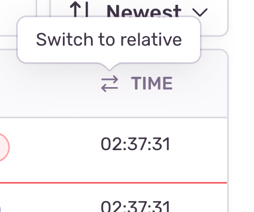
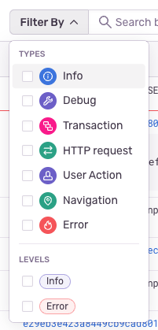
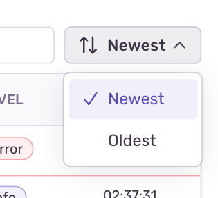

Sentry uses _breadcrumbs_ to create a trail of events that happened prior to an issue. These events are very similar to traditional logs, but can record more rich structured data.

SDKs automatically start recording breadcrumbs by enabling integrations. To learn how to do this for your platform, select the platform from the dropdown at the top of the page, then review the breadcrumbs documentation for that platform.

If an error event provides a trail, [sentry.io](https://sentry.io) displays the breadcrumbs on the **Issue Details** page:

## Breadcrumbs Display

Each part of the breadcrumb displays in a separate row and each row includes the following details: Type, Category, Description, Level, and Time.

Type

: A semi-internal attribute `type` can control the type of the breadcrumb. By default, all breadcrumbs are recorded as `default`, which makes them appear as a `Debug` entry, but Sentry provides other [types](https://develop.sentry.dev/sdk/event-payloads/breadcrumbs/#breadcrumb-types) that influence how the breadcrumbs are rendered.

Category

: The category of the event. This data is similar to a logger name, and helps you understand the area in which an event took place, such as auth.

Description

: A description is either:

- Message: A string describing the event, rendered as text with all whitespace preserved. It's often used as a drop-in for a traditional log message.

- Data: A key-value mapping of event metadata. This is often used instead of a message, but may be used in addition to one. [sentry.io](https://sentry.io) displays all the data sent.

Level

: The severity of an event. The level is set to one of five values, which are — in order of severity — fatal, error, warning, info, and debug.

Time

: A timestamp representing when the breadcrumb occurred. The format is either a string, as defined in [RFC 3339](https://tools.ietf.org/html/rfc3339), or a numeric (integer or float) value representing the number of seconds that have elapsed since the Unix epoch. By default, [sentry.io](https://sentry.io) displays the timestamp as an absolute time. You can click the toggle to update the display to relative time:

Learn more detailed information about breadcrumb data in the [Breadcrumbs Interface developer documentation](https://develop.sentry.dev/sdk/event-payloads/breadcrumbs/).

## Filtering the Display

You can filter the list of breadcrumbs by type and level. The provided types and levels are displayed as options in the filter:

## Full-Text Search

If you type anything in the filter search field, [sentry.io](https://sentry.io) filters out all fragmented data and attempts to find a match to the search criteria. If it finds one, the match is highlighted. Full-text search also works in conjunction with Filter By.

## Sorting

By default, breadcrumbs are sorted from newest to oldest. If you prefer a different ordering, use the dropdown to the right of the search bar. Your sort preference will be saved to the browser.

