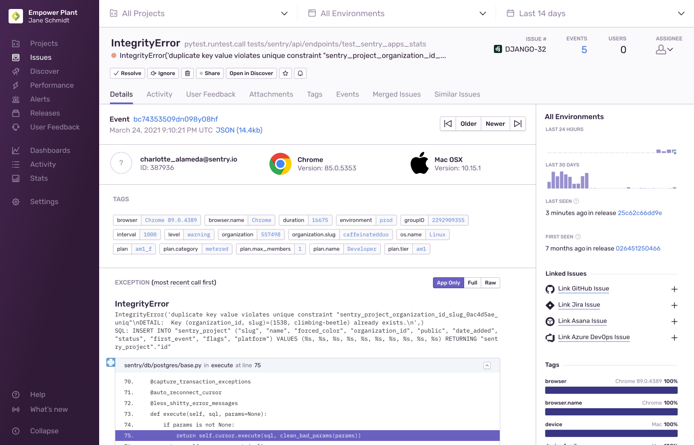
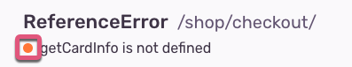

An _error issue_ is a grouping of error events. What counts as an error varies by platform, but in general, if there's something that looks like an exception, it can be captured as an error in Sentry. Sentry automatically captures errors, uncaught exceptions, and unhandled rejections, as well as other types of errors, depending on platform. We group similar error events into issues based on a fingerprint. For error issues, a fingerprint is primarily defined by the event stack trace.

The **Issue Details** page helps you to gain further insight into the source of an error issue and the impact it has on your application's users. The main area of the page displays information about a specific error event that's part of an issue. The top panel and right-hand sidebar of the page display a summary of all the error events grouped together in this issue:

While the <SandboxLink scenario="oneIssue" projectSlug="react">Issue Details</SandboxLink> page displays information about a specific error event that's part of an issue, you can navigate between the events of an issue using the "Older" and "Newer" buttons. Subscribe to an error issue by clicking the bell icon and fine tune [workflow notifications](/product/alerts/notifications/#workflow-notifications) related to the issue in **User Settings > Notifications**. Just below the issue title, the event description is displayed along with an icon representing the error level of the event:

The level can be:

- Error - orange
- Info - blue
- Warning - yellow
- Fatal - red
- Debug - gray
- Sample - purple

In the right hand sidebar, [sentry.io](https://sentry.io) reflects a summary that includes information such as how often the error <SandboxLink scenario="oneIssue" projectSlug="react">issue</SandboxLink> has occurred in the last 24 hours and the last 30 days, as well as the last time and the first time the issue was seen. If the issue is linked to any GitHub or Jira issues, that's displayed here as well. You can also use this section to link to existing GitHub or Jira issues. Learn more about linking issues in [Integrations](/product/integrations/). Lastly, there is a facet map, which shows the distribution of values for the tags for all events included in the error issue. All of these values are based on the environment that you've selected in the environment dropdown.

In addition, this page provides several other key pieces of information explained below.

## Trace Navigator

The trace navigator (which displays below the date) is an abbreviated view of the related [trace](/product/sentry-basics/tracing/distributed-tracing) for the current transaction. It displays up to six nodes, each representing different groups of the event's trace:

- **Root**: Starting transaction
- **Ancestor**: Events that are descendants of the root, and are directly related to the current event
- **Parent**: Event that directly started the current event
- **This Event**: Node representing the current event being viewed
- **Children**: Events that the current event directly started
- **Descendants**: Future generations of events created by children of this event

A node will be red if it is associated with errors.
Click "View Full Trace" to display the [Trace View](/product/sentry-basics/tracing/trace-view).

## Suspect Commits

A _suspect commit_ is a commit that's been identified as potentially having caused the error event. If you've configured [suspect commits](/product/issues/suspect-commits/), these are displayed. This allows you to immediately investigate commits that are likely to have generated the issue. The author of the suspect commit is also suggested as an assignee for the error issue.

## Tags

[Tags](/product/sentry-basics/search/) are key/value string pairs that are both indexed and searchable. For example, a tag provides you with information such as the browser, device, or user associated with the event. Tags are the diagnostic information sent by the SDK for the individual event.

The tags displayed in the main section of this page are specific to the event that you're viewing. In contrast, the tags displayed in the right-hand sidebar are a summary of all tag values for all events included in the issue. You can set your own tags to make them more useful for debugging as described in <PlatformLink to="/enriching-events/tags/">Customize Tags</PlatformLink>.

## Screenshot

Sentry provides the ability to take a screenshot and include it as an attachment when a user experiences an error, an exception or a crash. Screenshot attachments sent as a part of an event are displayed in this section. This feature only applies to SDKs with a user interface. It's supported for the following SDKs:

- [.NET Xamarin](/platforms/dotnet/guides/xamarin/)
- [Android](/platforms/android/enriching-events/screenshots/)
- [Flutter](/platforms/flutter/enriching-events/screenshots/)
- [iOS](/platforms/apple/guides/ios/enriching-events/screenshots/)
- [JavaScript Electron](/platforms/javascript/guides/electron/enriching-events/screenshots/)
- [Unity](/platforms/unity/enriching-events/screenshots/)

## Exception (Stack Trace)

The "Exception" section of the page displays the stack trace, which shows you the line of code that the event errored on:

It's the most important piece of information that the Sentry grouping algorithm uses to group events into one error issue. You can also customize how error events are grouped. Learn more about customized grouping in [Issue Grouping](/product/data-management-settings/event-grouping/).

## Breadcrumbs

[Breadcrumbs](/product/issues/issue-details/breadcrumbs/) provide a history and timeline leading up to the error event. These can include things like HTTP requests, log statements from the console or server, and DOM (document object model) events in JavaScript:

You can set your own <PlatformLink to="/enriching-events/breadcrumbs/">breadcrumbs</PlatformLink> to make them more useful for debugging.

If you’ve enabled [Session Replay](/product/session-replay/), you’ll see a replay preview under Breadcrumbs if there’s one associated with the frontend error event you’re viewing. This will lead you to the [Replay Details](/product/session-replay/replay-details/) page when you click it.

## Trace Details

[Tracing](/product/sentry-basics/tracing/distributed-tracing/) augments your existing error data by capturing interactions between your software systems. In the "Trace Details" section, you can click the "Search by Trace" button to see all the events that share the same trace ID.

## Event Grouping Information

The "Event Grouping Information" section provides details of how Sentry fingerprinted the event into the group. You can see which parts of the stack trace contributed to the fingerprint as well as all values that were available. You can also use the "Grouping Config" dropdown to experiment with other grouping algorithms.
