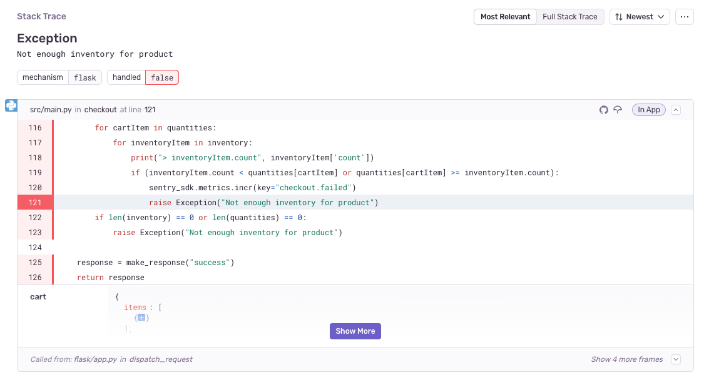
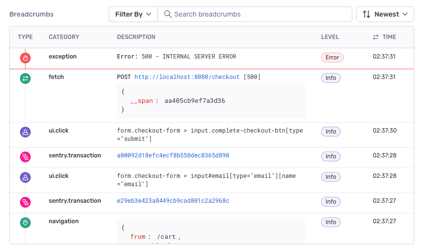

The **Issue Details** page helps you to gain further insight into the source of the issue and the impact it has on your application's users. The main area of the page displays information about a specific event that's part of an issue. The top panel and right-hand sidebar of the page display a summary of all the events grouped together in this issue:

While the <SandboxLink scenario="oneIssue" projectSlug="react">Issue Details</SandboxLink> page displays information about a specific event that's part of an issue, you can navigate between the events of an issue using the "Older" and "Newer" buttons.

In the right hand sidebar, [sentry.io](https://sentry.io) reflects a summary that includes information such as how often the <SandboxLink scenario="oneIssue" projectSlug="react">issue</SandboxLink> has occurred in the last 24 hours and the last 30 days, as well as the last time and the first time the issue was seen. If the issue is linked to any GitHub or Jira issues, that's displayed here as well. Lastly, there is a facet map, which shows the distribution of values for the tags for all events included in the issue. All of these values are based on the environment that you've selected in the environment dropdown.

## Issue Categories & Page Details

There are two categories of issues: [error issues](/product/issues/issue-details/error-issues/) and [performance issues](/product/issues/issue-details/performance-issues/). Depending on the issue category and available event data, the **Issue Details** page displays some combination of the following sections:

- **Event Dropdown** - Allows you to select a specific event from the issue to view.
- **Trace Navigator** - An abbreviated view of the related [trace](/product/sentry-basics/tracing/distributed-tracing) for the current transaction.
- **Suspect Commits** - A commit that's been identified as potentially having caused an error event.
- **Tags** - Searchable key/value string pairs providing information such as the browser or device.
- **Screenshot** - Screenshot taken when a user experiences an error, an exception or a crash; only available on [certain SDKs](/product/issues/issue-details/error-issues/#screenshots).
- **Exception (Stack Trace)** - Shows you the line of code that the event errored on.
- **Span Evidence** - Information about the performance problem in the context of the current event
- **Breadcrumbs** - Provide a history and timeline leading up to the error event and are customizable.
- **Trace Details** - Augments existing error data by capturing interactions between your projects.
- **Event Grouping Information** - Provides details of how Sentry fingerprinted the event into the group.

Learn more about what's included an issue detail for each of these in [Error Issues](/product/issues/issue-details/error-issues/) and [Performance Issues](/product/issues/issue-details/performance-issues/).
In addition, this page provides several other key pieces of information.

## Event Dropdown

By default, the **Issue Details** page displays the "Recommended" event with the most context to help you solve the issue. Sentry uses the following criteria in determining the recommended event:

- **Recency**: The recommended event is never more than 7 days older than the lastest event.
- **Relevence**: The recommended event takes into account what terms you've searched for on your way to the issue.
- **Content**: The recommended event prioritizes events that contain debugging tools such as replays, profiles, and traces.

To view other events, you can use the dropdown to skip to the latest or oldest event, or view the full list of events. You can change the default event in your [User Settings](https://sentry.io/settings/account/details/#defaultIssueEvent).
 
## Trace Navigator

The trace navigator (which displays below the date) is an abbreviated view of the related [trace](/product/sentry-basics/tracing/distributed-tracing) for the current transaction. It displays up to six nodes, each representing different groups of the event's trace:

- **Root**: Starting transaction
- **Ancestor**: Events that are descendants of the root, and are directly related to the current event
- **Parent**: Event that directly started the current event
- **This Event**: Node representing the current event being viewed
- **Children**: Events that the current event directly started
- **Descendants**: Future generations of events created by children of this event

A node will be red if it is associated with errors.
Click "View Full Trace" to display the [Trace View](/product/sentry-basics/tracing/trace-view).

## Suspect Commits

A _suspect commit_ is a commit that's been identified as potentially having caused the error event. If you've configured [suspect commits](/product/issues/suspect-commits/), these are displayed. This allows you to immediately investigate commits that are likely to have generated the issue. The author of the suspect commit is also suggested as an assignee for the issue.

## Tags

[Tags](/product/sentry-basics/search/) are key/value string pairs that are both indexed and searchable. For example, a tag provides you with information such as the browser, device, or user associated with the event. Tags are the diagnostic information sent by the SDK for the individual event.

The tags displayed in the main section of this page are specific to the event that you're viewing. In contrast, the tags displayed in the right-hand sidebar are a summary of all tag values for all events included in the issue. You can set your own tags to make them more useful for debugging as described in <PlatformLink to="/enriching-events/tags/">Customize Tags</PlatformLink>.

## Exception (Stack Trace)

The Exception section of the page displays the stack trace, which shows you the line of code that the event errored on.

It's the most important piece of information that the Sentry grouping algorithm uses to group events into one issue. You can also customize how events are grouped. Learn more about customized grouping in [Issue Grouping](/product/data-management-settings/event-grouping/).

## Breadcrumbs

[Breadcrumbs](/product/issues/issue-details/breadcrumbs/) provide a history and timeline leading up to the error event. These can include things like HTTP requests, log statements from the console or server, and DOM (document object model) events in JavaScript.

You can set your own <PlatformLink to="/enriching-events/breadcrumbs/">breadcrumbs</PlatformLink> to make them more useful for debugging.

If you’ve enabled [Session Replay](/product/session-replay/), you’ll see a replay preview under Breadcrumbs if there’s one associated with the event you’re viewing. This will lead you to the [Replay Details](/product/session-replay/replay-details/) page when you click it.

## Trace Details

[Tracing](/product/sentry-basics/tracing/distributed-tracing/) augments your existing error data by capturing interactions between your software systems. In the "Trace Details" section, you can click the "Search by Trace" button to see all the events that share the same trace ID.

## Tabs

This page displays the "Details" tab when it first opens, but several other tabs are available depending on issue category:

- **Activity** - A history of activity for the event where team members can share comments.
- **User Feedback** - Any feedback collected from users through the <PlatformLink to="/enriching-events/user-feedback/">SDK's user feedback</PlatformLink>.
- **<PlatformLink to="/enriching-events/attachments/">Attachments</PlatformLink>** - Stored additional files, such as config, log or screenshot files that are related to the error event.
- **Tags** - More detailed information about the tags across all the events included in the issue.
- **All Events** - A list of all the error events included in the issue.
- **Merged Issues** - A list of error issues that have been merged with this one.
- **Similar Issues** - A list of error issues that have a similar stack trace [that you can merge](/product/data-management-settings/event-grouping/merging-issues/).
- **Replays** – A list of [replays](/product/session-replay/) tied to error events included in the issue.
