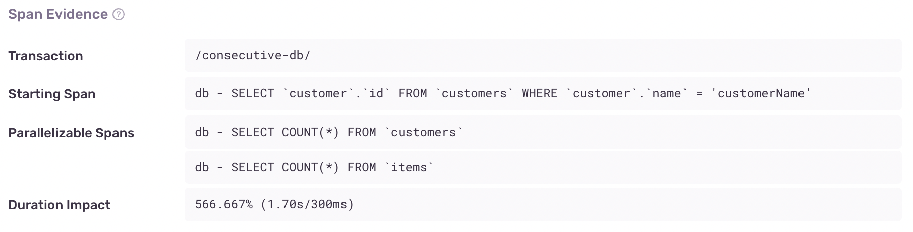
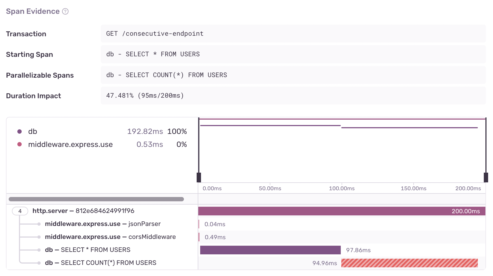
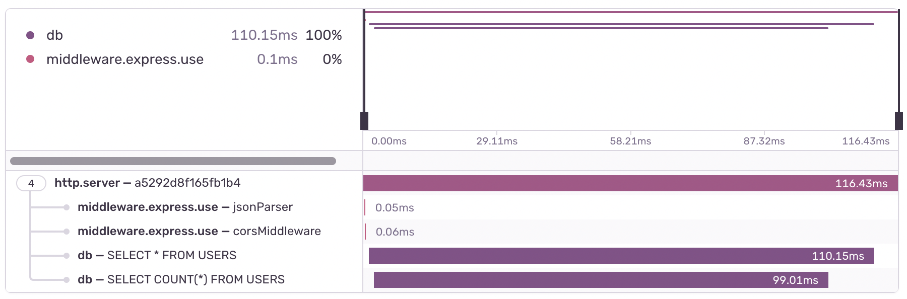

Consecutive DB Queries are a sequence of database spans where one or more have been identified as parallelizable, in other words, spans that can be shifted to the start of the sequence. This often occurs when a DB query performs no filtering on the data, for example a query without a WHERE clause.

## Detection Criteria

The detector for this performance issue looks for a set of sequential, non-overlapping database spans. Within this set of spans, it proceeds to look for queries that are parallelizable, which occurs when the following is true about the query:

- It doesn't contain a `WHERE` clause
- It's a `SELECT` query
- There are no parameters in the query
- It's not the first query in a set of sequential spans

Once these spans are found, the following must also hold true:

- Maximum time saved from parallelization must exceed a 100ms threshold
- Ratio between the maximum time saved and the duration of the sequential spans must exceed a 0.1 threshold
- Total duration of each parallelizable span must exceed a 30ms threshold

If Sentry isn't detecting a Consecutive DB issue where you expect one, it's probably because the transaction didn't meet one of the above criteria.

## Span Evidence

You can identify a Consecutive DB queries problem by four main aspects in the "Span Evidence" section:

- Transaction name
- Starting Span - The first span in a set of consecutive spans
- Parallelizable Spans - The spans that can be parallelized
- Duration Impact - The fraction of time added to the total transaction time as a result of spans not being ran in parallel



View it by going to the **Issues** page in Sentry, selecting your project, clicking on the Consecutive DB Queries error you want to examine, then scrolling down to the "Span Evidence" section in the "Details" tab.

## Example

Consider using this Node.js code when counting and retrieving all the users from a database

```javascript
const result = await db.query('SELECT * FROM USERS');
const count = await db.query('SELECT COUNT(*) FROM USERS');
processMyData({result, count});
```

This results in a consecutive DB performance issue. You'll notice these queries occur sequentially in the span tree,
but they aren't interdependent because the result of one doesn't affect the other. Therefore, they can be executed in parallel.



To fix this performance issue, you could use Promise.all():

```javascript
const [result, count] = await Promise.all([
  db.query('SELECT * FROM USERS'),
  db.query('SELECT COUNT(*) FROM USERS'),
]);
processMyData({result, count});
```

This makes the queries execute in parallel, which in this case, reduced the transaction duration by almost half!


