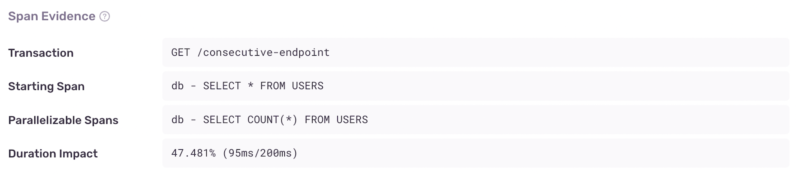

<Include name="early-adopter-note.mdx" />

Consecutive DB Queries are a sequence of database spans where one or more have been identified as parallelizable, or in other words, spans that may be shifted to the start of the sequence. This often occurs when a db query performs no filtering on the data, for example a query without a WHERE clause. To learn more about how to fix consecutive DB queries, check out these resources:

## Detection Criteria

The detector for this performance issuee looks for a set of sequential, non-overlapping database spans (consecutive spans). Within this set of spans, it proceeds to look for queries that are parallelziable, which occurs when all following criteria is true about the query.

- It does not contain a WHERE clause
- It is a SELECT query
- There is no parameters in the query
- It is not the first query in the set of sequential spans

Once these spans are found, they following criteria must also hold true:

- Maximum time saved from parallelization must exceed a threshold
- Total duration of each parallelizable span must exceed a threshold

If Sentry is not detecting a Consecutive DB issue where you expect one, it's probably because the transaction didn't meet one of the above criteria.

## Span Evidence

The evidence for a Consecutive DB queries problem has four main aspects:

- Transaction name
- Starting Span - This is the first span in the set of consecutive spans
- Parallelizable Spans - These are the spans that can be parallelized
- Duration Impact - This is the fraction of time added to the total transaction time as a result of spans not being ran in parallel.



## Example

Consider this node code where you're retriving all the users from a database, and a count of all the users

```javascript
  const result = await db.query("SELECT * FROM USERS");
  const count = await db.query("SELECT COUNT(*) FROM USERS");
  processMyData({ result, count });
```

This results in a consecutive db performance issue, we'll notice in the span tree these queries occur sequentially,
but they don't depend on each other, we aren't using the result of one in the other, and can therefore execute in parallel.


In order to fix this performance issue, you could use Promise.all():

```javascript
  const [result, count] = await Promise.all([
    db.query("SELECT * FROM USERS"),
    db.query("SELECT COUNT(*) FROM USERS"),
  ]);
  processMyData({ result, count });
```

This results in the queries executing in parallel, and in this case it reduced the transaction duration by almost half!


