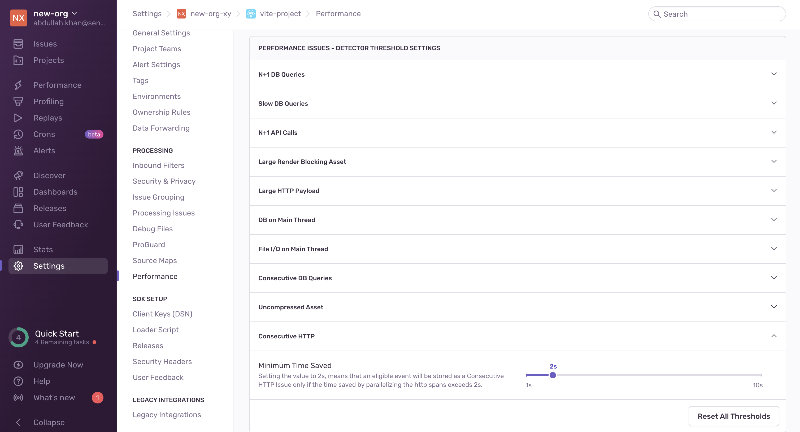
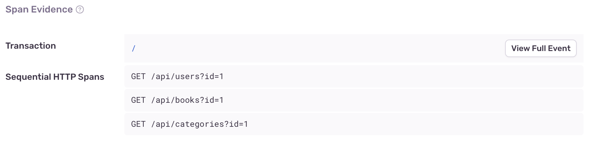

Consecutive HTTP issues are created when a set of sequential HTTP spans consistently exceeds 1000ms.

## Detection Criteria

<Note>

This issue is currently only available for backend and mobile SDKs.

</Note>

The detector for this performance issue looks for a set of sequential, non-overlapping HTTP spans. It intentionally ignores non-HTTP spans because the browser commonly performs other asynchronous operations, such as loading resources between HTTP spans.

Once this sequence is found, the following must hold true for each HTTP span:

- The HTTP method must be a GET, POST, DELETE, PUT, or PATCH
- The HTTP URL must not begin with \_next/static/ or \_next/data/

Once these spans are found, the following must also hold true:

- Minimum time saved from parallelization must exceed `2000ms`
- The duration of each HTTP span must exceed a threshold of `900ms`.
- The time between each HTTP span must not exceed a threshold of `500ms`.
- The number of sequential HTTP spans must exceed a threshold of `3`.

If Sentry doesn't detect a Consecutive HTTP issue where you expect one, it's probably because the transaction didn't meet one of the above criteria.

You can configure detector thresholds for consecutive HTTP issues in **Project Settings > Performance**:

## Span Evidence

You can find additional information about your Consecutive HTTP issue by looking at two main aspects in the "Span Evidence" section:

- **Transaction name**
- **Sequential HTTP Spans**

You can view the span evidence by going to the **Issues** page in Sentry, selecting your project, selecting the Consecutive HTTP Queries error you want to examine, then scrolling down to the "Span Evidence" section in the "Details" tab.

## Fixing Consecutive HTTP Issues

The causes of Consecutive HTTP issues vary, but here are some suggestions to help you resolve them:

- If your HTTP spans are independent, consider parallelizing them so they're no longer sequential.
- If you have control over the backend, consider optimizing your endpoints for this specific use case. You can investigate corresponding backend transactions to help identify potential improvements.
