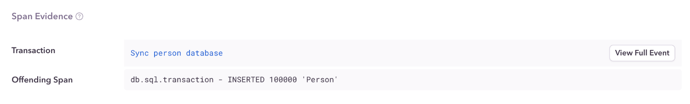

<Note>

This feature is available **only for iOS devices** using `sentry-cocoa` >= v8.5.0. We are working on adding support for Android devices and will update this page with the latest changes.

</Note>

The main UI thread in a mobile application handles user interface events such as button presses and page scrolls. To prevent App Hangs and Application Not Responding errors, the main UI thread shouldn't be used for performing long-running operations like database queries. These kinds of operations block the whole UI until they finish running and get in the way of the user interacting with the app.

## Detection Criteria

The detector for this performance issue looks at the total non-overlapping duration for database spans on the main thread. If it exceeds 16ms, a Performance Issue is created.

## Span Evidence

Span evidence identifies the root cause of the Database on Main Thread problem by showing you three main aspects:

- **Transaction name**
- **Parent Span:** Where the database spans occurred
- **Offending Span:** The actual spans that are performing database queries in the main thread

View it by going to the **Issues** page in Sentry, selecting your Android project, clicking on the database error you want to examine, then scrolling down to the "Span Evidence" section in the "Details" tab.
