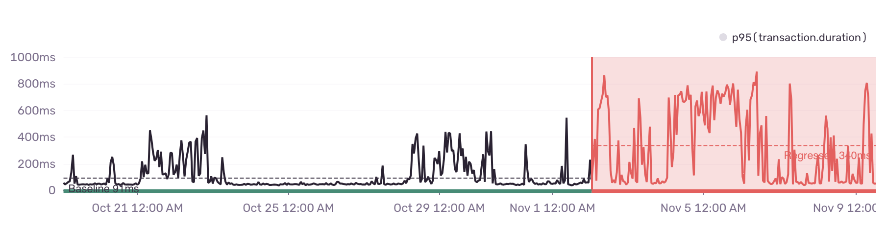

<Include name="feature-available-for-user-group-early-adopter.mdx" />

Endpoint Regression issues are a generic class of problems where the duration of a transaction increases over time and degrades application performance. Sentry proactively monitors common endpoints out of the box and reports any possible regressions, grouping them as Endpoint Regression issue types.

## Detection Criteria

The detector for performance issues periodically checks the 95th percentile transaction duration of the most common endpoints in your project. When a significant increase in the p95 value is detected and has been sustained for some time, a regression issue is created.

## Regression Evidence

To find additional information about your regressed endpoint, go to the top section which shows the following:

- **Endpoint Name:** The name of the transaction that has regressed.
- **Change in Duration:** The value of absolute and relative change in duration.
- **Approximate Start Time:** The approximate time when the regression occurred.

## Charts

The below chart shows the p95 transaction duration as well as the transaction throughput over a period of up to 14 days before and 14 days after the regression was identified.

## Potential Causes

The "Potential Causes" section shows a list of spans that might have contributed to the slow down the most. Next to each span, you can find the following:

- Span description that leads to the [Span Summary](/product/performance/transaction-summary/) page where you can find more data about that specific span.
- Throughput of that span before and after the observed change in duration.
- P95 of that span self time before and after the observed change in duration.

## Compare Events

The "Compare Events" section shows example events before and after the regression took place. Baseline events are events that have duration close to the original baseline P95 duration and regressed events have duration close to the new p95 baseline.
The "Compare Events" section lets you compare example events from before and after the regression occurred. We consider events to be part of the "Baseline events" when their duration is close to the original P95 duration. We refer to the events that have a duration close to the newest P95 baseline as "Regressed events".
