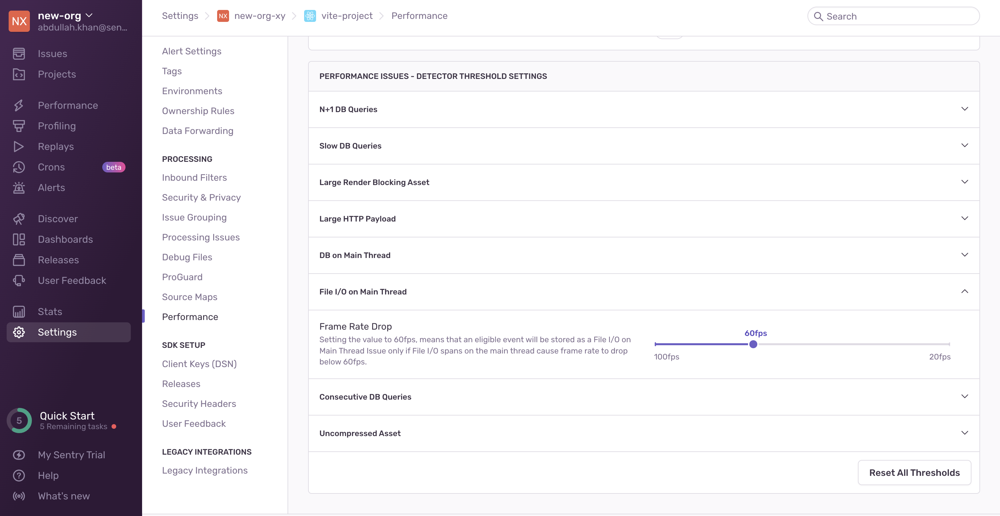

The main UI thread in a mobile application handles user interface events such as button presses and page scrolls. To prevent App Hangs and Application Not Responding errors, the main UI thread should not be used for performing long-running operations like File I/O. These kinds of operations block the whole UI until they finish running and get in the way of the user interacting with the app.

## Detection Criteria

The detector for this performance issue looks at the total non-overlapping duration for file I/O spans. If it exceeds 16ms, a performance issue is created.

You can configure detector thresholds for file I/O on main thread issues in **Project Settings > Performance**:



## Span Evidence

Span evidence identifies the root cause of the File I/O on main thread problem by showing you three main aspects:

- Transaction name
- Parent Span - Where the File I/O spans occurred
- Offending Span - The actual spans that are performing File I/O in the main thread


View it by going to the **Issues** page in Sentry, selecting your Android project, clicking on the File I/O error you want to examine, then scrolling down to the "Span Evidence" section in the "Details" tab.

## Example

Here are two examples of how a File I/O error may appear in your code if you're using Swift or Kotlin and how you might solve them.

This is what you might see when you're opening a file to get its contents if you're using Swift:

```swift
if let path = Bundle.main.path(forResource: "LoremIpsum", ofType: "txt") {
    let content = String(contentsOfFile: path)
    label.text = content
}
```

In order to fix this performance issue, you could use a dispatch queue:

```swift
let dispatchQueue = DispatchQueue(label: "ViewController", attributes: .concurrent) {
    dispatchQueue.async {
        if let path = Bundle.main.path(forResource: "LoremIpsum", ofType: "txt") {
            let content = String(contentsOfFile: path)
                DispatchQueue.main.async {
                    label.text = content
                }
        }
    }
}
```

This is what you might see if you're using Kotlin:

```kotlin
val file = File(context.cacheDir, "LoremIpsum.txt")
val content = file.readText()
```

In order to fix this performance issue you can initialize another thread to read the file instead.

```kotlin
suspend fun readFile(): String = withContext(Dispatchers.IO) {
    val file = File(context.cacheDir, "LoremIpsum.txt")
    val content = file.readText()
    return content
}
```
