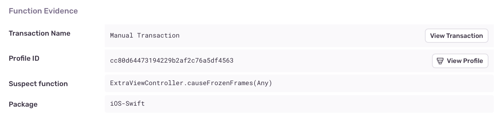
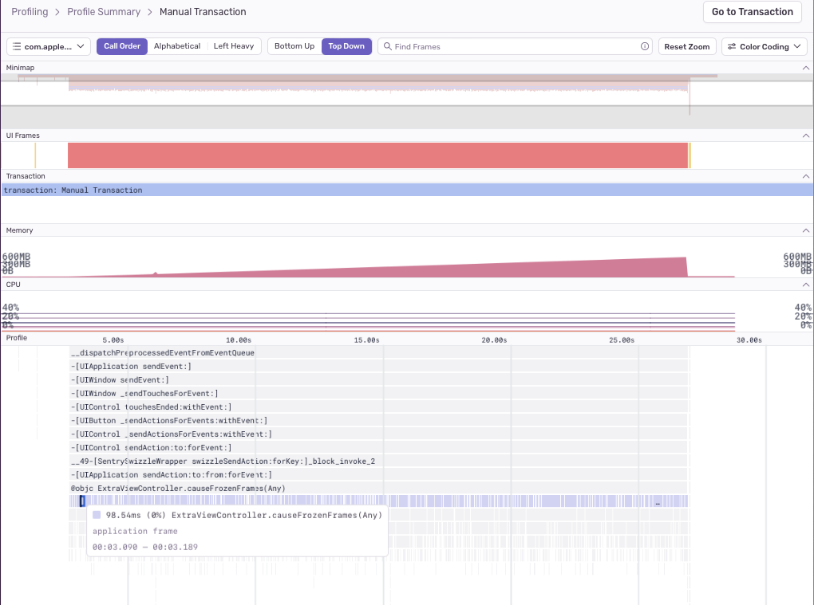
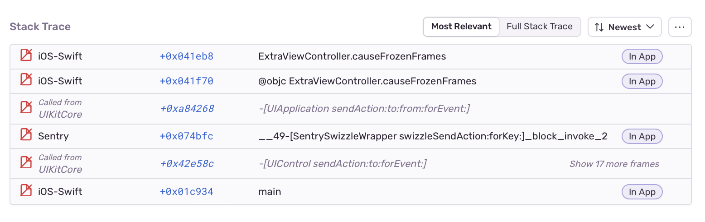

The main (or UI) thread in a mobile app is responsible for handling all user interaction and needs to be able to respond to gestures and taps in real time. If a long-running operation blocks the main thread, the app becomes unresponsive, impacting the quality of the user experience.

We can detect some specific causes for a main thread stall, like decoding [images](https://docs.sentry.io/product/issues/issue-details/performance-issues/image-decoding-main-thread/) or [JSON](https://docs.sentry.io/product/issues/issue-details/performance-issues/json-decoding-main-thread/), or [searching strings with regexes](https://docs.sentry.io/product/issues/issue-details/performance-issues/regex-main-thread/), but there are many other things that could cause a stall. If a main thread stall causes your app to drop UI frames, but doesn't match one of our specific detectors, Sentry reports it under the generic Frame Drop issue type.

## Detection Criteria

[Profiling](/product/profiling/) must be enabled for Sentry to detect Frame Drop issues. Once set up, Sentry will look for profiles that record a frozen UI frame and then search for the application function call occupying the majority of time that the display link waited to draw the frozen frame. If multiple functions simply call through to the next, the deepest call is chosen.

## Function Evidence

To find additional information about your Frame Drop problem, go to its **Issue Details** page and scroll down to the "Function Evidence" section, which shows the following:

- **Transaction Name:** The name of the transaction where the issue was detected.
- **Suspect Function:** The function that triggered the issue detection.
- **Duration:** How long the function took to execute and the number of consecutive samples collected by the profiler that contained the function.



To view the entire profile associated with the issue, click the “View Profile” button.

The profile will indicate where the suspect function was called from, along with other functions being called _by_ the suspect function:



## Stack Trace

The “Stack Trace” section shows a full stack trace view, highlighting the long-running function frame:



## Example

### iOS

The following code executes a long-running `while` loop on the main thread:

```objective-c
// given an array of number strings...

NSMutableOrderedSet<NSString *> *sortedEvenNumbers = [NSMutableOrderedSet<NSString *> orderedSet];
[numbers enumerateObjectsUsingBlock:^(NSString * _Nonnull obj, NSUInteger __unused idx, BOOL * _Nonnull __unused stop) {
    if (obj.integerValue % 2 == 0) {
        [sortedEvenNumbers addObject:obj];
    }
}];
```

Performance could be improved by moving the long computation off of the main thread. The simplest approach is dispatching it to a lower Quality of Service (QoS) queue (or `NSOperationQueue`):

```objective-c {tabTitle:Dispatch to Background Queue}
// given an array of number strings...

NSMutableOrderedSet<NSString *> *sortedEvenNumbers = [NSMutableOrderedSet<NSString *> orderedSet];
dispatch_async(dispatch_get_global_queue(QOS_CLASS_UTILITY, 0), ^{
    [numbers enumerateObjectsUsingBlock:^(NSString * _Nonnull obj, NSUInteger __unused idx, BOOL * _Nonnull __unused stop) {
        if (obj.integerValue % 2 == 0) {
            [sortedEvenNumbers addObject:obj];
        }
    }];
});
```

Another avenue to consider for loops is to parallelize iterations. There are several options for doing this:

1. If you're iterating through a Foundation collection, you may already be using `enumerateObjects` or `enumerateKeysAndObjects`. Change this to `-[NSArray|NSSet|NSOrderedSet enumerateObjectsWithOptions:usingBlock:]` or `-[NSDictionary enumerateKeysAndObjectsWithOptions:usingBlock:]`, with option `NSEnumerationConcurrent`. Note that modifying the collection from inside the block will result in an exception being thrown. This is roughly equivalent to dispatching each iteration of the loop body to a concurrent GCD queue.

1. Use `dispatch_apply` to perform iterations of a general loop on a concurrent queue.

```objective-c {tabTitle:Foundation Collection Concurrent Enumeration}
// given an array of number strings...

NSMutableOrderedSet<NSString *> *sortedEvenNumbers = [NSMutableOrderedSet<NSString *> orderedSet];
[numbers enumerateObjectsWithOptions:NSEnumerationConcurrent usingBlock:^(NSString * _Nonnull obj, NSUInteger __unused idx, BOOL * _Nonnull __unused stop) {
    if (obj.integerValue % 2 == 0) {
        [sortedEvenNumbers addObject:obj];
    }
}];
```

```objective-c {tabTitle:dispatch_apply}
// given an array of number strings...

NSMutableOrderedSet<NSString *> *sortedEvenNumbers = [NSMutableOrderedSet<NSString *> orderedSet];
dispatch_apply(numberOfNumbers, dispatch_get_global_queue(QOS_CLASS_UTILITY, 0), ^(size_t iteration) {
    NSString *number = numbers[iteration];
    if (number.integerValue % 2 == 0) {
        [sortedEvenNumbers addObject:number];
    }
});
```

Keep in mind that concurrent solutions require analysis of thread safety for the code you're parallelizing. You may need to `@synchronize` critical sections, use semaphores, or dispatch back to a serial queue (or the main queue for UI work). Note that both `enumerateObjects...` and `dispatch_apply` are synchronous and won't return until all iterations have completed. Dispatch their invocation asynchronously off the main queue to avoid waiting.
