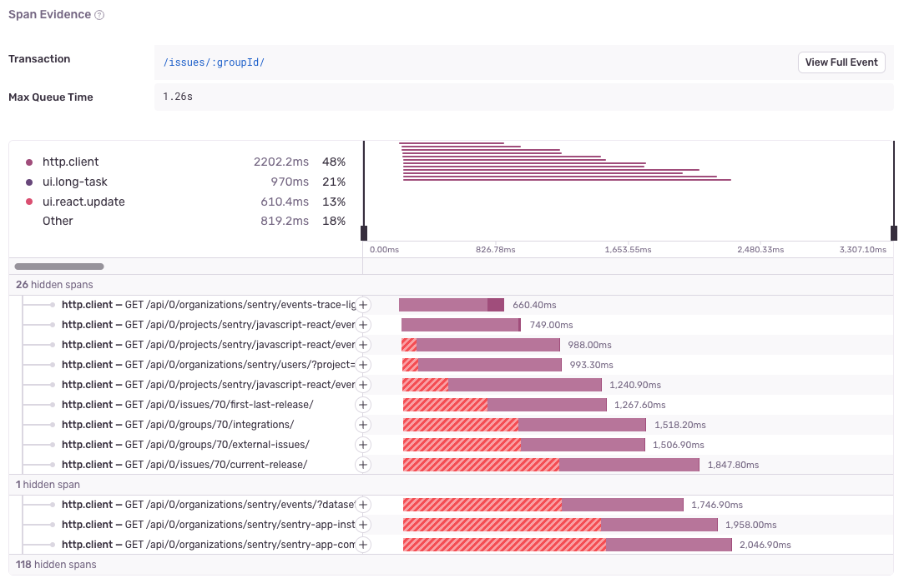

HTTP/1.1 overhead issues are created when a set of overlapping HTTP spans for the same host are queued by the browser and have a queue time that consistently exceeds 500ms.

## Detection Criteria

<Note>

This issue is currently only available for browser SDKs.

</Note>

The detector for this performance issue looks for a set of overlapping HTTP/1.1 spans that are getting slower because the request itself is being delayed. This is a problem for HTTP/1.1 because of browser connection limits.

Once these spans are found, the following must hold true:

- The max queue or 'wait' time reached by the slowest span in the set must exceed a threshold of `500ms`.
- There must be `6` or more overlapping HTTP spans.
- Each HTTP span must be using `HTTP/1.1`.
- The queue time must be increasing for each new HTTP span.
- All spans must share a common host (with the HTTP connection either coming from the same origin, or the same domain name).

All HTTP spans experience some wait time and will be included in the detection, but only HTTP spans over `100ms` will be marked as 'offending' and will show up in the span evidence.

If Sentry doesn't detect an HTTP overhead issue where you expect one, it's probably because the transaction didn't meet one of the above criteria.

You can configure detector thresholds for HTTP overhead issues in **Project Settings > Performance**.

## Span Evidence

You can find additional information about your Consecutive HTTP issue by looking at two main aspects in the "Span Evidence" section:

- **Transaction name**
- **Max Queue Time**

You can view the span evidence by going to the **Issues** page in Sentry, selecting your project, selecting the HTTP overhead error you want to examine, then scrolling down to the "Span Evidence" section in the "Details" tab.

## How to Fix HTTP Overhead

HTTP Overhead issues can be solved by upgrading to allow HTTP/2 or higher connections to your backend. This would involve your load balancers if you have them in front of your servers, or your server if it can be accessed directly. Since this may not always be possible, other options are to perform domain sharding, or reduce the number of simultaneous requests to your backend, but these solutions are more manual and harder to maintain over time.
