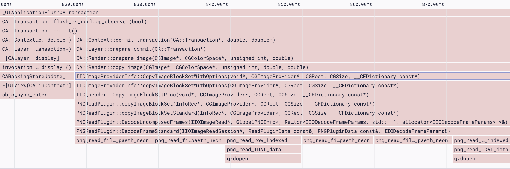

The main (or UI) thread in a mobile app is responsible for handling all user interaction and needs to be able to respond to gestures and taps in real time. If a long-running operation blocks the main thread, the app becomes unresponsive, impacting the quality of the user experience.

The process of decoding a compressed JPEG or PNG image into a bitmap (especially for large images), is an example of a long-running operation that may impact app responsiveness. If a long-running image decoding operation is detected on the main thread, Sentry will flag it as an issue.

## Detection Criteria

[Profiling](/product/profiling/) must be enabled for Sentry to detect Decoding on Main Thread issues. Sentry looks for functions related to image-decoding that have been running on the main thread for at least 40ms. This threshold ensures the function appears in a sufficient number of samples collected by the profile (~10ms per sample x 4 = ~40ms total), before it gets detected as an issue.

## Function Evidence

To find additional information about your Image Decoding on Main Thread problem, go to its **Issue Details** page and scroll down to the "Function Evidence" section, which shows the following:

- **Transaction Name:** The name of the transaction where the issue was detected.
- **Suspect function:** The function that triggered the issue detection (in this case, an image decoding function).
- **Duration:** How long the function took to execute and the number of consecutive samples collected by the profiler that contained the function.


To view the entire profile associated with the issue, click the “View Profile” button.

The profile will indicate where the suspect function was called from, along with other functions being called _by_ the suspect function:



## Stack Trace

The “Stack Trace” section shows a full stack trace for where the detected image decoding function was called from:


## Example

### iOS

The following code renders an image by setting the `image` property of `UIImageView` . The image isn't decoded when `UIImage.init(data:)` is called, but when the image is rendered on screen, which happens on the main thread.

```swift
func showImage(data: Data) {
	imageView.image = UIImage(data: data)
}
```

Performance could be improved by using `[UIImage.preparingForDisplay()](https://developer.apple.com/documentation/uikit/uiimage/3750834-preparingfordisplay)` to prepare the image for display on a background queue, before assigning the image to the image view on the main queue:

```swift
func showImage(data: Data) {
	DispatchQueue.global(qos: .userInitiated).async {
		let image = UIImage(data: data).preparingForDisplay()
		DispatchQueue.main.async {
			imageView.image = image
		}
	}
}
```

### Android

The following code calls `BitmapFactory.decodeByteArray` on the UI thread to decode an image and render it in an `ImageView`:

```kotlin
fun showImage(data: ByteArray) {
	imageView.setImageBitmap(BitmapFactory.decodeByteArray(data, 0, data.size))
}
```

Performance could be improved by moving the image decoding to a coroutine:

```kotlin
fun showImage(data: ByteArray) {
	lifecycleScope.launch(Dispatchers.IO) {
	  val bitmap = BitmapFactory.decodeByteArray(data, 0, data.size)

    withContext(Dispatchers.Main) {
      imageView.setImageBitmap(bitmap)
    }
  }
}
```
