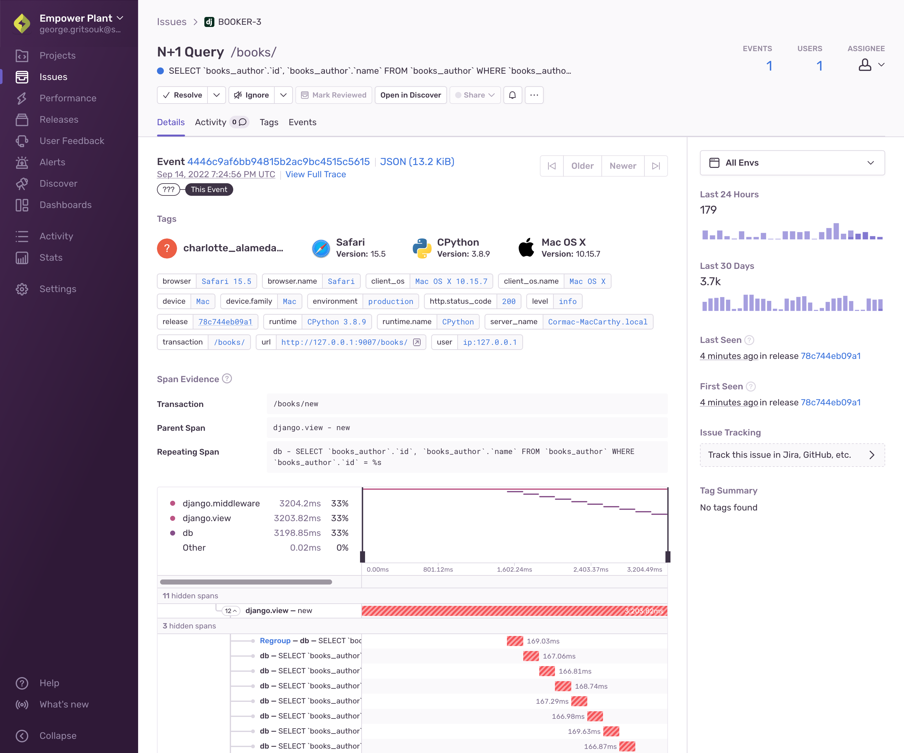

A _performance issue_ is a grouping of transaction events that are performing poorly. If your application is configured for [Performance Monitoring](/product/performance/), Sentry will detect common performance problems, and group them into issues. We group similar transaction events into issues based on a fingerprint. For performance issues, a fingerprint is primarily based on the problem type and the spans involved in the problem.

The **Issue Details** page helps you to gain further insight into the source of a performance issue and the impact it has on your application's users. The main area of the page displays information about a specific transaction event that's part of an issue. The top panel and right-hand sidebar of the page display a summary of all the transaction events grouped together in this issue:

<Note>

You can find performance issues by searching `issue.category:performance` in **Issues** and **Dashboards**.

</Note>

While the **Issue Details** page displays information about a specific transaction event that's part of an issue, you can navigate between the events of an issue using the "Older" and "Newer" buttons. On this page, you'll see information about the performance issue as well as the details of the most recent transaction event. The page also displays a summary of when the issue was seen, as well as a breakdown of the tags, span evidence, and breadcrumbs if they are available.

## How Performance Issues Work

Sentry detects performance issues by scanning incoming transaction events. First we check various properties of the transaction (span durations, span arrangement, span types, and so on) to detect likely problems. We then check these properties against corresponding thresholds to determine whether a performance issue exists. Lastly, we generate a unique problem fingerprint based on the problem type and location in the application, and use that fingerprint to create a performance issue.

## Tags

Tags are key/value string pairs that are both indexed and searchable. For example, a tag provides you with information such as the browser, device, or user associated with the event. Tags are the diagnostic information sent by the SDK for the individual event.

The tags displayed in the main section of this page are specific to the event that you're viewing. In contrast, the tags displayed in the right-hand sidebar are a summary of all tag values for all events included in the issue. You can set your own tags to make them more useful for debugging as described in Customize Tags.

## Span Evidence

Span evidence is information that explains the performance problem in the context of the current event. It may include details like the specific database queries that cause the problem, the spans that contain the problem, and the slow spans that have an impact on performance. This section also has a span tree which shows how the problematic spans relate to the rest of the event. Different performance problems will have slightly different kinds of evidence.

## Event Grouping Information

The "Event Grouping Information" section provides details of how Sentry fingerprinted the event into the group. You can see which parts of the span evidence contributed to the fingerprint.

## Performance Issue Types

The following is a list of available performance issues:

<table>
  <tr>
    <th>Browser</th>
    <td>
      <ul>
        <li>
          <a href="./large-http-payload/">Large HTTP Payload*</a>
        </li>
        <li>
          <a href="./large-render-blocking-asset/">Large Render Blocking Asset</a>
        </li>
        <li>
          <a href="./n-one-api-calls/">N+1 API Calls</a>
        </li>
        <li>
          <a href="./uncompressed-asset">Uncompressed Asset</a>
        </li>
      </ul>
    </td>
  </tr>
  <tr>
    <th>Server</th>
    <td>
      <ul>
        <li>
          <a href="./consecutive-db-queries/">Consecutive DB Queries</a>
        </li>
        <li>
          <a href="./n-one-queries/">N+1 Queries</a>
        </li>
        <li>
          <a href="./slow-db-queries/">Slow DB Queries</a>
        </li>
      </ul>
    </td>
  </tr>
  <tr>
    <th>Mobile</th>
    <td>
      <ul>
        <li>
          <a href="./file-main-thread-io/">File I/O on Main Thread</a>
        </li>
        <li>
          <a href="./db-main-thread-io/">Database on Main Thread</a>
        </li>
        <li>
          <a href="./json-decoding-main-thread/">JSON Decoding on Main Thread</a>
        </li>
        <li>
          <a href="./image-decoding-main-thread/">Image Decoding on Main Thread</a>
        </li>
        <li>
          <a href="./n-one-api-calls/">N+1 API Calls</a>
        </li>
      </ul>
    </td>
  </tr>
  <tr>
    <th>Serverless</th>
    <td>
      <ul>
        <li>
          <a href="./consecutive-db-queries/">Consecutive DB Queries</a>
        </li>
        <li>
          <a href="./n-one-queries/">N+1 Queries</a>
        </li>
        <li>
          <a href="./slow-db-queries/">Slow DB Queries</a>
        </li>
      </ul>
    </td>
  </tr>
</table>

<Note>
* Currently only available to Early Adopters.
</Note>

## Performance Issue Limitations

Performance issues currently have the following limitations:

- Performance issues can't be merged or deleted
- Custom fingerprinting and grouping can't be applied to performance issues

We're working on removing some or all of these limitations.
