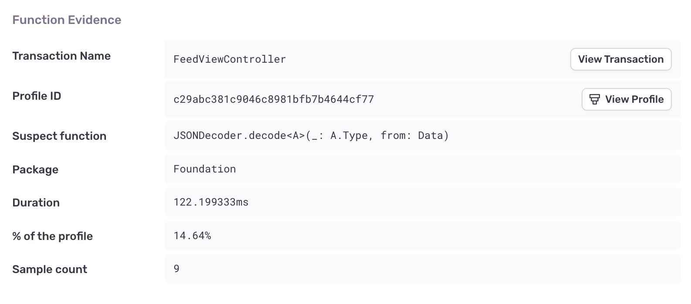
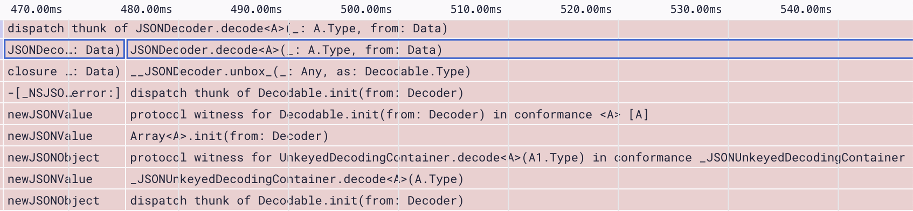
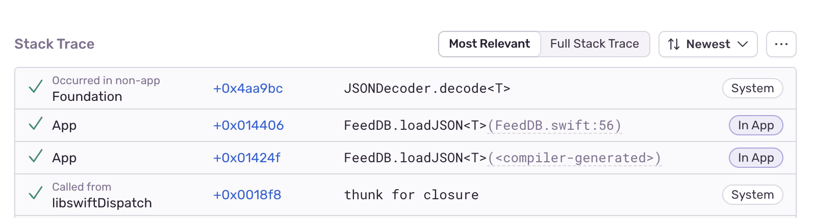

The main, (or UI) thread in a mobile app is responsible for handling all user interaction and needs to be able to respond to gestures and taps in real time. If a long-running operation blocks the main thread, the app becomes unresponsive, impacting the quality of the user experience.

The process of decoding a JSON blob into a data structure, is an example of a long-running operation that may impact app responsiveness. If a long-running JSON decoding operation is detected on the main thread, Sentry will flag it as an issue.

Decoding a JSON blob into a data structure can be a long running operation, especially for large blobs. This issue type is created when we detect a long running JSON decoding operation on the main thread.

## Detection Criteria

Once [Profiling](/product/profiling/) has been enabled, Sentry will be able to detect JSON Decoding on Main Thread issues by looking for functions related to JSON decoding that have been running on the main thread for at least 40ms. This threshold has been chosen so that we can see the function appear in a sufficient number of samples collected by the profile, (~10ms per sample x 4 = ~40ms total), before we detect the issue.

## Function Evidence

You can find additional information about your JSON Decoding on Main Thread problem by looking at four main aspects in the "Function Evidence" section:

- **Transaction Name:** The name of the transaction where the issue was detected.
- **Suspect function:** The function that triggered the issue detection (in this case, a JSON decoding function).
- **Duration:** How long the function took to execute.
- **Sample count:** The number of consecutive samples collected by the profiler that contained the function.

View it by going to the **Issues** page in Sentry, clicking on the issue you want to examine, then scrolling down to the "Function Evidence" section in the "Details" tab. To view the entire profile associated with the issue, click the “View Profile” button:



The profile will indicate where the suspect function was called from, along with other functions being called _by_ the suspect function:



## Stack Trace

The “Stack Trace” section shows a full stack trace for where the detected JSON decoding function was called from:



## Example

### iOS

The following code updates a view by calling `JSONDecoder.decode<T>` to decode JSON on the main thread:

```swift
func updatePersonView(json: Data) throws {
  personView.person = try JSONDecoder().decode(Person.self, from: json)
}
```

Performance could be improved by moving the JSON decoding to a background queue:

```swift
func updatePersonView(json: Data) {
	DispatchQueue.global(qos: .userInitiated).async {
    do {
			let person = try JSONDecoder().decode(Person.self, from: json)
			DispatchQueue.main.async {
				personView.person = person
			}
    catch let error {
			print(error) // handle error
    }
	}
}
```

### Android

The following code updates a view by calling `Gson.fromJson()`to decode JSON on the UI thread:

```kotlin
fun updatePersonView(json: String) {
	personView.person = Gson().fromJson(json, Person::class.java)
}
```

Performance could be improved by moving the JSON decoding to a coroutine:

```kotlin
fun updatePersonView(json: String) {
	lifecycleScope.launch(Dispatchers.IO) {
	  val person = Gson().fromJson(json, Person::class.java)

    withContext(Dispatchers.Main) {
      personView.person = person
    }
  }
}
```
