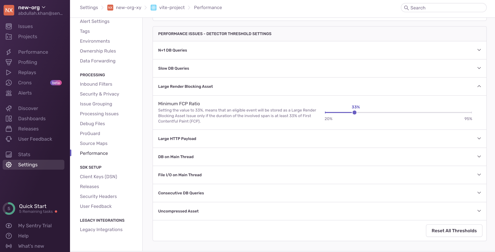
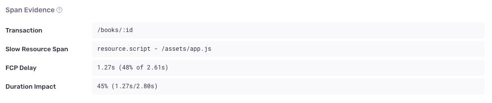

A _Large Render Blocking Asset_ is a performance problem that happens when a large asset causes a delay in displaying the page content. For example, if a page includes a stylesheet, and the browser pauses page rendering until the the entire stylesheet downloads and processes. If that stylesheet is large, the user may see a blank or unstyled screen for a long time. This problem occurs when applications don't split up asset files, load non-essential assets synchronously, or load assets too early.

## Detection Criteria

The detector for this performance issue looks for specific asset (resource) spans with the following criteria:

- The span operation has to be either a: `resource.link` or `resource.script`.
- The span's `resource.render_blocking_status` data property should either have a value of `blocking` (added by the `@sentry/browser` SDK, version `7.38.0`), or be missing.
- The span's `Encoded Body Size` data property has to be over `1MB`.
- The [First Contentful Paint (FCP)](/product/performance/web-vitals/#first-contentful-paint-fcp) of the transaction must be at least `2` seconds (with an upper bound of `10` seconds to eliminate outliers).
- The span's duration must be at least `33%` of the FCP.

You can configure detector thresholds for large render blocking asset issues in **Project Settings > Performance**:

## Span Evidence

You can get additional information about your Large Render Blocking Asset problem by looking at four aspects in the "Span Evidence" section:

- Transaction name
- Asset URL
- Effect on FCP
- Effect on total transaction time

View it by going to the **Issues** page in Sentry, selecting your project, clicking on the Large Render Blocking Asset error you want to examine, then scrolling down to the "Span Evidence" section in the "Details" tab.

## Fingerprinting

Sentry computes the issue fingerprint based on the asset URL. We detect many different patterns of cache-busting hashes in URL paths, filenames, and query strings so that the same asset is grouped into a single issue even as its contents change.

## Recommendations

We recommend that you use tools like [Chrome's DevTools](https://developer.chrome.com/docs/devtools/) or [Firefox Developer Tools](https://firefox-dev.tools) to identify and extract non-critical CSS and JS in your pages. You can learn more about fixing these assets by reading the Chrome Developers post: [Eliminate render-blocking resources](https://developer.chrome.com/en/docs/lighthouse/performance/render-blocking-resources/), and web.dev articles on [extracting critical CSS](https://web.dev/extract-critical-css/) and [deferring non-critical CSS](https://web.dev/defer-non-critical-css/).
