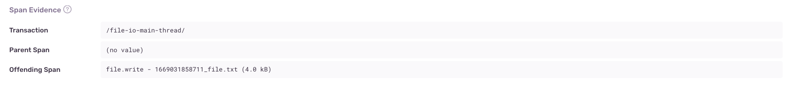

<Include name="early-adopter-note.mdx" />

The Main UI thread in a mobile application handles user interface events such as button presses and page scrolls. If the Main UI thread performs long-running operations like File IO, it will block the whole UI until the operation is complete, preventing the user from interacting with the app. If the Main UI thread is blocked for a long time, it can cause App Hangs and Application Not Responding errors.

## Detection Criteria

The detector for this performance issue looks at the total non-overlapping duration for File IO spans. If it exceeds 16ms, a Performance Issue is created.

## Span Evidence

Span evidence identifies the root cause of the File IO on main thread problem by showing you: 

- Transaction name
- Parent Span - Where the File IO spans occurred 
- Offending Span - The actual spans that are performing File IO in the main thread



## Example

Consider this Swift code where you're opening a file to get its contents:

```swift
if let path = Bundle.main.path(forResource: "LoremIpsum", ofType: "txt") {
    let content = String(contentsOfFile: path)
    label.text = content
}
```

In order to fix this performance issue, you could use a dispatch queue:

```swift
let dispatchQueue = DispatchQueue(label: "ViewController", attributes: .concurrent) {
    dispatchQueue.async {
        if let path = Bundle.main.path(forResource: "LoremIpsum", ofType: "txt") {
            let content = String(contentsOfFile: path)
                DispatchQueue.main.async {
                    label.text = content
                }
        }
    }
}
```

For Kotlin:

```kotlin
val file = File(context.cacheDir, "LoremIpsum.txt")
val content = file.readText()
```

In order to fix this performance issue you can initialize another thread to read the file instead. 

```kotlin
suspend fun readFile(): String = withContext(Dispatchers.IO) {
    val file = File(context.cacheDir, "LoremIpsum.txt")
    val content = file.readText()
    return content
}
```
