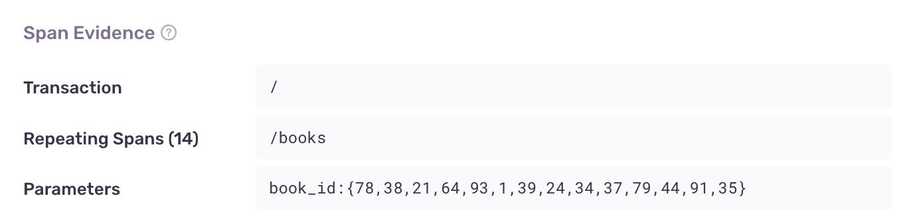

<Include name="early-adopter-note.mdx" />

_N+1 API Calls_ are a performance problem in which an application makes many simultaneous network requests to fetch a given type of resource. For example, an application might make one network request for each item in a list, instead of fetching all the information in a combined network call. Each call to the server incurs some performance overhead, and if the number of calls is high this can lead to severe performance problems. This problems commonly occurs when rendering lists or grids of items, where each item needs to fetch additional information from the server.

## Detection Criteria

The N+1 API Calls detector looks for groups of simultaneous network calls to the same URL. It uses the following detection criteria:

- Applies to `GET` requests only
- Minimum of 10 network calls must be happening simultaneously 
- Network calls must be a minimum of 50s in duration and within 5ms of each other
- Calls can't be to a GraphQL endpoint or to `_next/data`
- Calls can't be fetching a static resource (such as `.png` files)

## Span Evidence

The evidence for an N+1 queries problem has three main aspects:

- Transaction name
- Repeating spans - This is the URL that's receiving the repeated network calls
- Parameters - These are the query parameters that vary between the network calls



## Fingerprinting

Sentry computes the issue fingerprint based on the URLs of the repeating network calls. Sentry parameterizes the URLs by stripping integers, UUIDs, SHA1 hashes, and MD5 hashes. If you're finding that Sentry is failing to correctly group N+1 API Calls issues, you can parameterize the `http.client` spans in your transactions by using the <PlatformLink to="/configuration/options#before-send-transaction"><PlatformIdentifier name="before-send-transaction" /></PlatformLink> hook if your platform supports it.

## Example

Consider a book recommendation website written in React. The homepage generates a list of the most popular books, and renders a `<Book />` component for each book in the list. Each `<Book />` component makes a `fetch` call to get the book information from the API.

```jsx
const Book({ id }) => {
  { book, isLoading } = useFetch(`/books?id=${id}`);

  if (isLoading) {
    return <span>LOADING...</span>
  }

  return (
    <div>
      <span>{book.title}</span>
    </div>
  );
};
```

If the list has 100 books in it, the page will make 100 network calls simultaneously. The 100 is the "N" of "N+1 API Calls". This effect is visible on the span waterfall, which shows all the simultaneous network requests:


## Fixing N+1 API Call Issues

Fixes for this issue type depend on the application context. In some cases, this behavior is intentional and even desired. It's up to you to decide what the appropriate fix is, if any. Here are some common approaches:

- fetch all the information ahead of time, in one network calls. In the example above, you might update the `/books` endpoint to accept a list of IDs (e.g., `/books?id=78&id=89&id=120`)
- lazy-load the information. In the book example, you could change the `<Book>` component to only fetch the information once the component is visible on the screen
