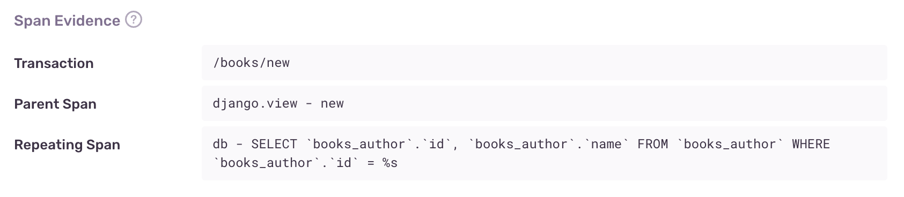

_N+1 queries_ are a performance problem in which the application makes database queries in a loop, instead of making a single query that returns or modifies all the information at once. Each database connection takes some amount of time, so querying the database in a loop can be many times slower than doing it just once. This problem often occurs when you use an object-relational mapping (ORM) tool in web frameworks like Django or Ruby on Rails.

## Detection Criteria

The detector for performance issues looks for a set of sequential, non-overlapping database spans with similar descriptions. It also uses the following criteria:

- Total duration of involved spans must exceed a threshold (usually 100 ms)
- Total count of involved spans must exceed a threshold (usually five spans)
- Involved spans must have full queries as their descriptions (some SDKs truncate queries and add an ellipsis to the end)
- There must be at least one database span that precedes the repeating spans (this is called the "source" span, and is used for fingerprinting)

If Sentry is not detecting an N+1 issue where you expect one, it's probably because the transaction didn't meet one of the above criteria.

You can configure detector thresholds for N+1 queries issues in **Project Settings > Performance**:


## Span Evidence

The evidence for an N+1 queries problem has four main aspects:

- Transaction name
- Parent span - This can be a view, a serializer, or another span that logically groups the queries.
- Repeating span - This is the "N" of N+1 queries. This is the looped query that should have been part of a bulk query.



## Fingerprinting

Sentry computes the issue fingerprint based on the parent span, the source span, and the repeating spans. If you're finding that Sentry is failing to correctly group N+1 query issues, make sure that the database spans in your transactions have parameterized queries as the span description. For example, the span description `SELECT * FROM books WHERE books.id = 1` is not parameterized correctly because it includes the book ID. The book ID parameter should vary for each query. This would create different fingerprints and separate issues. A correct span description should look something like this: `SELECT * FROM books WHERE books.id = %s`. While Sentry attempts to parameterize queries while fingerprinting, it may miss some cases.

## Example

Consider a book review website. It has two ORM models, `Book` and `Author`, each with a corresponding database table. The website shows a list of the ten oldest books and their respective authors. The code might look like this:

```python
from django.http import HttpResponse

def books(request):
    books = Book.objects.all()[:10]
    book_list = [book.title + " by " + book.author.name for book in books]
    return HttpResponse((", ").join(book_list))
```

This code has a subtle performance problem. Each call to `book.author.name` makes a query to fetch the book's author. In total, this code makes 11 queries: one query to fetch the list of books, and 10 more queries to fetch the author of each book. This results in a characteristic query span waterfall:


In order to fix this performance issue, you could use the `select_related` method in Django, like so:

```python
from django.http import HttpResponse

def books(request):
    books = Book.objects.select_related("author").all()[:10]
    book_list = [book.title + " by " + book.author.name for book in books]
    return HttpResponse((", ").join(book_list))
```

Django will `JOIN` the tables ahead of time, and preload the author information. That way, calling `book.author.name` does not need to make an extra query. Instead of a long waterfall, there is a single `SELECT` query:


N+1s can also happen when modifying data. For example, instead of creating objects in a loop:

```python
for i in range(1, 11):
    Book.objects.create(title: f"Book {i}")
```

You can instead create the objects in a single query:

```python
Book.objects.bulk_create(
    [Book(title: f"Book {i}") for i in range(1, 11)]
)
```
