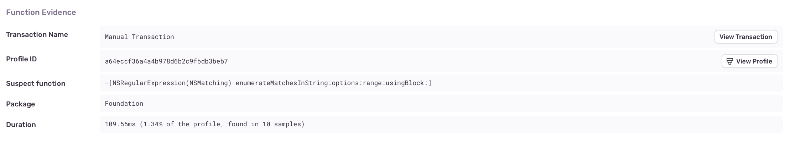
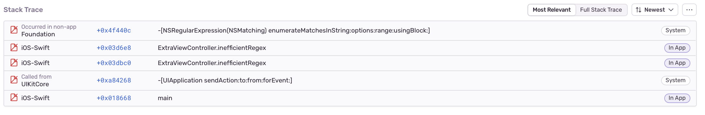

The main, (or UI) thread in a mobile app is responsible for handling all user interaction and needs to be able to respond to gestures and taps in real time. If a long-running operation blocks the main thread, the app becomes unresponsive, impacting the quality of the user experience.

Evaluating matches between strings and regular expressions can be long-running operations that may impact app responsiveness. If a long-running regular expression operation is detected on the main thread that can be offloaded to the background, Sentry will flag them it as an issue.

## Detection Criteria

Once [Profiling](/product/profiling/) has been enabled, Sentry will be able to detect Regex on Main Thread issues by looking for functions related to regular expressions that have been running on the main thread for at least 40ms. This threshold has been chosen so that we can see the function appear in a sufficient number of samples collected by the profile, (~10ms per sample x 4 = ~40ms total), before we detect the issue.

## Function Evidence

You can find additional information about your Regex on Main Thread problem by looking at four main aspects in the "Function Evidence" section:

- **Transaction Name:** The name of the transaction where the issue was detected.
- **Suspect function:** The function that triggered the issue detection (in this case, a regular expression function).
- **Duration:** How long the function took to execute.
- **Sample count:** The number of consecutive samples collected by the profiler that contained the function.

View it by going to the **Issues** page in Sentry, clicking on the issue you want to examine, then scrolling down to the "Function Evidence" section in the "Details" tab. To view the entire profile associated with the issue, click the “View Profile” button:



The profile will indicate where the suspect function was called from, along with other functions being called _by_ the suspect function:


## Stack Trace

The “Stack Trace” section shows a full stack trace for where the detected image decoding function was called from:



## Example

### iOS

The following code searches for matches against a regular expression in a large string:

```swift
let url = Bundle.main.url(forResource: "mobydick", withExtension: "txt")!
let text = try! String(contentsOf: url)
let regex = try! NSRegularExpression(pattern: #"([tT]he)?.*([wW]hale)"#, options: [.dotMatchesLineSeparators])
let results = regex.matches(in: text, range: NSMakeRange(0, text.count))
```

Performance could be improved by moving the calls to compile the regex and use it to find matches in the string to a lower priority queue (as well as the calls to load the text field being searched, in this example):

```swift
DispatchQueue.global(qos: .userInitiated).async {
    let url = Bundle.main.url(forResource: "mobydick", withExtension: "txt")!
    let text = try! String(contentsOf: url)
	let regex = try! NSRegularExpression(pattern: #"([tT]he)?.*([wW]hale)"#, options: [.dotMatchesLineSeparators])
	let results = regex.matches(in: text, range: NSMakeRange(0, text.count))
	DispatchQueue.main.async {
		// display results...
	}
}
```
