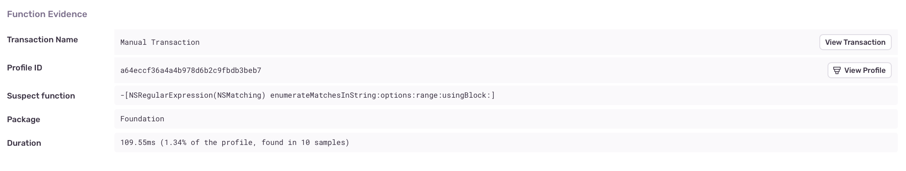
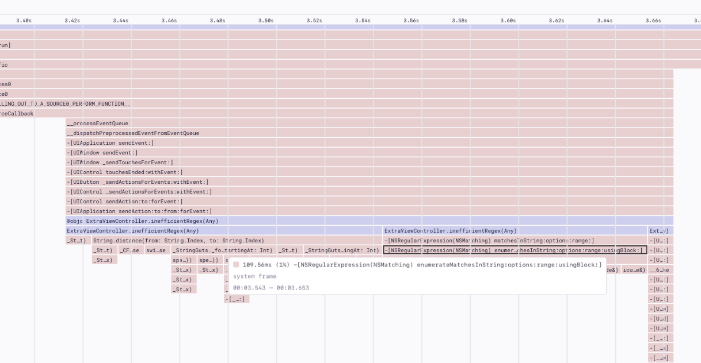
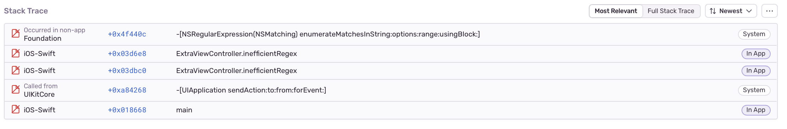

The main (or UI) thread in a mobile app is responsible for handling all user interaction and needs to be able to respond to gestures and taps in real time. If a long-running operation blocks the main thread, the app becomes unresponsive, impacting the quality of the user experience.

Evaluating matches between strings and regular expressions (regex) can be long-running operations that may impact app responsiveness. If a long-running regex operation is detected on the main thread that can be offloaded to the background, Sentry will flag it as an issue.

## Detection Criteria

[Profiling](/product/profiling/) must be enabled for Sentry to detect Regex on Main Thread issues. Sentry looks for functions related to regular expressions that have been running on the main thread for at least 40ms. This threshold ensures the function appears in a sufficient number of samples collected by the profile (~10ms per sample x 4 = ~40ms total) before it gets detected as an issue.

## Function Evidence

To find additional information about your Regex on Main Thread problem, go to its **Issue Details** page and scroll down to the "Function Evidence" section, which shows the following:

- **Transaction Name:** The name of the transaction where the issue was detected.
- **Suspect function:** The function that triggered the issue detection (in this case, a regular expression function).
- **Duration:** How long the function took to execute and the number of consecutive samples collected by the profiler that contained the function



To view the entire profile associated with the issue, click the “View Profile” button.

The profile will indicate where the suspect function was called from, along with other functions being called _by_ the suspect function:



## Stack Trace

The “Stack Trace” section shows a full stack trace for where the detected regex function was called from:



## Example

### iOS

The following code searches for matches against a regular expression in a large string:

```swift
let url = Bundle.main.url(forResource: "mobydick", withExtension: "txt")!
let text = try! String(contentsOf: url)
let regex = try! NSRegularExpression(pattern: #"([tT]he)?.*([wW]hale)"#, options: [.dotMatchesLineSeparators])
let results = regex.matches(in: text, range: NSMakeRange(0, text.count))
```

Performance could be improved by moving the calls both to create and use the regex to a lower priority queue (as well as the calls to load the text field being searched, in this example):

```swift
DispatchQueue.global(qos: .userInitiated).async {
    let url = Bundle.main.url(forResource: "mobydick", withExtension: "txt")!
    let text = try! String(contentsOf: url)
	let regex = try! NSRegularExpression(pattern: #"([tT]he)?.*([wW]hale)"#, options: [.dotMatchesLineSeparators])
	let results = regex.matches(in: text, range: NSMakeRange(0, text.count))
	DispatchQueue.main.async {
		// display results...
	}
}
```

### Android

The following code calls `String.matches` on the UI thread to search for matches against a regular expression in a large text:

```kotlin
fun matchRegex(text: String, regexPattern: String) {
  val matches = text.matches(regexPattern.toRegex())
  if (matches) {
    // Do something
  }
}
```

Performance could be improved by moving the match to a coroutine:

```kotlin
fun showImage(text: String, regexPattern: String) {
  lifecycleScope.launch(Dispatchers.IO) {
    val pattern = Pattern.compile(regexPattern)
    val matches = pattern.matcher(text).matches()

    withContext(Dispatchers.Main) {
      if (matches) {
        // Do something
      }
    }
  }
}
```
