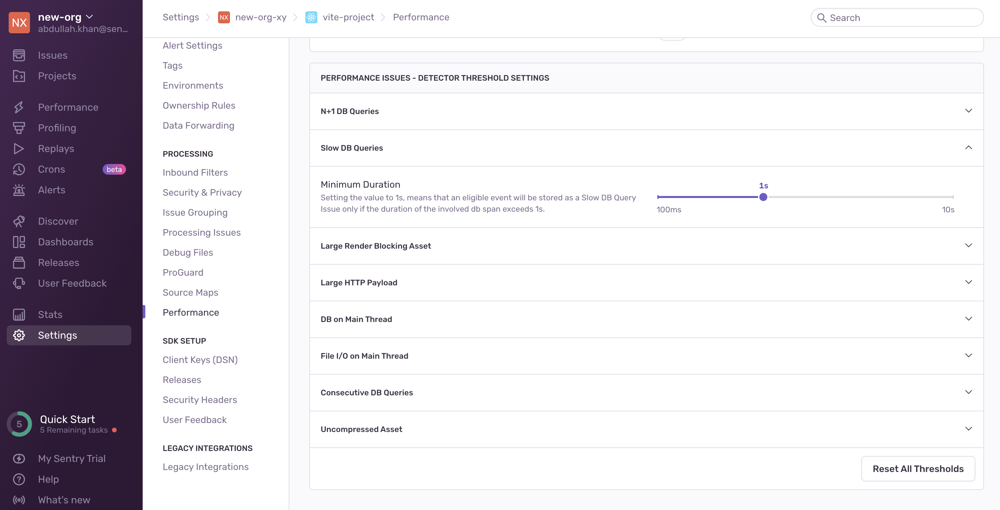
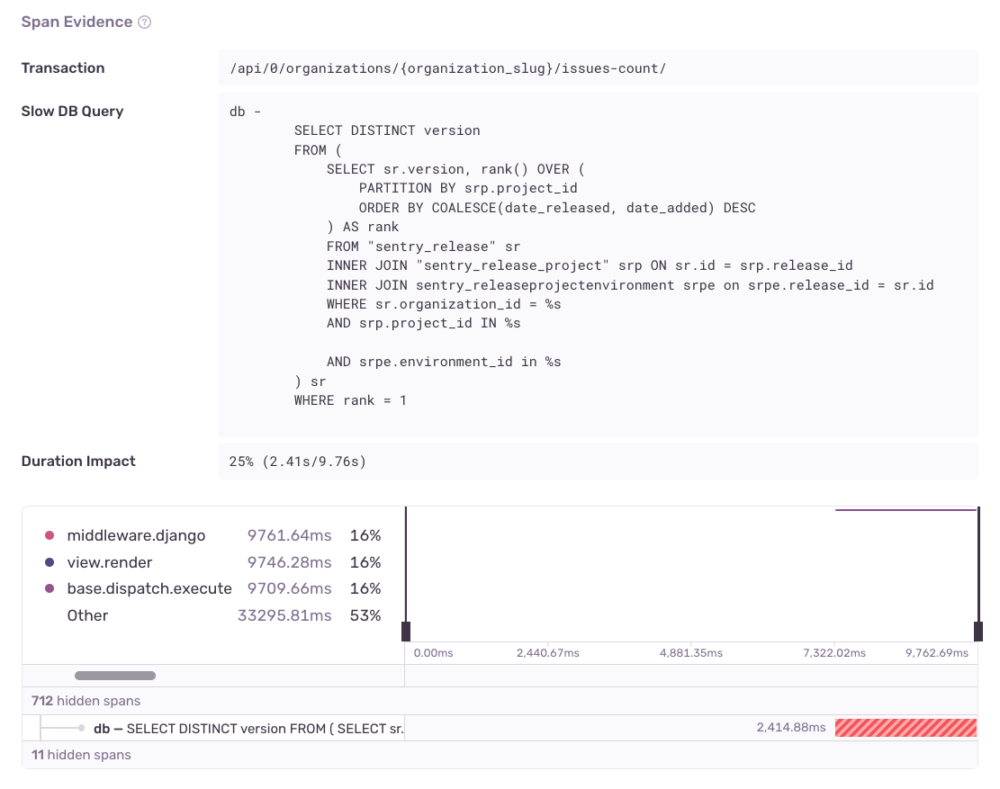

Slow DB Query issues are created when a particular `SELECT` SQL query in your application consistently takes longer than `1000ms` to resolve.

## Detection Criteria

The detector for this performance issue looks at singular database spans with the following criteria:

- The span operation starts with `db` and the query is stored within the span description
- The query is specifically a `SELECT` query
- The span duration is at least `1000ms`

Keep in mind, an issue won't be created unless the query in question is _consistently_ taking longer than `1000ms`. More specifically, the issue will be created only if the same query is detected as a slow query
in 100 events within a 24-hour period.

You can configure detector thresholds for slow DB queries issues in **Project Settings > Performance**:

## Span Evidence

You can get additional information about your Slow DB Query by looking at the following fields in the "Span Evidence":

- Transaction name
- Slow DB Query
- Duration Impact - The duration of the query as compared to the entire transaction, to put into perspective how much of the transaction is being taken up by the query

View it by going to the **Issues** page in Sentry, selecting your project, clicking on the Slow DB Query issue you want to examine, then scrolling down to the "Span Evidence" section in the "Details" tab.

## Fixing Slow DB Queries

Slow queries often happen when un-indexed tables are queried. To avoid this, make sure that your table is properly indexed. While there aren’t any other obvious fixes, there are steps you can take to narrow down the causes of your query being slow.

If it's supported by your version of SQL, you can run an `EXPLAIN` command on your query. This will present you with a query plan. The plan will lay out individual steps that your database will perform in order to execute the query, along with additional information, such as its cost.

The cost is an arbitrary value, but it will fluctuate based on how “expensive” that portion of the query is. You can compare the cost of each step to determine which ones are the most expensive. Additionally, you can run `EXPLAIN ANALYZE`, which will execute the query and report back with the same information as a regular `EXPLAIN`, plus the actual time taken by each step of your query (be careful not to run this on any destructive queries, as they _will_ be fully executed!).

You can learn more about `EXPLAIN` from the following resources:

- [PostgreSQL Documentation: EXPLAIN](https://www.postgresql.org/docs/current/sql-explain.html)
- [MySQL Documentation: Optimizing Queries with EXPLAIN](https://dev.mysql.com/doc/refman/8.0/en/using-explain.html)
