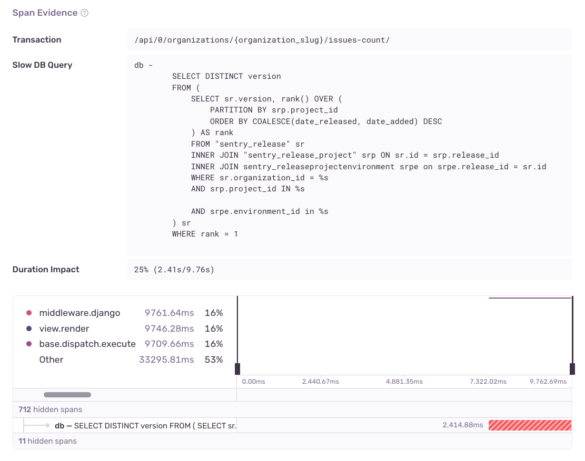

<Include name="early-adopter-note.mdx" />

Slow DB Query issues are created when a particular SQL query in your application consistently takes longer than `1s` to resolve. To be more precise, this issue type is created only if the query in question
is seen taking longer than `1s` in 100 events within a 24 hour period. These queries can potentially be optimized **TODO WRITE MORE HERE**

## Detection Criteria

The detector for this performance issue looks at singular database spans with the following criteria:

- The span operation starts with `db` and the query is stored within the span description
- The query is specifically a `SELECT` query
- The span duration is at least `1000ms`

Keep in mind that an issue will not be created unless the query in question is _consistently_ taking longer than `1000ms`. More specifically, the issue is created only if the same query is detected as a slow query
in 100 events within a 24 hours period.

## Span Evidence

The "Span Evidence" section of a Slow DB Query issue contains the following fields:

- Transaction name
- Slow DB Query
- Duration impact - The duration of the query with respect to the entire transaction, to put into perspective how much of the transaction is being taken up by the query

View it by going to the **Issues** page in Sentry, selecting your project, clicking on the Slow DB Query issue you want to examine, then scrolling down to the "Span Evidence" section in the "Details" tab.

## Recommendations
