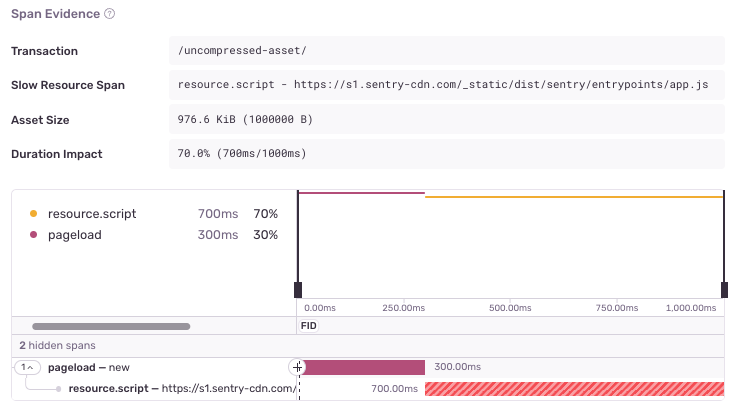

<Include name="early-adopter-note.mdx" />

Uncompressed asset issues happen when a file that needs to be downloaded in order to load a browser page, doesn’t get compressed while being transferred. This may indicate a misconfiguration of the server or CDN (content delivery network) that’s serving the asset file.

## Detection Criteria

The detector for this performance issue looks for specific asset (resource) spans with the following criteria:

- The span has to be one of either: `resource.link` or `resource.script` spans, which in practice means it's a `.css` or `.js` file.
- It has to be over `512kb` in size, to rule out smaller files less likely to benefit from being compressed.
- The span duration has to be over `500ms`, to rule out faster transfers or assets served in internal networks.
- There has to be another asset span in the transaction that has compressed files. This helps rule out cases whether your users browser is not sending the `Accept-Encoding` header whatsoever.

If Sentry isn't detecting an uncompressed asset issue where you expect one, it's probably because the transaction didn't meet one of the above criteria.

## Span Evidence

You can identify an Uncompressed Asset problem by four main aspects in the "Span Evidence" section:

- Transaction name
- Slow Resource Span - The uncompressed slow span, usually containing the asset url
- Asset Size - The size of the asset
- Duration Impact - The fraction of time added to the total transaction time, which can likely be reduced with compression.

View it by going to the **Issues** page in Sentry, selecting your project, clicking on the Uncompressed Asset error you want to examine, then scrolling down to the "Span Evidence" section in the "Details" tab.

## Recommendations

Check the server or CDN (content delivery network) where the asset is being hosted and make sure it is setup for gzip or brotli compression.
