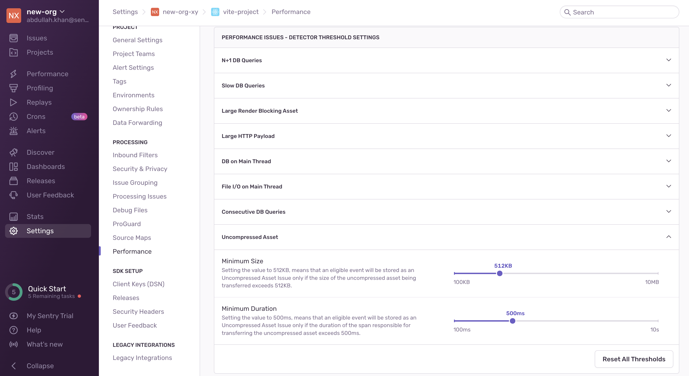

Uncompressed asset issues happen when a file that needs to be downloaded in order to load a browser page, doesn’t get compressed while being transferred. This may indicate a misconfiguration of the server or CDN (content delivery network) that’s serving the asset file.

## Detection Criteria

The detector for this performance issue looks for specific asset (resource) spans with the following criteria:

- The span has to be one of either: `resource.link` or `resource.script` spans, which in practice means it's a `.css` or `.js` file.
- It has to be over `512kb` in size, (to filter out smaller files that are less likely to benefit from being compressed).
- The span duration has to be over `300ms` (to filter out faster transfers or assets served in internal networks).
- There has to be another asset span in the transaction that has compressed files. This helps filter out cases where a users' browser isn't sending the `Accept-Encoding` header.

If Sentry isn't detecting an uncompressed asset issue where you expect one, it's probably because the transaction didn't meet one of the above criteria.

You can configure detector thresholds for uncompressed asset issues in **Project Settings > Performance**:

## Span Evidence

You can identify an uncompressed asset problem by four main aspects in the "Span Evidence" section:

- Transaction name
- Slow resource span - The uncompressed slow span, usually containing the asset url
- Asset size
- Duration impact - The fraction of time potentially added to the total transaction time if this span is in the critical path.

View it by going to the **Issues** page in Sentry, selecting your project, clicking on the Uncompressed Asset error you want to examine, then scrolling down to the "Span Evidence" section in the "Details" tab.

## Recommendations

Check the server or CDN (content delivery network) where the asset is being hosted and make sure it's set up for gzip or brotli compression.
