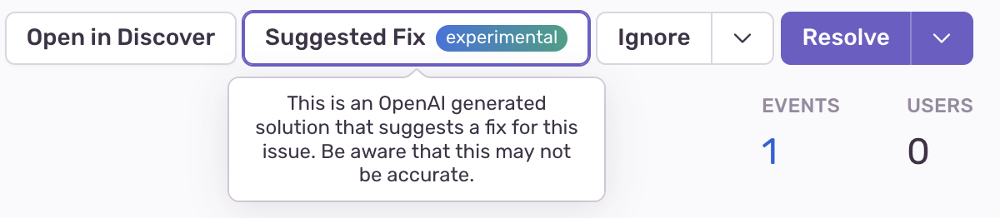
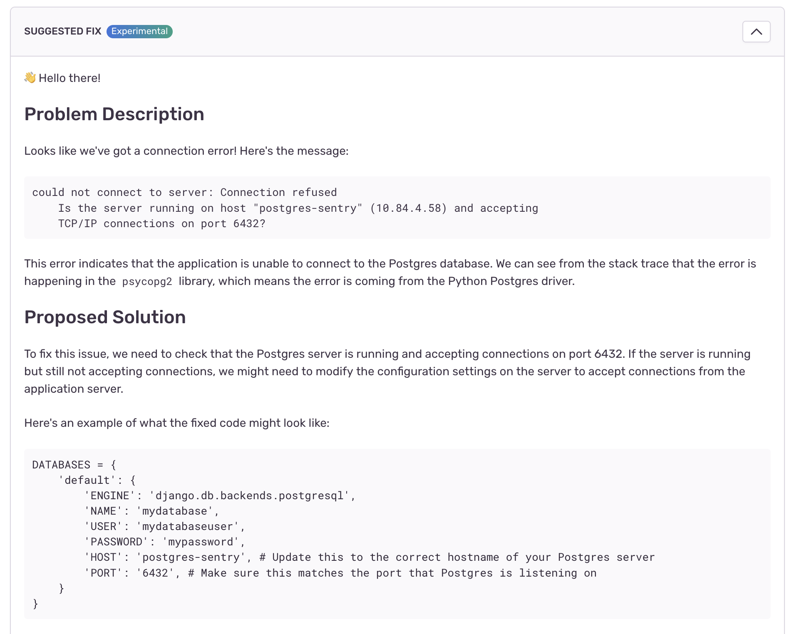

Suggested Fix is an experimental feature that uses AI to explain an issue
and to propose a solution.  To achieve this, the feature sends certain parts
of an error event to OpenAI for processing.

If your organization is enrolled in the "Early Adopters" program, you will find
a new button called "Suggested Fix" in the issue toolbar:

Once you click it, Sentry will send information about the event to OpenAI for
analysis.  Under normal circumstances we do not send data to a third party
undisclosed in our [subprocessor list](https://sentry.io/legal/subprocessors/).
Because of this you need to provide consent to do so.  If your organization has
signed a DPA with us, an owner of the organization will need to sign a
"OpenAI Subprocessor Acknowledgement" in the organization [Legal & Compliance
page](https://sentry-sdks.sentry.io/settings/legal/).  Otherwise an individual
user will receive a prompt to confirm that data will be sent to a third party.

Under all circumstance we will not sent any event data to OpenAI without an
explicit instruction to do so.  Only by clicking the "Suggested Fix" button
will selected event data be shared with a third party.

After some period of waiting, a suggested fix will be produced and might look
something like this:

