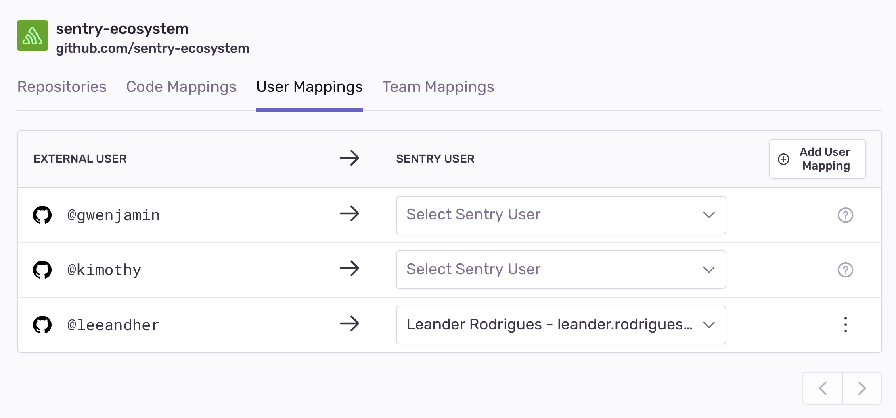

<Include name="only-error-issues-note.mdx" />

Sentry offers multiple ways to define the "ownership" of an issue. With ownership defined, we can automatically assign issues and send alerts to the owner. Sentry defines ownership with _code owners_ and _ownership rules_. Code owners functionality lets you import your [GitHub](https://docs.github.com/en/repositories/managing-your-repositorys-settings-and-features/customizing-your-repository/about-code-owners) or [GitLab](https://docs.gitlab.com/ee/user/project/code_owners.html) CODEOWNERS file, and then we assign issues according to those file paths. Ownership rules allow you to override the assignments based on code owners and provide advanced matcher types (for example, urls and tags). These rules can also match on the file paths of files in the stack trace, URL of the request, or event tags.

## How It Works

Ownership rules and code owners are matched against individual events in an issue. This matching is relied upon in other areas of [sentry.io](https://sentry.io), as described in the following sections. One key thing to note: issue owners are set for an issue, not a project or organization.

### Ownership Rules

You define ownership rules per project. To configure ownership rules, navigate to your **[Project] > Settings > Issue Owners**, or click on the "Create Ownership Rule" button on an Issue Details page.

Types of matches available:

1. Path: matches against all file paths in the event's stack trace
2. Module: matches against the module in the event's stack trace
3. URL: matches against the event's `url`
4. Tag: matches against event tags

The general format of a rule is: `type:pattern owners`

`type`

: Can be either `path`, module, `url`, or `tags.TAG_NAME`, which matches the specified tag.

`pattern`

: The pattern you're matching on. For example, `src/javascript/*` for `path`, `[https://www.example.io/checkout](https://www.example.io/checkout)` for `url`, or `Chrome 81.0.*` for `tags.browser`.

: `pattern` matching supports unix-style [glob syntax](<https://en.wikipedia.org/wiki/Glob_(programming)>). For example, add `*` to match anything and `?` to match a single character. _This is not a regex._

`owners`

: The owner, or list of owners, identified by either the email of the Sentry user or the name of the team, prefixed with `#`. Thus, the owner may be example@company.com or example1@company.com example2@company.com or `#backend-team`. A space separates each owner in the list of owners.

Teams _must_ have access to the project to become owners. To grant a team access to a project, navigate to **[Project] > Settings > Project Teams**, and click "Add Team".

To grant a user access to a project, the user must be a member of a team with access to the project. To add a user to a team, navigate to **Settings > Teams**, select a team, and click "Add Member".

You can add an ownership rule from **[Project] > Settings > Issue Owners**:


You can also add a rule from the **Issue Details** page:


When you create a rule from the **Issue Details** page, you'll see some suggested paths and URLs based on the events in the issue. Note that [sentry.io](https://sentry.io) doesn't suggest tags.

### Code Owners

<Note>

Let us know if you have feedback: [ecosystem-feedback@sentry.io](mailto:ecosystem-feedback@sentry.io).

</Note>

<Note>

This feature is available only if your organization is on a Business plan.

</Note>


Import your CODEOWNERS file and use it alongside your ownership rules to assign Sentry issues. A prerequisite for this feature is the **Code Mappings** from [stack trace linking](/product/integrations/source-code-mgmt/github/#stack-trace-linking).

To quickly setup a code mapping for a project:

1.  Go to an issue in your project. You should see the following option to link to your source code in the stack trace:
    
2.  When you click the link, a modal will open. Enter the source code URL from GitHub/GitLab corresponding to stack trace filename and we'll automatically create the code mapping and set up stack trace linking for the project.

Now that we have code mappings, we are able to transform the paths in your CODEOWNERS file to your expected build output. For example, you may build your program in a `dist/` folder, but that will not be in your CODEOWNERS. However the `dist/` prefix is captured in the stack trace's file paths. Code mappings allow Sentry to figure out how to normalize the file paths between your build output and the CODEOWNERS paths.

You can import and incrementally add the mappings between your source control teams/users to Sentry Teams/Users using [external team/user mappings](/product/issues/issue-owners/#external-teamuser-mappings). Sentry uses the external team/user mappings to convert the owners in your CODEOWNERS file into their equivalents in Sentry. Sentry will automatically ignore rules that are missing team/user mappings.

This feature supports GitHub and GitLab CODEOWNERS file syntax with the following exceptions:

- Escaping a pattern starting with `#` using `\` so it is treated as a pattern and not a comment
- Using `!` to negate a pattern
- Using `[ ]` to define a character range
- [GitLab Premium syntax](https://docs.gitlab.com/ee/user/project/code_owners.html#code-owners-sections)
- [GitHub CODEOWNERS syntax exceptions](https://docs.github.com/en/github/creating-cloning-and-archiving-repositories/creating-a-repository-on-github/about-code-owners#syntax-exceptions)

<Alert level="info">

Ownership rules take precedence over the information provided by your CODEOWNERS file when Sentry assigns issues.

</Alert>

#### Limitations

We support CODEOWNERS files with a maximum of 100,000 characters. If your file exceeds this size, we suggest using wildcard rules to consolidate multiple entries into a single one.

#### External Team/User Mappings

<Note>

Let us know if you have feedback: [ecosystem-feedback@sentry.io](mailto:ecosystem-feedback@sentry.io).

</Note>




Create external team/user mappings for your GitHub/GitLab teams and users by navigating to **Settings > Integrations > GitHub/GitLab > [Configuration] > Team Mappings/User Mappings**. Suggestions will come from any CODEOWNERS files on projects for the organization.

### Suggested Assignees

On the Issue Details page, you'll see suggested assignees based on ownership rules matching the event you're looking at (by default, the Issue Details page shows the latest event). Suggested assignees can also be based on [suspect commits](/product/releases/suspect-commits/). You can assign the _issue_ to a suggested assignee by clicking on the suggestion. An event can have multiple suggested assignees if it matches multiple ownership rules.


### Auto-Assign

You can automatically assign issues to their owners by enabling the following setting in **[Project] > Settings > Issue Owners**.


If an issue is already assigned, a new event for that issue will not re-assign the issue even if it has a different owner. If an issue is not assigned, but a new event has multiple owners, [sentry.io](https://sentry.io) assigns it to the owner(s) from the last matching rule (regardless of the rule `type`).

### Issue Alerts

You can send [Issue Alerts](/product/alerts-notifications/issue-alerts/) to issue owners. Issue alerts are event-driven: when [sentry.io](https://sentry.io) receives an event, it evaluates issue alert rules for the issue for that event. If the alert conditions match, [sentry.io](https://sentry.io) sends an alert to the _owners of the event that triggered the alert_.


If no ownership rules match the event, the alert will either be sent to nobody or all members of the project, depending on the following setting in **[Project] > Settings > Issue Owners:**


Alerts sent to issue owners obey the user or team's notification preferences.

## Evaluation Flow

If you have both ownership rules and code owners, Sentry evaluates an event against the rules in the following order:

1. Code owners, top-to-bottom
2. Ownership rules, top-to-bottom

After evaluation, the last rule matching returns the assignment.

### Example

**Code Owners:**

```
codeowners:*.js                    #ecosystem
```

**Ownership Rules:**

```
path:*.js                          #ecosystem
path:sentry/api/*                  #api
url:*subscription*                 #billing
path:dist/frontend/components/*               #frontend
```

When Sentry recieves an event with a stacktrace filepath: `dist/frontend/components/sidebar.js`, we:

1. Evaluate against the code owners top-to-bottom; we get one match.
2. Evaluate against the ownership rules top-to-bottom; we get two matches.

The matches, in order, are:

```
[
  "codeowners:*.js                    #ecosystem",
  "path:*.js                          #ecosystem",
  "path:dist/frontend/components/*               #frontend"
]
```

Sentry will return the last matching rule, which in this case is `path:dist/frontend/components/* #frontend`

## Troubleshooting

Ensure that all teams and users have access to the project. If they don't have the correct access, the Issue Owners rules will fail to save. To grant a team access to a project, navigate to **[Project] > Settings > Project Teams**, and click "Add Team". To grant a user access to a project, the user must have at least member access to a team associated with the project. To add a user to a project's team, navigate to **Settings > Teams**, select a team, and then click "Add Member".
