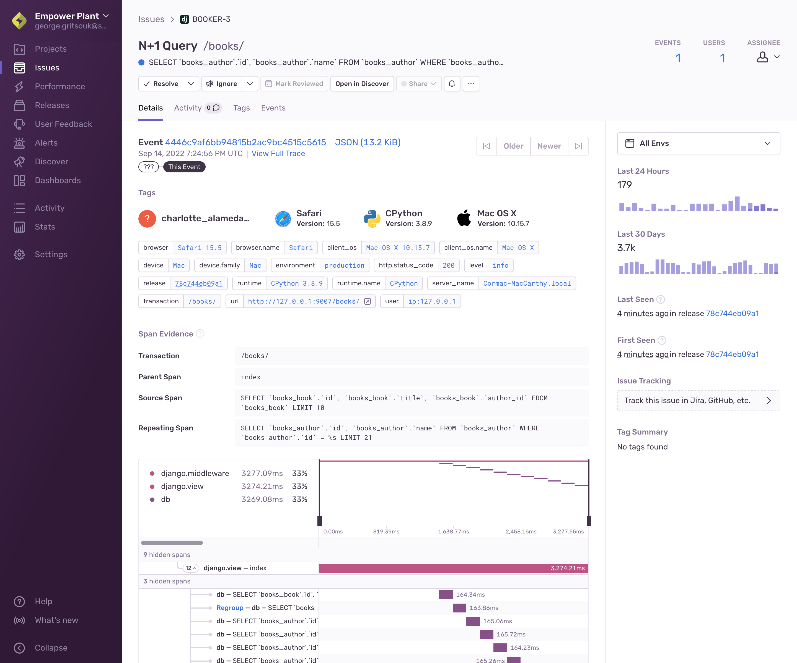

<Include name="early-adopter-note.mdx" />

The **Issue Details** page for performance issues helps you to gain further insight into the source of an issue and the impact it has on your application's users. The main area of the page displays information about a specific transaction event that's part of an issue. The top panel and right-hand sidebar of the page display a summary of all the events grouped together in this issue:

<Note>

You can find performance issues by searching `issue.category:performance` in **Issues**, **Discover**, and **Dashboards**.

</Note>

While the **Issue Details** page displays information about a specific transaction event that's part of an issue, you can navigate between the events of an issue using the "Older" and "Newer" buttons. You'll see information about the issue as well as the details of the most recent event. You'll be able to see the summary of when the issue was seen, a breakdown of the tags, span evidence, and breadcrumbs if they are available.

## How Performance Issues Work

Sentry detects performance issues by scanning incoming transaction events. It checks various properties of the transaction (span durations, span arrangement, span types, etc.) to detect likely problems. Sentry then checks these properties against corresponding thresholds to determine whether a performance issue exists. Sentry then generates a unique problem fingerprint based on the problem type and location in the application, and uses that fingerprint to create a performance issue.

## Tags

Tags are key/value string pairs that are both indexed and searchable. For example, a tag provides you with information such as the browser, device, or user associated with the event. Tags are the diagnostic information sent by the SDK for the individual event.

The tags displayed in the main section of this page are specific to the event that you're viewing. In contrast, the tags displayed in the right-hand sidebar are a summary of all tag values for all events included in the issue. You can set your own tags to make them more useful for debugging as described in Customize Tags.

## Span Evidence

Span evidence is information that explains the nature of the performance problem, and how it manifests in a transaction event. This section lists the spans involved in the issue and their descriptions, and shows a span tree that visually explains the problem's impact on the transaction. Different performance problems have slightly different kinds of evidence.

## Performance Issue Limitations

Performance issues currently have the following limitations:

- Sentry only detects one type of issue: [N+1 Queries](n-one-queries)
- You cannot create alerts for performance issues
- Performance issues cannot be merged or deleted
- Custom fingerprinting and grouping do not apply to performance issues
- Performance issues only support simple ignore rules

We're working on removing some or all of these limitations.
