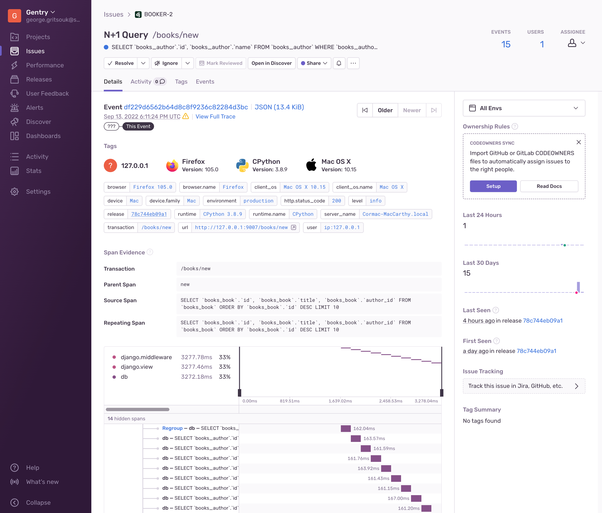

<Include name="early-adopter-note.mdx" />

Sentry automatically collects and displays errors in your applications. It groups those errors into Issues, and gives you a workflow for triaging, assigning, and fixing them. With _Performance Issues_, Sentry offers the same workflow for performance problems in your code. If you send transaction events to Sentry, Sentry will automatically scan those transactions for performance problems, and group them into actionable issues.

## How It Works

A performance issue is very similar to a regular error-based issue. When looking at a performance issue you'll see information about the issue as well as the details of the most recent event. You'll be able to see the summary of when the issue was seen, a breakdown of the tags, and breadcrumbs if they are available.

The main difference is that performance issues do not have a stack trace. Instead, they have "Span Evidence" section that shows information about the issue's cause, and a span tree that highlights the spans involved in the issue.

The "Span Evidence" section highlights the key information about the issue. This includes details about the event and the spans that caused the issue, depending on the issue type. The Span Tree is a visual representation of the spans involved in the issue.

## Exploring Performance Issues

You can search for performance issues using the `issue.category:performance` filter anywhere there's a query input.

## Performance Issue Types

Right now, Performance Issues only detects one type of issue: [N+1 Database Queries](n-plus-one-database-queries).

### Limitations

Performance Issues have a few limitations with respect to error issues. Performance Issues do not support the following features:

1. Performance issues do not support alerts
2. It is not possible to add custom fingerprinting logic to performance issues
3. Performance issues do not have stack traces, and therefore are not subject to codeowner rules, or suspect commits
4. Performance issues cannot be merged or deleted
5. Advanced ignores (e.g., ignore until X number of users see the issue in Y amount of time) are not available for Performance issues
