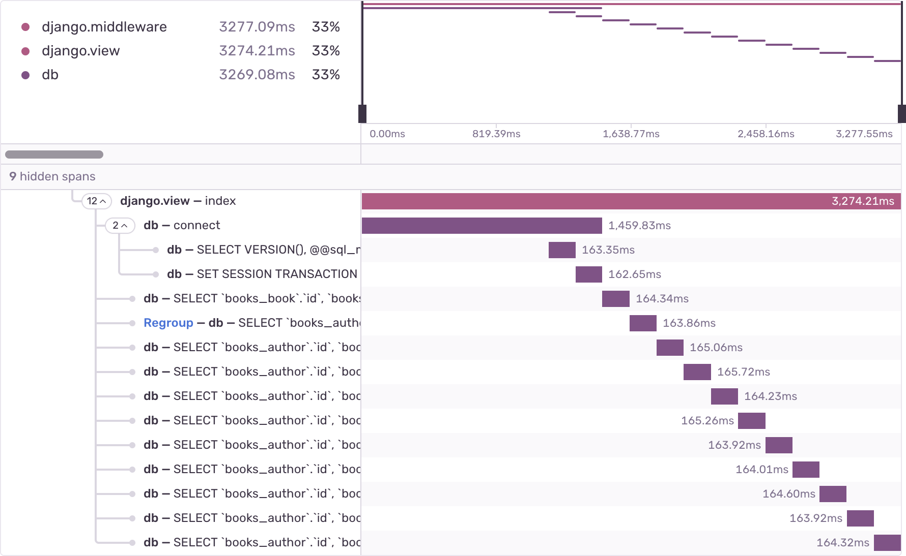

<Include name="early-adopter-note.mdx" />

_N+1 queries_ are a performance problem in which the application makes database queries in a loop, instead of making a single query that returns all the information at once. Each database connection takes some amount of time, so querying the database in a loop can be many times slower than doing it just once. This problem often occurs when you use an object-relational mapping (ORM) tool in web frameworks like Django or Ruby on Rails.

## Detection Criteria

The detector for performance issues looks for a set of sequential, non-overlapping database spans with similar descriptions. It also uses the following criteria:

- Total duration of involved spans must exceed a threshold (usually 100ms)
- Total count of involved spans must exceed a threshold (usually 5 spans)
- Involved spans cannot be truncated

If Sentry is not detecting an N+1 issue where you expect one, it's probably because the transaction did not meet one of the above criteria.

## Span Evidence

The evidence for an N+1 queries problem has four main aspects:

- Transaction name
- Parent span - This can be a view, a serializer, or another span that logically groups the queries.
- Source span - This is the query that most likely caused the N+1 queries.
- Repeating span - This is the "N" of N+1 queries. This is the looped query that should have been part of the source.


## Example

Consider a book review website. It has two ORM models, `Book` and `Author`, each with a corresponding database table. The website shows a list of the ten oldest books and their respective authors. The code might look like this:

```python
from django.http import HttpResponse

def books(request):
    books = Book.objects.all()[:10]
    book_list = [book.title + " by " + book.author.name for book in books]
    return HttpResponse((", ").join(book_list))
```

This code has a subtle performance problem. Each call to `book.author.name` makes a query to fetch the book's author. In total, this code makes 11 queries: one query to fetch the list of books, and 10 more queries to fetch the author of each book. This results in a characteristic query span waterfall:



In order to fix this performance issue, you could use the `selected_related` method in Django, like so:

```python
from django.http import HttpResponse

def books(request):
    books = Book.objects.select_related("author").all()[:10]
    book_list = [book.title + " by " + book.author.name for book in books]
    return HttpResponse((", ").join(book_list))
```

Django will `JOIN` the tables ahead of time, and preload the author information. That way, calling `book.author.name` does not need to make an extra query. Instead of a long waterfall, there is a single `SELECT` query:


