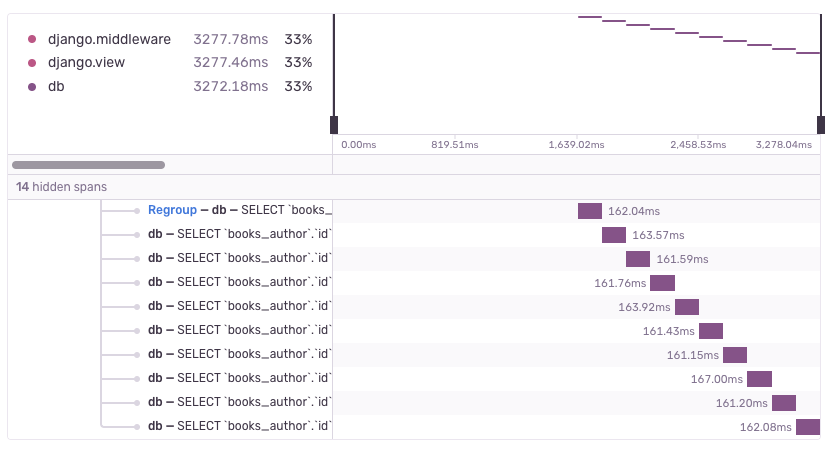

<Include name="early-adopter-note.mdx" />

## N+1 Database Queries

An "N+1 Query" is a performance issue in which the application makes database queries in a loop, instead of making a single query that returns all the information at once. Each database connection has some amount of performance overhead, so querying the database in a loop can be many times slower than doing it just once. This issue often occurs when using an Object-relational mapping (ORM) tool in web frameworks like Django or Ruby on Rails.

## Issue Properties

An N+1 Query issue has four main properties:

- the transaction name
- the parent span. This can be a view, a serializer, or another kind of span that groups all the database queries
- the source span. This is a database query span that caused the N+1 issue
- the repeated span. This is the repeated query that fetches information that should have been fetched in the source span


## Example

Consider a book review website. It has two ORM models: `Book` and `Author`, each with a corresponding database table. The website shows a list of ten oldest books and their respective authors. The code might look like this:

```python
from django.http import HttpResponse

def books(request):
    books = Book.objects.all()[:10]
    book_list = [book.title + " by " + book.author.name for book in books]
    return HttpResponse((", ").join(book_list))
```

This code has a performance issue. Instead of making one query to fetch all books and their authors, it makes 11 queries! One query to fetch the list of books, and then ten queries to fetch the author of each book one-by-one. This results in a characteristic N+1 Query span waterfall:



In order to fix this issue, you could use the `selected_related` method in Django, like so:

```python
from django.http import HttpResponse

def books(request):
    books = Book.objects.select_related("author").all()[:10]
    book_list = [book.title + " by " + book.author.name for book in books]
    return HttpResponse((", ").join(book_list))
```
