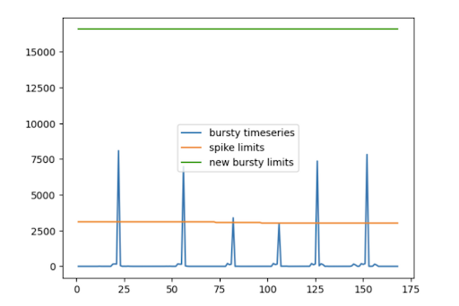

Sentry defines an issue as `Escalating` when the number of events is significantly higher than the previous week.

The escalating issues algorithm uses historical data from the previous week to calculate thresholds for the next week on a per-issue basis. If an issue exceeds its predetermined threshold, it gets tagged as "escalating." An escalating issue is automatically surfaced in the "Unresolved" and "Escalating" tabs, even if the issue was previously archived.

## Escalating Limit Calculation

Escalating limit is calculated on a daily basis as the max of either a baseline spike limit or a bursty limit:

limitescalating = max(limitspike , limitbursty)

In most cases, the spike limit is applied to issues with a relatively stable event volume, while the bursty limit is applied to issues with regular bursts in volume (such as cron or Airflow jobs and task runners).

### Spike Limit Calculation
The spike limit calculation establishes a baseline for what’s considered a significant increase in volume for an issue. It takes the average hourly volume (weighted by day-of-week) and variance over the previous week to calculate the limit:

limitspike = avgweighted + (min(max((avg + (5 \* std))/avg, 5),8) \* avg)

**Example**

The chart above shows the event volumes for an actual Sentry issue that was escalating. The orange line shows the volume from the past week, which is then used to generate the spike threshold for the next week, represented by the green line. The blue line shows the next week’s volume, which crosses the threshold around hour 148 (day 7). At this point, the issue is flagged as escalating.

### Bursty Limit Calculation
Some issues, such as cron jobs, purposefully have a high volume of events in a short period of time. If we used the spike limit calculation, it could incorrectly flag these types of issues as escalating. To account for this, the algorithm uses a bursty limit calculation, which is based on the maximum hourly volume and the coefficient of variation (ratio of standard deviation over the average) for the previous week:

limitbursty = maxtimeseries \* min(max(2, 5e-0.65cv), 5)

**Example**

This chart shows an example of a bursty Sentry issue. The spike limit, represented by the orange line, would have incorrectly flagged the issue as escalating. The algorithm accounts for this behavior with the new bursty limit, represented by the green line.
