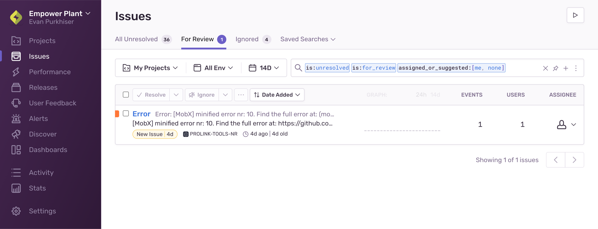
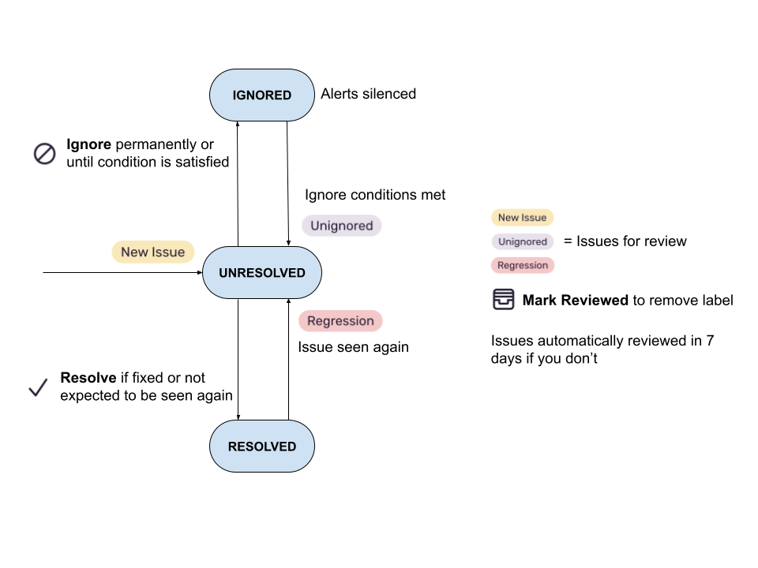

To help organize issues for you and your team, you can take actions such as assigning, resolving, or archiving issues. These actions are referred to as _triaging_.

An issue can be in one of four states:

- Unresolved: The default state for all new issues.
- Archived: The issue can be archived permanently or until a condition is met or until it escalates, at which point it becomes Escalating.
- Resolved: The issue is marked resolved (or automatically resolved) because it was fixed or isn't expected to happen again. If the issue is seen again, its state changes to Unresolved.
- Escalating: The issue has exceeded its forecasted hourly event volume and requires your attention.

When any of the following conditions occur for an issue, that issue is flagged _for review_, included in the **Review List**, and given a label indicating why it was flagged:

- A new issue is created; it's labeled "New Issue"
- A resolved issue re-occurs; it's labeled "Regression"
- An archived issue meets its snooze conditions; it's labeled "Ongoing"
- An archived issue is escalating; it's labeled "Escalating"

Issues in the **Review List**, or for-review issues, are a sub-set of all unresolved issues, and you can view these issues in the "For Review" tab of the **Issues** page. By default, they are filtered to display issues relevant to you; that is, issues that are assigned to you or suggested for you.

When you mark a for-review issue as reviewed, [sentry.io](https://sentry.io) removes the reason label and the issue remains in the Unresolved state.

Resolving or archiving an issue implicitly marks the issue reviewed.

To keep the list of issues in the **Review List** fresh, [sentry.io](https://sentry.io) automatically marks issues as reviewed if they haven't already been reviewed after seven days.

The image below shows how issues move through different states with the applicable labels.

## Triage Actions

Triage typically involves one or more of the following actions.

### Resolve

Resolve an issue when it's fixed or you don't expect it to happen again. You can do this manually or by [including the issue ID in a commit](/product/releases/associate-commits/#resolve-issues-by-commit). In addition, you can resolve issues by setting the auto-resolve value.

The "Auto Resolve" feature allows you to specify an interval after the last occurrence of an issue when it should be automatically resolved. To check if this has been defined for a project, go to **[Project] > Settings > General Settings** and check the "Event Settings" section.

### Archive

Archive an issue until it escalates (the default action when you press the button) if it's just an issue that is low priority but you want to be notified if it escalates. Or archive it until a condition is met, at which point it becomes Unresolved.

<Note>

Metric alerts can be triggered by ignored issues.

</Note>

### Mark Reviewed

Mark an issue as reviewed when you want to acknowledge that you've seen the issue but don't want to ignore it; that is, you intend to fix it at some point in the future. Marking an issue reviewed removes the reason label and removes it from the **Review List** in the "For Review" tab. The "Mark Reviewed" action is only available on issues flagged for review.

While you can work to have zero unresolved issues ("Inbox Zero") by resolving or ignoring all issues, this usually isn't feasible for any non-trivial production application. However, it is feasible to have zero for-review issues by triaging the issues in the **Review List**.
**We recommend triaging these issues once a day to keep your issues manageable.**

### Assign

Assign issues to teams or individuals to route them to the right people and help you and your team see only relevant issues. Typically, assigning an issue to a team indicates that the team owns the issue and that they're responsible for triaging it further. In some cases, you can assign issues manually or automatically using [ownership rules and code owners](/product/issues/ownership-rules/). For error issues, on the issue list, you might also see a list of suggested assignees including the owners of suspect commits.

### Link Issues

Create an issue in an external project management tool like Jira that tracks the Sentry issue, or link an existing one. [Two-way sync](/product/accounts/getting-started/#33-issue-tracking) is available for some tools. Issues linked using [public integrations](/product/integrations/integration-platform/public-integration) or [internal integrations](/product/integrations/integration-platform/internal-integration) are searchable using the terms `is:linked` and `is:unlinked`. You can also set up Sentry issues to be automatically linked to tickets (or issues) in certain integrations using [alert actions](/product/alerts-notifications/issue-alerts/).

### Delete

Delete an issue to remove it from [sentry.io](https://sentry.io). A new issue is created if a new instance of the issue (that is, a new event) occurs.

<Include name="only-error-issues-note.mdx" />

### Delete and Discard

Delete and discard an issue to remove it from [sentry.io](https://sentry.io). A new issue is not created even if a new instance of the issue (that is, a new event) occurs.

<Include name="only-error-issues-note.mdx" />
