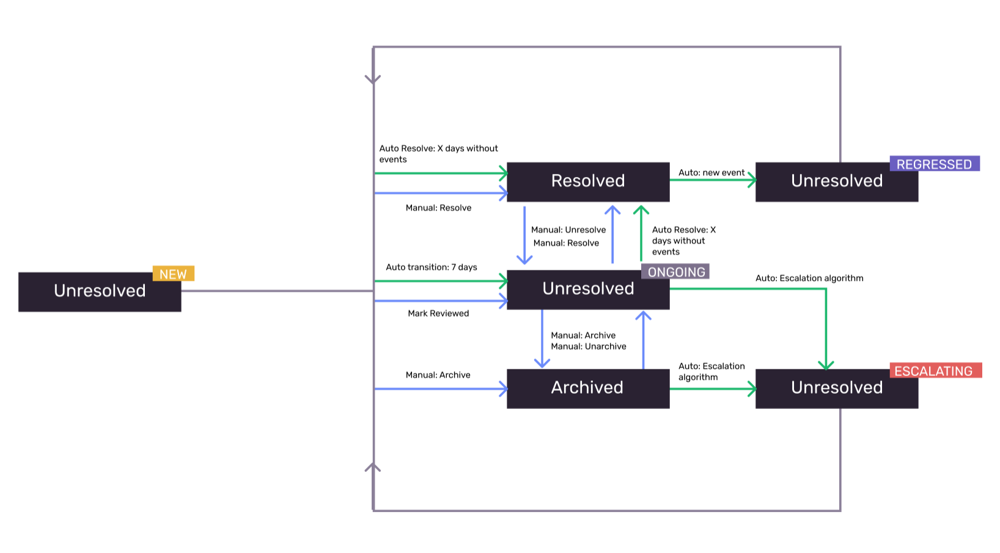

Use the status tags attached to issues on the [**Issues** page](https://sentry.io/issues/) in Sentry to help you triage and prioritize problems with your application that are important to you. Keep in mind that an issue can only have **one status at a time.**

Here's a list of all statuses, how they're assigned to an issue, and their custom search term:

| Status         | Condition                                                                                                                                                                                                                                                                                      | Custom Search Term |
| -------------- | ---------------------------------------------------------------------------------------------------------------------------------------------------------------------------------------------------------------------------------------------------------------------------------------------- | ------------------ |
| **New**        | An issue that was created in the last 7 days.                                                                                                                                                                                                                                                  | is:new             |
| **Ongoing**    | An issue that was created more than 7 days ago or has manually been marked as reviewed.                                                                                                                                                                                                        | is:ongoing         |
| **Escalating** | An issue that's exceeded its forecasted event volume. For more details, see [Escalating Issues Algorithm](escalating-issues). Please note that escalating issues does not work for merged/unmerged issues. | is:escalating      |
| **Regressed**  | A resolved issue that's come up again.                                                                                                                                                                                                                                                         | is:regressed       |
| **Archived**   | An issue that's been marked as archived.                                                                                                                                                                                                                                                       | is:archived        |
| **Resolved**   | An issue that's been marked as fixed.                                                                                                                                                                                                                                                          | is:resolved        |

The diagram below shows how the statuses are updated automatically and manually:

One way to limit the issues that you see is by selecting a tab at the top of the **Issues** page. On the “Unresolved" tab, you'll find `New`, `Ongoing`, `Escalating`, and `Regressed` issues. You can also narrow down further by choosing the "For Review", "Regressed", "Escalating", or "Archived" tabs.

## Manually Triaging Issues

While some issue statuses are added and updated automatically, you can manually `Archive` or `Resolve` an issue, which will also change its status.

### Archive

You can manually archive issues that are less pressing or not applicable to you or your team. This will change their status to `Archived` and remove them from the issues list. Sentry will automatically bring an issue back to the top of the list and change its status to `Escalating` if the events in that issue significantly increase over a short period of time. To learn more about how this works, see [Escalating Issues Algorithm](escalating-issues). There's also an option to mark an issue as `Archived` for:

- Forever
- A set period of time
- Until it occurs a set number of times
- Until a set number of users are affected

If you archive an issue "Forever", events connected with that issue will continue to be recorded, but the issue will never be labeled as escalating even if it meets escalating conditions. You can still unarchive any archived issue, including those that have been archived "Forever". All unarchived issues will then show up in the "Unresolved" tab.

### Resolve

You can manually mark an issue as `Resolved` when it’s been fixed. You can also specify further by resolving it in:

- Your next release
- A current release
- Another release

or

- By [including the issue ID in a commit](/product/releases/associate-commits/?original_referrer=https%3A%2F%2Fdocs.sentry.io%2Fproduct%2Fissues%2Fstates-triage%2F#resolve-issues-by-commit)

If the same issue comes back, its status will automatically change to `Regressed`.

### Delete

You can remove an issue from the issue list by deleting it, but it will reappear as a new issue if it recurs.

There's also an option to `Delete and Discard Forever`, which will make it so that the issue is never seen again, even if it recurs. Any future events tied to the permanently deleted issue will be discarded automatically and won't count towards [your quota](/product/accounts/quotas/).

<Note>

You can only delete [Error Issues](/product/issues/issue-details/error-issues/?original_referrer=https%3A%2F%2Fdocs.sentry.io%2Fproduct%2Fissues%2Fstates-triage%2F). Other issue categories, such as [Performance Issues](/product/issues/issue-details/performance-issues/?original_referrer=https%3A%2F%2Fdocs.sentry.io%2Fproduct%2Fissues%2Fstates-triage%2F), don't support this feature.

</Note>
