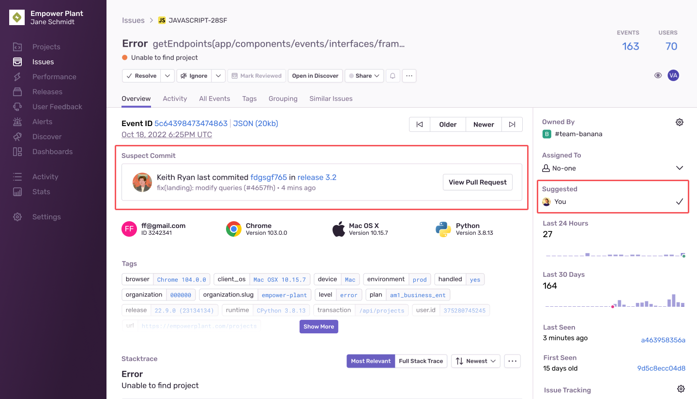

<Include name="only-error-issues-note.mdx" />

Suspect commits show you the most recent commit to the code in the first frame of your stack trace. In the suspect commit information, we include the author of the commit and the pull request in which the commit was made.

When you've enabled suspect commits, we can tie together issues with the commits made in your code repository, including the following information:

- Files observed in the stack trace
- Files touched by those commits
- Authors of those files

Suspect commits and suggested assignees are then displayed on the **Issue Details** page in [sentry.io](https://sentry.io):

## Enable Suspect Commits

In order to see suspect commits, you have to first upload source maps, (or your platform-specific files for mapping transformed source code to the original source). Check out the docs for your [specific platform](/platforms/)) to learn more. Note, that Sentry may not display suspect commits that were committed prior to your integration being set up.

### 1. Connect a Repository Using Integrations

Suspect commits can be enabled using the following integrations:

- [GitHub](/product/integrations/source-code-mgmt/github/)
- [GitLab](/product/integrations/source-code-mgmt/gitlab/)

In [sentry.io](https://sentry.io):

1. Go to **Settings > Integrations**.
1. Click the integration you’d like to use.
1. Configure the integration if you haven’t already.
1. Add the repository you'd like to use.

### 2. Set Up Code Mappings

<Note>

Sentry will automatically try to set up code mappings on Python and JavaScript projects for organizations with the GitHub integration installed. However, you can still manually add code mappings if you choose to do so. Support for other languages and other source code integrations are planned.

</Note>

1. Go to **Settings > Integrations > [Integration] > Configurations**.
1. Click the "Configure" button.
1. Click the "Code Mappings" tab.
1. Set up a code mapping for each project for which you want to enable suspect commits. To create a new code mapping, click **Add Mapping**.
1. Fill out the form, then click **Save Changes**. Each form field is described below.

#### Code Mapping Form Fields

- **Project** (required) - The Sentry project.
- **Repo** (required) - The GitHub repository associated with the Sentry project above. If you have more than one GitHub repository being used per Sentry project, you'll need multiple code mappings.
- **Branch** (required) - The default branch of your code we fall back to if you don't have commit tracking set up.
- **Stack Trace Root** and **Source Code Root** (optional):
  - If the file path in your Sentry stack trace frame matches the path to your source code, you don't need to set these values. For example, everything after the branch (`main`) matches the file path of `code.py` using a source code path of `https://github.com/MeredithAnya/testing/blob/main/code.py` so you don't need to set the **Stack Trace Root** and **Source Code Root**.
  - If the filename in your Sentry stack trace frame doesn't match the path to your source code, you'll need to replace the **stack_root** part of the filename with your **source_root** to make the filename match the source code path. For example, to get `src/code.py` to match `code.py` when the source code path is `https://github.com/MeredithAnya/testing/blob/main/code.py`, change the **Stack Trace Root** to be set as `src/`, and leave **Source Code Root** empty.

The first frame in the stack trace is considered suspect when looking at them top-down. If the first frame is not in-app, the next frame is considered suspect.

## Suspect Commits Without Integrations

You can send us your commit data [manually](/product/releases/associate-commits/) if:

- You don’t want Sentry to connect to your repository.
- Your organization doesn't have a GitHub or Gitlab integration.
- Your integration has gotten disconnected.

Sentry will attempt to find suspect commits via your Github or Gitlab integration by default. If this fails and you've set up the manual process, Sentry will fall back to using the release commit data to find suspect commits.

## Missing Suspect Commits

There are a few reasons why an issue might not have suspect commits:

- The issue doesn't have a stack trace or doesn't have any in-app frames.
- The stack trace doesn't have any in-app frames that match the code mappings.
- The code mappings for the project are incorrect.

## Limitations

- If auto-assignment is enabled but the Suspect Committer is not in the Sentry organization, we will not be able to auto-assign the issue to them.
