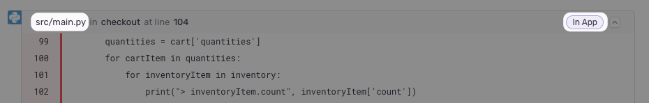
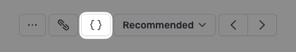

<Include name="only-error-issues-note.mdx" />

Suspect commits show you the most recent commit to the code in your stack trace. In the suspect commit information, we include the author of the commit and the pull request in which the commit was made.

When you've enabled suspect commits, we can tie together issues with the commits made in your code repository, including the following information:

- Files observed in the stack trace
- Files touched by those commits
- Authors of those files

Suspect commits and suggested assignees are then displayed on the **Issue Details** page in [sentry.io](https://sentry.io), as shown below.

  <iframe
    src="https://demo.arcade.software/XIrI8grPiEtHHSfCpCOt?embed"
    frameborder="0"
    loading="lazy"
    webkitallowfullscreen
    mozallowfullscreen
    allowfullscreen
    style="position: absolute; top: 0; left: 0; width: 100%; height: 100%;color-scheme: light;"
    title="FE Tutorial -> See Suspect Commits & Suggested Assignees"
  ></iframe>

## Enable Suspect Commits

In order to see suspect commits, you have to first upload source maps, (or your platform-specific files for mapping transformed source code to the original source). Check out the docs for your [specific platform](/platforms/)) to learn more. Note, that Sentry will not display suspect commits for issues that were created prior to your integration being set up.

### 1. Connect a Repository Using Integrations

Suspect commits can be enabled using the following integrations:

- [GitHub](/product/integrations/source-code-mgmt/github/)
- [GitLab](/product/integrations/source-code-mgmt/gitlab/)

In [sentry.io](https://sentry.io):

1. Go to **Settings > Integrations**.
1. Click the integration you’d like to use.
1. Configure the integration if you haven’t already.
1. Add the repository you'd like to use.

### 2. Set Up Code Mappings

<Note>

Sentry will automatically try to set up code mappings on Python and JavaScript projects for organizations with the GitHub integration installed. However, you can still manually add code mappings if you choose to do so. Support for other languages and other source code integrations are planned.

</Note>

1. Go to **Settings > Integrations > [Integration] > Configurations**.
1. Click the "Configure" button.
1. Click the "Code Mappings" tab.
1. Set up a code mapping for each project for which you want to enable suspect commits. To create a new code mapping, click **Add Mapping**.
1. Fill out the form, then click **Save Changes**. Each form field is described below.

#### Code Mapping Form Fields

- **Project** (required) - The Sentry project.
- **Repo** (required) - The GitHub or GitLab repository associated with the Sentry project above. If you have more than one repository being used per Sentry project, you'll need multiple code mappings.
- **Branch** (required) - The default branch of your code we fall back to if you don't have commit tracking set up.
- **Stack Trace Root** and **Source Code Root** (optional): See below for information on determining these values.

#### Stack Trace Root and Source Code Root

<Note>

The following information is only valid for platforms which use traditional file paths. Platforms with package names (such as [**Java**](/platforms/java/source-context#setting-up-code-mappings), **Cocoa**, and **Flutter**) require additional steps.

</Note>

First, navigate to a stack trace that you wish to map. Find an **In App** frame, which is denoted by a bubble on the right side of the frame. The filename will be shown as the first piece of text at the left hand side of the frame header. In this example, it is `src/main.py`.

If you aren’t sure, you can look at the event JSON by clicking on the `{}` button in the event header. Find the text in the frame's `filename`.

Next, locate the file seen in the stack trace with your source code provider (e.g. GitHub). In this example, the path is `flask/src/main.py` (`empower` is ignored since it is the name of the repo).

Compare the file path from the stack trace with the path found in your source repository. In this example, the `src/` folder in the stack trace matches the `flask/src` folder in the source code. Using that information, set the **Stack Trace Root** to `src/` and the **Source Code Root** to `flask/src/`. This tells Sentry to replace all file paths beginning in `src/` with `flask/src/` when searching for the source code.

For best results, we recommend always providing a non-empty value for the **Stack Trace Root** when possible.

The first frame in the stack trace is considered suspect when looking at them top-down. If the first frame is not in-app, the next frame is considered suspect.

### UI Walkthrough

Follow along with the animated gif below to see how to integrate your GitHub account and repository.

  <iframe
    src="https://demo.arcade.software/OlEYtzImezSBwsV8SVc8?embed"
    frameborder="0"
    loading="lazy"
    webkitallowfullscreen
    mozallowfullscreen
    allowfullscreen
    style="position: absolute; top: 0; left: 0; width: 100%; height: 100%;color-scheme: light;"
    title="FE Tutorial -> Install GitHub Config & Add Code Mapping"
  ></iframe>

## How It Works

When you have a GitHub/GitLab integariton and valid code mappings, Sentry will look at the stack trace of an issue and and collect all in-app frames. For each in-app frame, Sentry checks the blame info for the exact file and line number. If the most recent commit is less than 1 year old, we consider it a suspect commit.

## Suspect Commits Without Integrations

You can send us your commit data [manually](/product/releases/associate-commits/) if:

- You don’t want Sentry to connect to your repository.
- Your organization doesn't have a GitHub or Gitlab integration.
- Your integration has gotten disconnected.

Sentry will attempt to find suspect commits via your GitHub or GitLab integration by default. If this fails and you've set up the manual process, Sentry will fall back to using the release commit data to find suspect commits.

## Missing Suspect Commits

There are a few reasons why an issue might not have suspect commits:

- The issue doesn't have a stack trace or doesn't have any in-app frames.
- The stack trace doesn't have any in-app frames that match the code mappings.
- The stack trace doesn't have any in-app frames with recent commits (less than 1 year old).
- The code mappings for the project are incorrect.
- The issue was created prior to the integration being set up.

## Limitations

- If auto-assignment is enabled but the Suspect Committer is not in the Sentry organization, we will not be able to auto-assign the issue to them.
