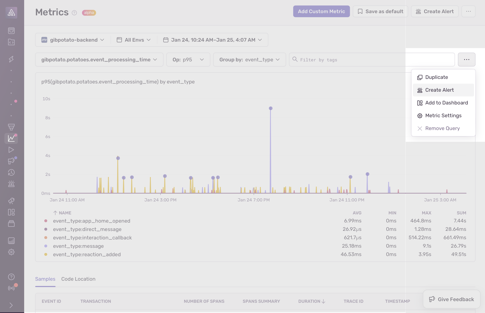

<Include name="feature-stage-alpha-metrics.mdx" />

Once you've started sending metrics to Sentry, you can begin to explore them in the product by navigating to the Metrics page.

## Querying & Visualisation

Using our query editor you can choose the metric you want to plot, by searching or selecting it from the list of available metrics within your project. The next step is to select the aggregate operation you'd like to perform (e.g. avg, min, max, percentiles, etc.), as well as optionally grouping by tags in order to segment your data or filter for specific tag values. In addition to custom metrics that are defined by your team, you can also explore any performance metrics that Sentry offers out-of-the-box.

You are able to see the results of your query displayed on a chart below and you can choose between line, area and bar for the visualisation type. Underneath the chart, you have a summary table where you can see avg, min, max and sum for your metric at a glance. When using group by, you might have multiple time series displayed on the chart and multiple lines in your table that represent each segment.

If you find an interesting area in your visualisation and would like to "zoom in" and dig deeped, you can do so by drawing a rectangle on the area of interest. This will narrow down the visualisation on the particular time and value range that you have selected.

Whereas observing one metric is sometimes enough to reach an insight, it is oftentimes necessary to look at multiple metrics simultaneously and observe potential correlations. In this case, you can create additional queries in order to compare and contrast different metrics.

//image: multiple-queries.png

## Sample Transactions

<Note>Currently only available in Python and PHP</Note>

We believe that metrics are a great tool for analysing your data in aggregate and identifying possible issues. However when it comes to investigating the root cause for a particular anomaly, we think that correlation with other signals such as traces is key. That is why for any metric query, we also surface a list of sample transactions which allow you to go deeper into your investigation.

## Code Locations

<Note>Currently only available in Python and PHP</Note>

When it comes to custom metrics, you can use the code locations tab to see the line of code in your application where your metric is being emitted. This can come in handy when troubleshooting an issue, especially if you were not the one creating the metric in the first place.

## Create Alerts & Dashboards

In order to stay ahead of issues, you can also create metric-based alerts to be notified about unexpected changes or spikes.

If you want to continuously monitor a particular metric, you can create a Dashboard widget and display it together with other datapoints that matter most to you.

