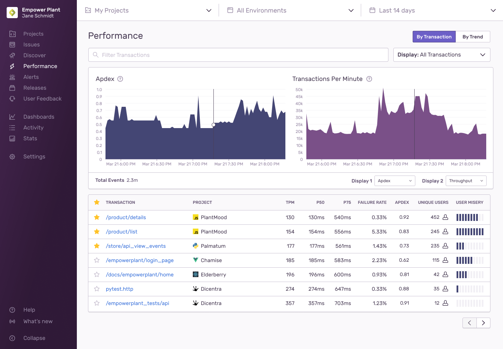
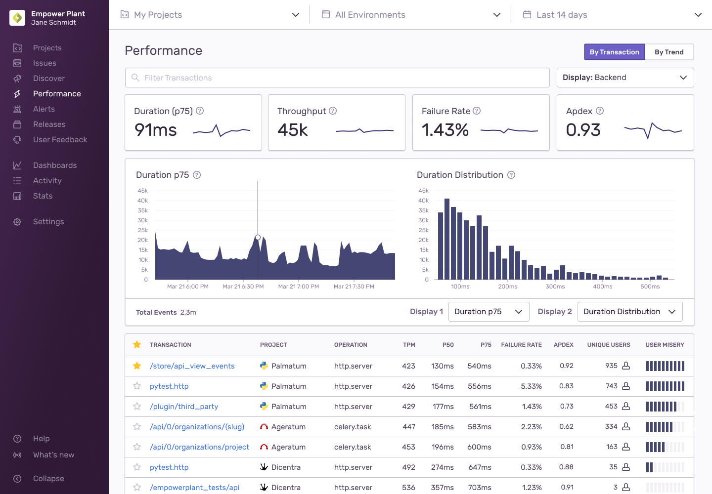

You can filter the information displayed on the **Performance** page by searching or using page-level display filters.

## Transaction and Trend Views

The page default is to view transactions, but you can use the “By Transaction/By Trend” toggle to change the overall display of the page. The different ways you can filter and set the display of transactions is described fully on this page. To learn more about viewing transactions by trend, see our [Trends View documentation](/product/performance/trends/).

## Search Condition Filters

The search bar operates similarly to the one in the Discover [Query Builder](/product/discover-queries/query-builder/#filter-by-search-conditions). For example, you can refine your transaction search to a specific release by using `release:` as a key field and assigning the version as a value.

## Display Filter

The "Display" filter is next to the search bar. It automatically selects a set of [metrics](/product/performance/metrics/) and table columns based on the platform of your project. For example, a JavaScript project defaults to a Frontend (Pageload) display. You can change the selected display, though note that some modes are not applicable to all platforms.

### All Transactions

When you select "All Transactions", the table includes all frontend and backend transactions.

### Frontend (Pageload)

"Frontend (Pageload)" puts an emphasis on [Web Vitals](/product/performance/web-vitals/). The transactions are automatically filtered to only include `transaction.op:pageload`. This generally corresponds to all browser page transitions that are not handled internally in SPA frameworks, such as React or Vue.

### Frontend (Other)

"Frontend (Other)" includes any other frontend transaction that is not a pageload. The filter `transaction.op:!pageload` automatically gets added. This generally corresponds to page transitions handled internally in SPA frameworks, such as React or Vue. Note that if you've selected a backend project, this mode also displays backend transactions.

### Backend

"Backend" puts an emphasis on duration, throughput, failure rate, and Apdex. Note that if you've selected a frontend project, this mode also displays all frontend transactions.

## Graphs

You can compare graphs side by side to find any relevant correlations. For example, if an Apdex score dips significantly during a given time period, you'll be able to visualize whether throughput spiked in the same time interval in a "Transactions per Minute" graph. The global header and search conditions will also allow you to further filter these graphs:

- [Apdex](/product/performance/metrics/#apdex)
- [Transactions Per Minute (TPM)](/product/performance/metrics/#throughput-total-tpm-tps)
- [Failure Rate](/product/performance/metrics/#failure-rate)
- [p50 Duration](/product/performance/metrics/#p50-threshold)
- [p95 Duration](/product/performance/metrics/#p95-threshold)
- [p99 Duration](/product/performance/metrics/#p99-threshold)

## Transaction Table

The table of transactions provides a list of the most frequent transactions based on the current page filters and display options. By default, the table is sorted by transactions per minute, with the most frequent transactions displayed first. The table may be filtered further based on global header and search condition filters.
The [Display Filter](#display-filter) controls what displays in the table columns, such as:

- Transaction Name
- Project
- Operation
- [TPM](/product/performance/metrics/#throughput-total-tpm-tps)
- [P50](/product/performance/metrics/#average-transaction-duration)
- [P95](/product/performance/metrics/#p95-threshold)
- [Failure Rate](/product/performance/metrics/#failure-rate)
- [Apdex](/product/performance/metrics/#apdex)
- Unique Users
- [User Misery](/product/performance/metrics/#user-misery)

### Starring Key Transactions

<Note>

This feature is available only if you're in the Early Adopter program. Features available to Early Adopters are still in-progress and may have bugs. We recognize the irony. If you’re interested in being an Early Adopter, you can turn your organization’s Early Adopter status on/off in General Settings. This will affect all users in your organization and can be turned back off just as easily.

</Note>

If you have transactions you frequently return to, you can mark them as a key transaction for any of your teams by clicking the star in the corresponding row. Each team can mark up to 100 transactions as a key transaction. These key transactions are shared with all members of the team ensuring the most important information is surfaced to the top of the list. You can also mark a transaction as a key transaction in its corresponding [summary view](/product/performance/transaction-summary/#starring-key-transactions).
