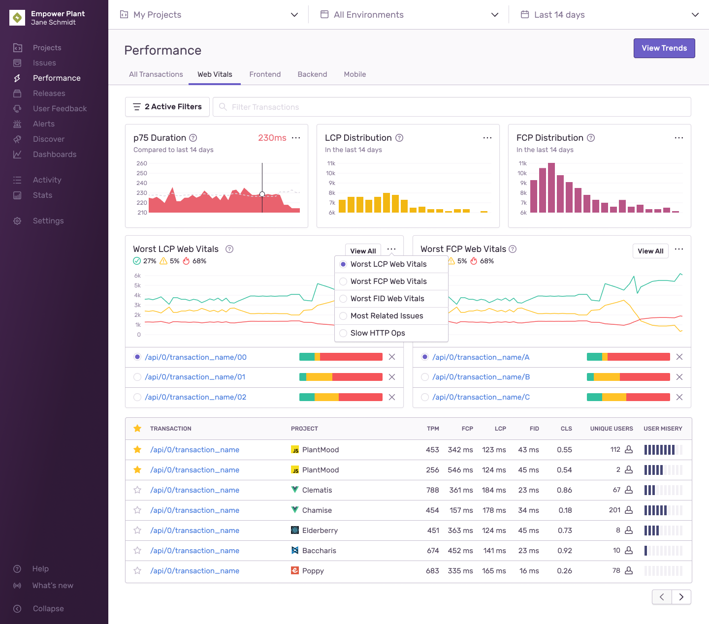
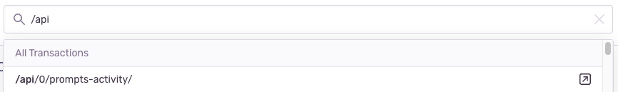
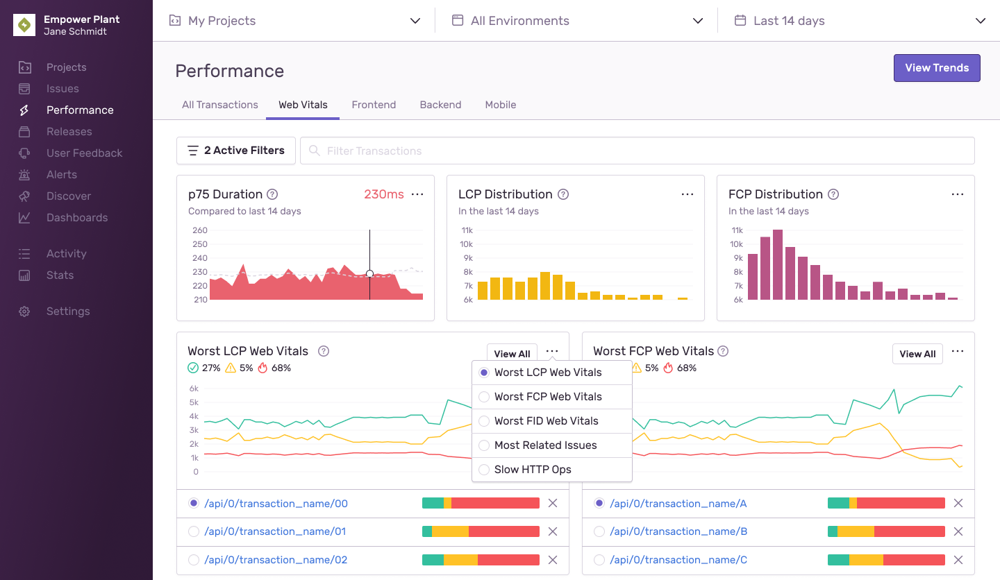

You can filter the information displayed on the **Performance** page by searching or using page-level display filters.

## Transaction and Trend Views

The page displays a view of transactions, but you can click the “View Trends” button to view trends information. The different ways you can filter and set the display of transactions is described fully on this page. To learn more about viewing transactions by trend, see our [Trends View documentation](/product/performance/trends/).

## Tabs {#display-filter}

Each tab in **Performance** displays an automatically selected set of [widgets](#widgets) and table columns based on the platform of your project. For example, a JavaScript project displays the "Web Vitals" tab by default. Each tab and its [metrics](/product/performance/metrics/) are explained below.

### All Transactions

When you select "All Transactions", the table includes all transactions across any projects and period you have selected.

### Web Vitals {#frontend-pageload}

[Web Vitals](/product/performance/web-vitals/) includes frontend pageload transactions. The transactions are automatically filtered to only include `transaction.op:pageload`. This generally corresponds to all browser page transitions that are the first load of a page. It also includes performance information from the beginning of the load itself, as well as the performance of the SPA frameworks being loaded, such as React or Vue (if available).

### Frontend {#frontend-other}

"Frontend" includes all frontend transactions, without a specific focus on Web Vitals. This generally corresponds to page transitions handled internally in SPA frameworks, such as React or Vue. Note that if you've selected a backend project, this mode also displays backend transactions.

### Backend

"Backend" puts an emphasis on duration, throughput, failure rate, and Apdex. Note that if you've selected a frontend project, this mode also displays all frontend transactions.

### Mobile

"Mobile" puts an emphasis on [Mobile Vitals](/product/performance/mobile-vitals/). Note that if you've selected a non-mobile project, this mode also displays all of those transactions.

## Filtering Transactions

### Transaction Name Search

Rather than searching for transactions by matching event properties, the search bar on the **Performance** page filters by transaction name only. You can search for specific transaction names or use wildcards, which can take the place of one or more characters in a search term (e.g., `/api/*/organization`).

When you begin typing, a list of transaction names that match your search appear. There are two ways to interact with the search results:

1. Clicking on a transaction name will apply a filter on the **Performance** page to only display transaction data for the selected transaction.
2. Clicking the upwards arrow icon on a search result will take you to that transaction's summary page.

### Search Condition Filters

In the transaction summary, the search bar operates similarly to the one in the Discover [Query Builder](/product/discover-queries/query-builder/#filter-by-search-conditions). For example, you can refine your transaction search to a specific release by using `release:` as a key field and assigning the version as a value.

## Widgets

[Widgets](/product/performance/filters-display/widgets/) offer visualizations that you can change to best match your workflow.

In the first row, there are time series and distribution graphs of common metrics for the selected project type (frontend or backend), such as User Misery or Failure Rate. You can compare these side-by-side to find any correlations.

In the second row, there are actionable widgets that can show you areas of concern in your application, such as Most Regressed Transactions or Most Recurring Issues. Below these widgets, there are lists of transactions, which you can click to see additional context. Transactions shown in these lists can be temporarily removed from the view by clicking the 'X' beside the transaction name.

Each widget has a menu in the top right where can you change the widget shown. Your changes will be persisted locally either for the session or until application storage is cleared. After that, the default set of widgets is displayed.

### Basic Widgets

- [Apdex](/product/performance/metrics/#apdex)
- [Transactions Per Minute (TPM)](/product/performance/metrics/#throughput-total-tpm-tps)
- [Failure Rate](/product/performance/metrics/#failure-rate)
- [p50 Duration](/product/performance/metrics/#p50-threshold)
- [p75 Duration](/product/performance/metrics/#p75-threshold)
- [p95 Duration](/product/performance/metrics/#p95-threshold)
- [p99 Duration](/product/performance/metrics/#p99-threshold)
- [User Misery](/product/performance/metrics/#user-misery)

### Actionable Widgets

- [Most Improved](/product/performance/filters-display/widgets/#most-improved)
- [Most Regressed](/product/performance/filters-display/widgets/#most-regressed)
- [Most Related Issues](/product/performance/filters-display/widgets/#most-related-issues)
- [Most Slow Frames](/product/performance/filters-display/widgets/#most-slow-frames)
- [Most Frozen Frames](/product/performance/filters-display/widgets/#most-frozen-frames)
- [Worst LCP Vitals](/product/performance/filters-display/widgets/#worst-lcp-vitals)
- [Worst FCP Vitals](/product/performance/filters-display/widgets/#worst-fcp-vitals)
- [Worst FID Vitals](/product/performance/filters-display/widgets/#worst-fid-vitals)
- [Slow HTTP Ops](/product/performance/filters-display/widgets/#slow-http-ops)
- [Slow DB Ops](/product/performance/filters-display/widgets/#slow-db-ops)
- [Slow Browser Ops](/product/performance/filters-display/widgets/#slow-browser-ops)
- [Slow Resource Ops](/product/performance/filters-display/widgets/#slow-resource-ops)

## Transaction Table

The table of transactions provides a list of the most frequent transactions based on the current page filters and display options. By default, the table is sorted by transactions per minute, with the most frequent transactions displayed first. The table may be filtered further based on the page and search condition filters.
The [Display Filter](#display-filter) controls what displays in the table columns, such as:

- Transaction Name
- Project
- Operation
- [TPM](/product/performance/metrics/#throughput-total-tpm-tps)
- [P50](/product/performance/metrics/#average-transaction-duration)
- [P95](/product/performance/metrics/#p95-threshold)
- [Failure Rate](/product/performance/metrics/#failure-rate)
- [Apdex](/product/performance/metrics/#apdex)
- Unique Users
- [User Misery](/product/performance/metrics/#user-misery)

### Starring Key Transactions

If you have transactions you frequently return to, you can mark them as a key transaction for any of your teams by clicking the star in the corresponding row. Each team can mark up to 100 transactions as a key transaction. These key transactions are shared with all members of the team ensuring the most important information is surfaced to the top of the list. You can also mark a transaction as a key transaction in its corresponding [summary view](/product/performance/transaction-summary/#starring-key-transactions).
