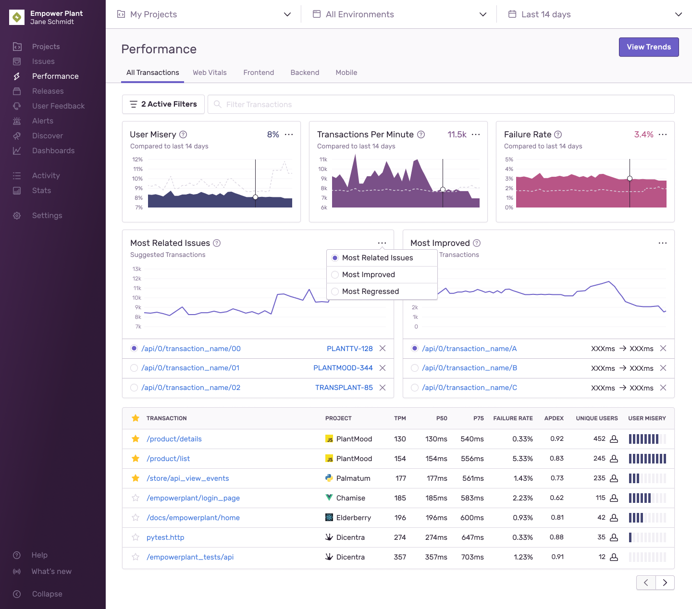

With <SandboxLink scenario="performance" projectSlug="react">performance monitoring</SandboxLink>, Sentry tracks application performance, measures metrics like throughput and latency, and displays the impact of errors across multiple services. Sentry captures [distributed traces](/product/sentry-basics/tracing/distributed-tracing/) consisting of [transactions](/product/performance/transaction-summary/#what-is-a-transaction) and spans to measure individual services and operations within those services.

<Note>

Learn more about traces in the [full Tracing documentation](/product/sentry-basics/tracing/).

</Note>

The **Performance** page is the main view in [sentry.io](https://sentry.io) where you can search or browse for <SandboxLink scenario="oneTransaction" projectSlug="react">transaction</SandboxLink> data. A transaction represents a single instance of an activity you want to measure or track, like a page load, page navigation, or an asynchronous task. The page displays graphs that visualize transactions or trends, as well as a table where you can view relevant transactions and drill down to more information about them.

Using the information on this page, you can trace issues back through services (for instance, frontend to backend) to identify poorly performing code. This allows you to answer questions like whether your application performance is getting better or worse, if your last release is running more slowly than previous ones, or which specific services are slow. Then you can begin to address the code that’s degrading performance.

## Filter Performance Data

The <SandboxLink scenario="performance" projectSlug="react">Performance</SandboxLink> page provides you with several filter and display options so that you can focus on the performance data you want. Search conditions help you find the <SandboxLink scenario="oneTransaction" projectSlug="react">transactions</SandboxLink> you want to investigate. You can also control what kind of information is visualized in the [widgets](/product/performance/filters-display/#widgets) or which transactions appear first in the [transactions table](/product/performance/filters-display/#transaction-table).

## Analyze Performance Trends

The [trends view](/product/performance/trends/) surfaces transactions that have had significant changes in their performance over time. This view is ideal for providing insights when you have transactions with large counts.

## Investigate Transactions

When you find a transaction of interest, you can investigate further by going to its [Transaction Summary page](/product/performance/transaction-summary). Every transaction has a summary view that gives you a better understanding of its overall health. With this view, you'll find graphs, instances of these events, stats, facet maps, related errors, and more.

The summary page for Frontend transactions has a "Web Vitals" tab, where you can see a detailed view of the [Web Vitals](/product/performance/web-vitals/) associated with the transaction. You can access a **Transaction Summary** page from the transactions table on the **Performance** page.

## Explore Performance Metrics

There are several types of [metrics](/product/performance/metrics/) that you can visualize in the graphs, such as Apdex, Transactions Per Minute, P50 Duration, and User Misery to get a full understanding of how your software is performing.

## Triage Performance Issues

If your application is configured for Performance Monitoring, Sentry will detect common performance problems, and group them into issues just like it does with errors. Performance issues help to surface performance problems in your application and provide a workflow for resolving them. Learn more about [performance issues](/product/issues/issue-details/performance-issues/).

## Watch a Tutorial

Check out our short [video](/product/performance/performance-video/) tutorial explaining how Sentry performance monitoring helps you find and solve the most impactful performance issues in your application.

## Learn More

<PageGrid />
