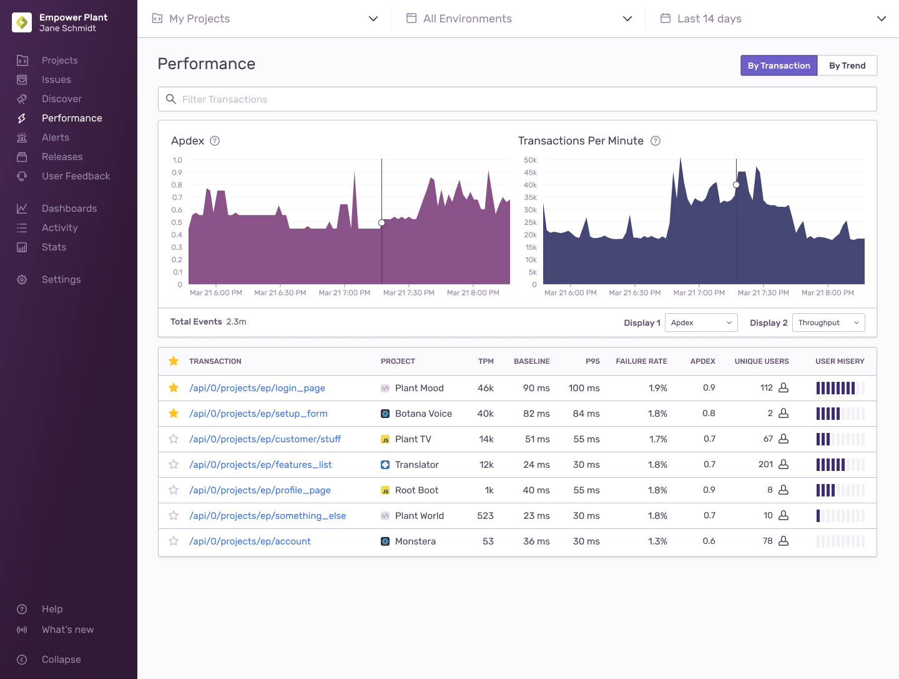
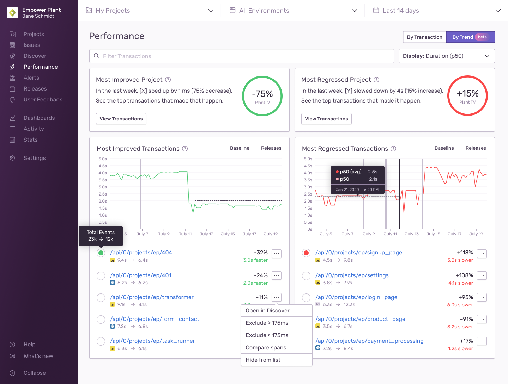

The Performance Monitoring homepage is the main view where you can search or browse for transaction data. Filter by search conditions or choose from a list of sortable transactions in the table. As soon as a transaction of interest has been rooted out, you can investigate further by clicking it for its [summary view](/product/performance/transaction-summary/).

## Filter by Search Conditions

The search bar operates similarly to the one in the Discover [Query Builder](/product/discover-queries/query-builder/#filter-by-search-conditions). For example, you can refine your transaction search to a specific release by using `release:` as a key field and assigning the version as a value.

## Graphs

Compare graphs side by side to find any relevant correlations. For example, if an Apdex score dips significantly during a given time period, you'll be able to visualize whether throughput spiked in the same time interval. The global header and search conditions will also enable you to filter these graphs even more. The display options are listed below:

- [Apdex](/product/performance/metrics/#apdex)
- [Transactions Per Minute (TPM)](/product/performance/metrics/#throughput-total-tpm-tps)
- [Failure Rate](/product/performance/metrics/#failure-rate)
- [p50 Duration](/product/performance/metrics/#p50-threshold)
- [p95 Duration](/product/performance/metrics/#p95-threshold)
- [p99 Duration](/product/performance/metrics/#p99-threshold)

## Transaction Table

Below the graphs are a list of transactions that may be filtered down based on global header and search condition filters. The provided columns offer details about each transaction.

- Transaction Name
- Project
- [TPM](/product/performance/metrics/#throughput-total-tpm-tps)
- [P50](/product/performance/metrics/#average-transaction-duration)
- [P95](/product/performance/metrics/#p95-threshold)
- [Failure Rate](/product/performance/metrics/#failure-rate)
- [Apdex](/product/performance/metrics/#apdex)
- Unique Users
- [User Misery](/product/performance/metrics/#user-misery)

## Key Transaction View

If you have transactions you frequently return to; you can mark each one as a key transaction in their corresponding [summary views](/product/performance/transaction-summary/#key-transaction). This enables a shortcut to view only Key Transactions by toggling the tab in the upper right corner of the homepage.

## Trends View

Trends surfaces transactions that have had significant changes in their performance over time. This view can be found by toggling the tab in the upper right corner of the homepage.

Trending transactions are calculated first by filtering out transactions with large fluctuations in [throughput](/product/performance/metrics/#throughput-total-tpm-tps), then determining the baselines of the two halves of the duration, and calculating their percentage change. Regressions are any percentage changes greater than 0, while improvements are percentage changes less than 0.

For example looking at a transaction over two weeks with the default [P50](/product/performance/metrics/#average-transaction-duration) baseline, if the first week had a `p(50)=100s`, and the second a `p(50)=110s` the percentage is `(110/100)-1 = 0.1`. This means that this example transaction had a performance regression of `10%`.

The accuracy of a trend improves the more data that is available, for this reason, trends perform best on long periods, and with transactions with large counts.

While the baseline defaults to P50 but the Display dropdown lets you change this. The baseline is used to determine the percentage change but is also used for the comparison view found in the dropdown for each transaction. This comparison view finds the transaction in each period with the duration closest to the baseline and compares their spans.
