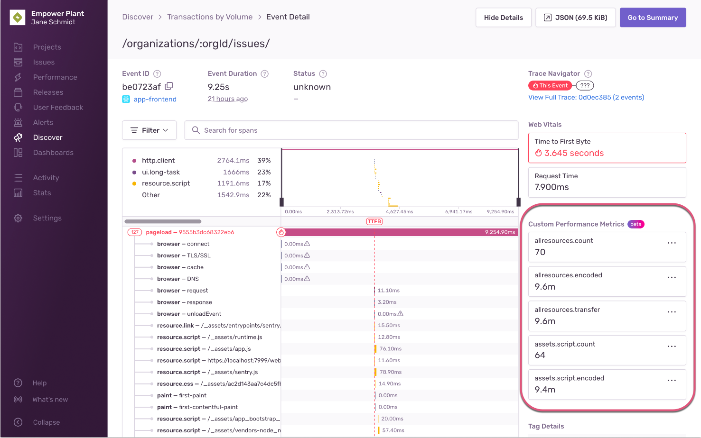

Metrics provide insight about how users are experiencing your application. In [Performance](/product/performance/), we'll set you up with a few of the basic metrics to get you started. For further customizations on target thresholds, feel free to build out a query using the Discover [Query Builder](/product/discover-queries/query-builder/). By identifying useful thresholds to measure your application, you have a quantifiable measurement of your application's health. This means you can more easily identify when errors occur or if performance issues are emerging.

## Apdex

Apdex is an industry-standard metric used to track and measure user satisfaction based on your application response times. A higher Apdex score is better than a lower one; the score can go up to 1.0, representing 100% of users having a satisfactory experience. The Apdex score provides the ratio of satisfactory, tolerable, and frustrated requests in a specific transaction or endpoint. This metric provides a standard for you to compare transaction performance, understand which ones may require additional optimization or investigation, and set targets or goals for performance.

Below are the components of Apdex and its formula:

- **T**: Threshold for the target response time.
- **Satisfactory**: Users are satisfied using the app when their page load times are less than or equal to T.
- **Tolerable**: Users consider the app tolerable to use when their page load times are greater than T and less than or equal to 4T.
- **Frustrated**: Users are frustrated with the app when their page load times are greater than 4T.
- **Apdex**: (Number of Satisfactory Requests + (Number of Tolerable Requests/2)) / (Number of Total Requests)

Configure what a satisfactory response time threshold (ms) is for Apdex in **Settings > Performance**. You can set this for each project with [custom thresholds](#custom-thresholds).

## Failure Rate

`failure_rate()` indicates the percentage of unsuccessful transactions. Sentry treats transactions with a status other than “ok,” “cancelled,” and “unknown” as failures. For more details, see a [list of possible status values](https://develop.sentry.dev/sdk/event-payloads/span/).

## Throughput (Total, TPM, TPS)

Throughput indicates the number of transactions over a given time range (Total), average transactions per minute (TPM), or average transactions per second (TPS).

## Latency

### Average Transaction Duration

Average Transaction Duration indicates the average response time for all occurrences of a given transaction.

The following functions aggregate transaction durations:

- average
- various percentiles (by default, the pre-built Transactions query shows the 75th and 95th percentiles, but there are many other options, including a custom percentile)
- maximum

One use-case for tracking these statistics is to help you identify transactions that are slower than your organization's target Service Level Agreements (SLAs).

A word of caution when looking at averages and percentiles: In most cases, you'll want to set up tracing so that only [a fraction](/product/sentry-basics/tracing/distributed-tracing/#data-sampling) of possible traces are actually sent to Sentry, to avoid overwhelming your system. Further, you may want to filter your transaction data by date or other factors, or you may be tracing a relatively uncommon operation. For all of these reasons, you may end up with average and percentile data that is directionally correct, but not accurate. (To use the most extreme case as an example, if only a single transaction matches your filters, you can still compute an "average" duration, even though that's clearly not what is usually meant by "average.")

The problem of small sample size (and the resulting inability to be usefully accurate) will happen more often for some metrics than others, and sample size will also vary by row. For example, it takes less data to calculate a meaningful average than it does to calculate an equally meaningful 95th percentile. Further, a row representing requests to `/settings/my-awesome-org/` will likely contain many times as many transactions as one representing requests to `/settings/my-awesome-org/projects/best-project-ever/`.

### P50 Threshold

The p50 threshold is the value at which 50% of transaction durations are greater than the threshold. This is also the median. For example, if the p50 threshold is 10 milliseconds, then 50% of transactions exceeded that threshold, taking longer than 10 milliseconds.

### P75 Threshold

The p75 threshold is the value at which 25% of transaction durations are greater than the threshold. For example, if the p75 threshold is 10 milliseconds, then 25% of transactions exceeded that threshold, taking longer than 10 milliseconds.

### P95 Threshold

The p95 threshold is the value at which 5% of transaction durations are greater than the threshold. For example, if the p95 threshold is 50 milliseconds, then 5% of transactions exceeded that threshold, taking longer than 50 milliseconds.

### P99 Threshold

The p99 threshold is the value at which 1% of transaction durations are greater than the threshold. For example, if the p99 threshold is five seconds, then 1% of transactions exceeded that threshold, taking longer than five seconds.

## Frequency

The following functions aggregate transaction counts and the rate at which transactions are recorded:

- count
- count unique values (for a given field)
- average requests (transactions) per second
- average requests (transactions) per minute

Each of these functions is calculated with respect to the collection of transactions within the given row, which means the numbers will change as you filter your data or change the time window. Also, if you have set up your SDK to [sample your data](/product/sentry-basics/tracing/distributed-tracing/#data-sampling), remember that only the transactions that are sent to Sentry are counted. So if a row containing transactions representing requests to a given endpoint is calculated to be receiving 5 requests per second, and you've got a 25% sampling rate enabled, in reality you're getting approximately 20 requests to that endpoint each second. (20 because you're collecting 25% - or 1/4 - of your data, so your real volume is 4 times what you're seeing in Sentry.)

## User Misery

User Misery is a user-weighted performance metric to assess the relative magnitude of your application performance. While you can examine the ratio of various response time threshold levels with [Apdex](#apdex), User Misery counts the number of unique users who were frustrated based on four times the satisfactory response time threshold (ms). User Misery highlights transactions that have the highest impact on users.

The calculation accounts for the volume and proportion of users that experienced a slow transaction; so 800/1000 miserable users will translate to a higher user misery score than 5/5 miserable users.

You can set satisfactory thresholds for each project with [custom thresholds](#custom-thresholds).

<Note>

User Misery is calculated using a probability distribution. This prevents false positives and ensures reasonable values for datasets with low event volume. You can view the underlying data by querying for the [`count_miserable()` function](/product/discover-queries/query-builder/#stacking-functions).

</Note>

## Custom Thresholds

For each project, you can configure how [Apdex](#apdex) and [User Misery](#user-misery) are calculated in **[Project] > Settings > Performance**. You can override project-level settings at the transaction level in **Transaction Summary > Settings**.

The calculation method determines if duration is defined as the entire length of the transaction or as a specific [Web Vital](/product/performance/web-vitals/) such as LCP. The response time threshold determines what the satisfactory baseline duration is in milliseconds. This threshold may vary across projects depending on how user-facing a project is.

## Custom Performance Metrics

In addition to the automatic performance metrics described above, Sentry supports setting custom performance metrics on transactions. Custom performance metrics allow you to define metrics (beyond the ones mentioned above) that are important to your application and send them to Sentry.

For example, you might want to set a custom metric to track:

- Total memory usage during a transaction
- The amount of time being queried
- Number of times a user performed an action during a transaction

You define and configure custom metrics in the SDK. Currently, you can set custom metrics in:

<Include name="custom-metrics-supported-sdks.mdx" />

Custom metrics are accessible to you in [sentry.io](https://sentry.io) when you:

- Create visualizations in **Dashboards**
- Query and add columns for them in **Discover**
- View a transaction event detail (see image below)

> _Custom metrics data displayed in the sidebar of a transaction event detail under the "Custom Performance Metrics" heading._

You can define up to 10 custom performance metrics per transaction. If more custom performance metrics are included in a transaction event, the list will be truncated.
